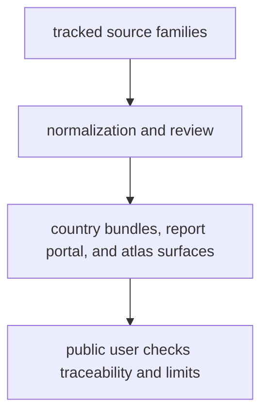

# Bijux Pollenomics Product Guide

`bijux-pollenomics` is the product guide for the repository's public evidence.
It explains what the repository publishes today, why those outputs exist, how
far they can be trusted, and where to go next without reading the source code
first.

The central idea is simple. This repository rebuilds one governed evidence
system, then publishes several public-facing cuts from that same state. Pollen
context, environmental archaeology, boundary framing, fieldwork records, and
animal ancient-DNA recovery all live in one repository, but they do not all
carry the same scientific weight. This guide explains those differences
directly instead of leaving them buried in the file tree.

That same model now includes the Sweden lake evidence program. The lake packet
is not a side spreadsheet pasted beside the atlas. It is another published cut
through the repository evidence state, with its own ranking logic, shortlist
rules, and honesty boundaries.

Use this handbook when your first question is:

- what this repository is actually for
- what I can use from it right now
- what kind of question each output can answer
- what the current limits are before I rely on a public map, report, or data file

Do not use this handbook when you need maintainer-only release policy, internal
governance, or package-check implementation details. Those belong in the
repository's internal docs, not on the public product surface.

  <a class="md-button md-button--primary" href="../../index.md">Open the documentation home</a>
  <a class="md-button" href="foundation/">What this repository is for</a>
  <a class="md-button" href="architecture/">How evidence becomes outputs</a>
  <a class="md-button" href="interfaces/">Commands and public contracts</a>
  <a class="md-button" href="operations/">Install and rebuild</a>
  <a class="md-button" href="quality/">Checks and current limits</a>

## What You Can Learn Here

- understand the product shape before reading package names or command syntax
- decide whether you need the visible public answer, the narrower evidence
  chain, or the rebuild workflow behind it
- tell which surfaces are mature public context and which remain partial or
  recovery-heavy
- move from a big public question to the right page quickly instead of
  wandering through internal terminology

## Publication Loop

```mermaid
flowchart TB
    sources["tracked source families"]
    normalization["normalization and review"]
    outputs["country bundles, report portal, and atlas surfaces"]
    readers["public user checks traceability and limits"]

    sources --> normalization
    normalization --> outputs
    outputs --> readers
```

## What Most People Need First

- what the repository already publishes with confidence:
  pollen context, environmental archaeology context, boundary framing, and
  governed report bundles
- what the Sweden lake packet adds:
  candidate prioritization, scenario comparison, and a fieldwork shortlist
  without pretending those rankings replace field limnology
- what remains visibly partial:
  animal ancient-DNA recovery and the claims that depend on deeper sample
  extraction
- how to use the product without overstating it:
  start with public outputs for orientation, then drop to evidence and review
  surfaces when a claim matters
- how this can grow to more countries and more regions:
  the world, Europe-plus, Nordic, and country outputs are meant to be one
  expansion model, not separate products

## Start Here

- start with [foundation](foundation/index.md) if you need the product answer:
  what this repository is for, what it refuses to claim, and why
- move to [architecture](architecture/index.md) if you need the lifecycle
  answer: how evidence becomes reviewable files, reports, and maps
- use [interfaces](interfaces/index.md) if you need the runtime answer: which
  commands, files, and contracts are meant to stay stable
- use [operations](operations/index.md) if you need the practical answer: how
  to install, verify, rebuild, and recover locally
- use [quality](quality/index.md) if you need the trust answer: what the
  current checks, limits, and refusal rules actually say

## Routes By Question

- what does this repository publish, and what does it still refuse to claim:
  [repository scope and limits](foundation/repository-scope-and-limits.md)
- how does source material become visible data, reports, and map surfaces:
  [runtime system model](architecture/runtime-system-model.md)
- what commands do I actually run for inspection, rebuilds, and checks:
  [entrypoints and examples](interfaces/entrypoints-and-examples.md)
- how do I follow common rebuild paths without getting lost in internal
  tooling:
  [common workflows](operations/common-workflows.md)
- how do I judge whether a surface is reviewable, publishable, or still too
  weak for a stronger claim:
  [runtime invariants and limits](quality/runtime-invariants-and-limits.md)
- how do I understand the Sweden lake packet and the optional Nordic overlays:
  [Sweden lake priorities](../nordic-atlas/sweden-lake-priorities/index.md)
- where do the public data explanations live if I care more about evidence than
  code:
  [data handbook](../pollenomics-data/index.md)

## Evidence Routes

If your question is really about the evidence families behind the product, move
from this handbook into the public data pages that explain them directly:

- [LandClim](../pollenomics-data/sources/landclim.md)
- [Neotoma](../pollenomics-data/sources/neotoma.md)
- [SEAD](../pollenomics-data/sources/sead.md)
- [RAA](../pollenomics-data/sources/raa.md)
- [Boundaries](../pollenomics-data/sources/boundaries.md)
- [AADR](../pollenomics-data/sources/aadr.md)

## What This Guide Covers

- the product shape of the runtime
- the architecture that turns governed evidence into governed outputs
- the public command and file contracts you can inspect
- the operational route for rebuilding and checking the repository
- the quality rules that keep visible output language honest
- the places where ranking, atlas, and fieldwork outputs are informative but
  still narrower than a finished scientific inference engine

## What This Guide Does Not Promise

- that you already know the repository layout
- that every visible output has the same scientific strength
- that the current animal ancient-DNA slice already equals a finished
  pollenomics engine
- that maintainer-only rules belong on the public product surface
