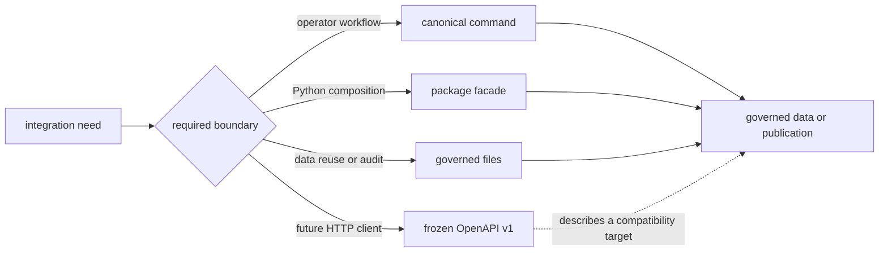

# API Surface

Bijux Pollenomics exposes a deliberately small integration surface. The
installed command, the top-level Python facade, and governed files are current
interfaces. The versioned OpenAPI document is a frozen compatibility target;
it does not imply that this repository operates a live HTTP service.

## Supported Interfaces

| Interface | Current role | Appropriate use | Authority |
| --- | --- | --- | --- |
| `bijux-pollenomics` | canonical command | inspection, collection, evidence review, and publication workflows | command help, exit status, and written contract surfaces |
| `pollenomics` | compatibility command | the same workflows under the shorter distribution name | delegates to the canonical runtime |
| `bijux_pollenomics` | Python facade | embedding collection, reporting, and product-scope operations | names exported by the package root and public API modules |
| governed JSON, CSV, GeoJSON, Markdown, and HTML | persisted exchange and publication | inspection, reuse, review, and downstream analysis | the owning manifest or evidence contract |
| OpenAPI v1 | future HTTP compatibility target | client design and schema review | pinned schema plus `schema.hash` |



## Python Surface

The stable Python facade is the package root:

```python
from bijux_pollenomics import (
    collect_data,
    generate_country_report,
    generate_multi_country_map,
    generate_published_reports,
)
```

The root also exports result types and product, ownership, surface, runtime,
and alias contracts. Specialized integrations may use
`bijux_pollenomics.data_downloader`, `bijux_pollenomics.reporting`, and
`bijux_pollenomics.command_line`; deeper modules remain implementation detail
unless their owning API explicitly exports a name.

The `pollenomics` package re-exports the canonical runtime facade. It is an
identity-compatible entrypoint, not an independent scientific API.

### Root Export Families

| Family | Root exports | Contract |
| --- | --- | --- |
| collection | `collect_data`, `collect_context_data` | write collector-owned source state and return `DataCollectionReport` or `ContextDataReport` |
| publication | `generate_country_report`, `generate_multi_country_map`, `generate_published_reports` | write one owned publication boundary and return its report type |
| product inspection | `build_product_scope`, `build_surface_map`, `build_ownership_map` | return immutable descriptions without changing governed state |
| distribution contracts | `runtime_surface_contract`, `compatibility_alias_contract` | identify the canonical runtime and the short-name delegation boundary |

The facade deliberately does not export a general harmonization, inference, or
HTTP-service object. Absence from this table is therefore material when
evaluating the current product boundary.

### Call And Result Contract

Public workflow functions take explicit filesystem roots and scientific scope
instead of discovering authority from process state. Collection returns a
`DataCollectionReport`; country, multi-country, and complete publication calls
return their corresponding report types. These results summarize the
completed operation. The written bundle and its manifest remain the durable
exchange surface.

Calls that publish a bundle replace their owned output through staging. A
caller must therefore treat the output root as an ownership boundary, not as a
directory for unrelated application files. Invalid empty scopes are rejected
before publication, while source, evidence, and contract failures propagate
as failures rather than returning a plausible partial report.

```python
from pathlib import Path

from bijux_pollenomics import generate_country_report

report = generate_country_report(
    version_dir=Path("data/aadr/v66"),
    country="Sweden",
    output_dir=Path("artifacts/example-country"),
    context_root=Path("data"),
)

print(report.total_unique_samples, report.output_dir)
```

This example writes to `artifacts/` for inspection. Selecting a governed
publication root is a separate decision with review obligations.

## File Interfaces

Files are often the strongest integration boundary because they retain state
that can be inspected without executing the runtime:

- source-family captures and normalized records preserve acquired evidence;
- review and governance records preserve ambiguity, fitness, and exclusion;
- publication manifests preserve membership and product scope;
- GeoJSON and tables carry reusable public rows;
- Markdown and HTML render interpretation without replacing structured
  authority.

Consumers should join records by declared identifiers and consult the owning
manifest before interpreting a copied field. A convenient downstream copy is
not automatically the authority for that fact.

## OpenAPI Status

`apis/bijux-pollenomics/v1/` contains `schema.yaml`, a pinned JSON rendering,
and the governed schema digest. It defines health, published-report discovery,
atlas summary, and Nordic country-summary shapes that future HTTP delivery
must preserve.

The schema is reviewable today, but the repository does not promise that its
server URL is currently deployed. Until an HTTP service is separately
published and operated, use the CLI, Python facade, or checked-in artifacts.

The frozen document currently defines four read shapes: health, published
report discovery, atlas summary, and one Nordic AADR country summary. It is not
a serialization contract for every database record or runtime command. A
future adapter must map those read shapes to governed publication state rather
than treating the schema as an alternate evidence database.

## Compatibility Rules

- command aliases must resolve to the same runtime behavior;
- public Python exports may evolve only through an explicit compatibility
  decision;
- governed file meaning is carried by schemas, manifests, and evidence roles,
  not by filename alone;
- a changed OpenAPI schema requires a matching pinned rendering and digest;
- internal module layout may change without redefining a supported interface.

## Compatibility Posture

Compatibility protects observable meaning, not every implementation detail.
For a supported surface, a compatible change preserves accepted inputs,
result interpretation, evidence roles, artifact identity, and failure
semantics. New optional fields may extend a structured record only when older
consumers can continue to identify the record and its governing contract.

Compatibility must be assessed separately for each affected dimension:

| Dimension | Observable contract |
| --- | --- |
| invocation | callable name, arguments, defaults, accepted values, and exception or exit behavior |
| result | return type, required fields, status meaning, and distinction between success and refusal |
| persisted data | schema, stable identifiers, fact ownership, null and precision semantics, and joins |
| publication | manifest identity, scope, membership, companion artifacts, warnings, and exclusions |
| scientific posture | evidence role, admitted population, claim ceiling, and release language |

A source-compatible function can still introduce an incompatible scientific
change if it silently changes the admitted population or the meaning of a
precision field. Conversely, adding an optional rendering can be compatible
when the manifest, members, roles, and governing facts remain unchanged.

A rename, removal, changed default scope, weakened refusal, or altered
publication membership is not a cosmetic change. It requires an explicit
compatibility decision and a migration path appropriate to the affected CLI,
Python, file, or OpenAPI consumer.
