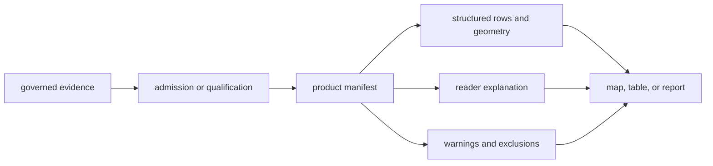
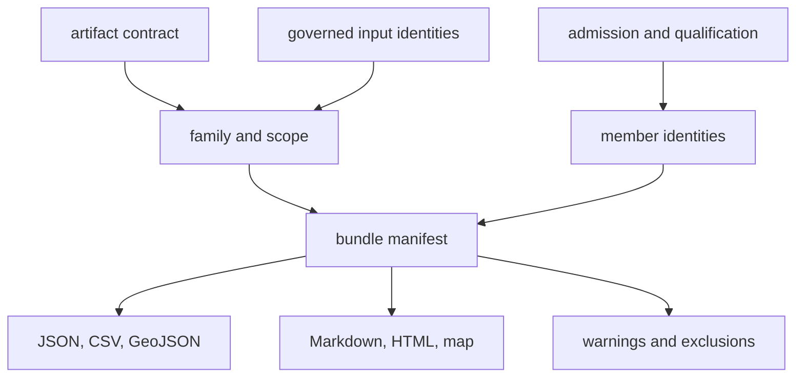

# Artifact Contracts

A published artifact is a claim-bearing product, not merely a generated file.
Its contract identifies the product scope, membership, evidence roles,
traceability, warnings, and exclusions needed to interpret it honestly.

## Publication Families

| Family | Reader question | Governing material |
| --- | --- | --- |
| world | What evidence can be viewed without a regional assumption? | world bundle, publication contract, evidence surface, traceability, and scientific review |
| Europe-plus | Which wider European records qualify under one regional scope? | regional bundle, scope metadata, feature tables, and exclusions |
| Nordic | Which records qualify for Nordic comparison? | Nordic bundle, country membership, evidence roles, and point traceability |
| country | What is admitted within one named country? | country manifest, samples, species, localities, citations, warnings, and summary |
| Sweden lake | Which basins remain interesting across evidence and sensitivity views? | ranking manifest, scenarios, registry, distance bands, map, and fieldwork-preparation packet |
| repository review | What is currently supported, incomplete, or blocked? | readiness, honesty, coverage, exclusion, truth-posture, and claim-audit reports |

## Bundle Anatomy

The manifest is the entrypoint for a bundle. It records what belongs to the
product and connects the visible rendering to structured members. Supporting
files then divide responsibilities:

- CSV and JSON expose rows, summaries, and machine-readable decisions;
- GeoJSON exposes geometry together with feature properties and evidence role;
- citations identify external evidence and source context;
- warnings preserve qualifications that affect interpretation;
- exclusions explain why known candidates are absent;
- Markdown and HTML provide a readable view over those governed materials.

No rendering outranks its inputs. If a map label and a structured evidence row
disagree, the discrepancy is a publication defect to investigate rather than
a choice between two equally authoritative stories.

## Artifact Identity

An artifact is identified by more than its path. Its durable identity combines
the artifact family, product scope, source or data version, governed member
identifiers, and the contract that defines the bundle. Country and regional
outputs also carry their geography explicitly; analysis outputs carry their
method or scenario.

A filename can help a person locate an artifact but cannot substitute for
this identity. Moving or copying a rendering without its manifest, warnings,
and traceability produces an incomplete derivative.

## Consistency Rules

- every member named by a manifest must resolve to its structured row or
  feature;
- identifiers and evidence roles must agree across JSON, CSV, GeoJSON, and
  narrative copies;
- counts are derived from membership, never used as a substitute for it;
- citations, warnings, and exclusions remain connected to the scope they
  qualify;
- geography and version are recorded rather than inferred from a folder name;
- a failed publication leaves the preceding complete bundle authoritative.

If two bundle surfaces disagree, consumers should stop at the manifest and
traceability boundary and report the inconsistency. Choosing whichever value
looks more plausible would erase the evidence needed to repair the product.

## Reading One Feature

Start with the visible feature identifier, locate it in the bundle membership
or traceability surface, follow the governing evidence-row identifier, and
then inspect the source, locality, chronology, and coordinate basis. This path
separates six questions that a single marker cannot answer:

1. What object is shown?
2. Why is it in this product?
3. Which evidence role does it have?
4. Where and when is it supported?
5. Which source or curation decision owns that support?
6. Which warnings limit reuse?

## Evolution And Reuse

An additive rendering or optional field may preserve compatibility when
membership, identifiers, evidence roles, and governing meaning remain stable.
A changed member key, scope, admission rule, precision meaning, or required
companion surface changes the contract and must be reviewed as such.

Downstream products may subset an artifact, but they should record the parent
bundle identity, selection rule, retained member identifiers, and any new
qualification. They cannot claim the original bundle's completeness after
discarding exclusions or scope metadata.

## Direct Inspection

- [world product](../../../report/world/README.md)
- [world publication contract](../../../report/world/world_map_publication_contract.md)
- [world point traceability](../../../report/world/world_point_traceability.md)
- [Sweden country bundle](../../../report/countries/sweden/README.md)
- [Sweden lake evidence richness](../../../report/countries/sweden/sweden_lake_evidence_richness_v66.md)
- [animal atlas readiness](../../../report/animal_atlas_readiness.md)
- [animal atlas exclusions](../../../report/animal_atlas_exclusion_report.md)
- [repository claim audit](../../../report/repository_claim_audit.md)

## Contract Limits

A published bundle establishes declared membership and traceability at its
recorded state. It does not establish representative sampling, exhaustive
source recovery, equal maturity across evidence families, or suitability for
an undeclared analysis. Those stronger claims require separate evidence.
