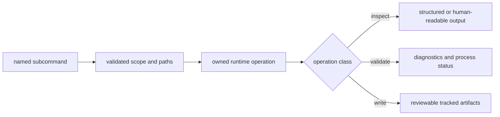

# CLI Surface

The `bijux-pollenomics` command is the canonical operational interface. Every
subcommand belongs to collection, evidence inspection, validation, or
publication, and its effect on repository state should be knowable before it
runs.



## Command Families

| Family | Commands | State effect |
| --- | --- | --- |
| capability and ownership | `surface-map`, `product-scope`, `ownership-map`, `source-support` | read-only orientation |
| animal evidence structure | `adna-layout`, `adna-runtime-manifest`, `adna-artifact-plan`, `adna-curation-manifest`, `adna-normalization-bundle` | read-only manifests and plans |
| animal evidence review | `adna-archive-projects`, `adna-domestication-coverage`, `adna-species`, `adna-species-review`, `adna-release-bar`, `adna-release-readiness` | read-only coverage and release posture |
| validation | `validate-collection-summary` | validates an existing summary without recollection |
| collection and contract refresh | `collect-data`, `refresh-data-contract-surfaces`, `refresh-animal-adna-foundation` | writes governed data and, for the animal refresh, related publication surfaces |
| publication | `report-country`, `report-multi-country-map`, `publish-reports` | writes scoped report and atlas products |

## Inspect Before Writing

```bash
bijux-pollenomics product-scope
bijux-pollenomics ownership-map
bijux-pollenomics source-support
bijux-pollenomics adna-species
bijux-pollenomics publish-reports --help
```

Help is part of the interface contract. Use the subcommand help to confirm
required inputs, defaults, and destinations before an operation that replaces
tracked state.

## Explicit Write Paths

Collection and publication should name their governed roots when reproducible
review matters:

```bash
bijux-pollenomics collect-data all --version v66 --output-root data
bijux-pollenomics publish-reports \
  --aadr-root data/aadr \
  --version v66 \
  --output-root docs/report \
  --context-root data
```

`collect-data` can replace source-family directories. `publish-reports` can
replace derived report products. Review their diffs as evidence and
publication changes respectively; a zero exit status does not by itself prove
scientific admission or unchanged output.

## Alias Command

The `pollenomics` executable forwards to the same runtime with a shorter program
name. It does not own separate handlers, defaults, evidence rules, or report
logic. Durable operational documentation and system ownership use the
canonical `bijux-pollenomics` name.

For Python imports, continue to the [API surface](api-surface.md). For safe
operation sequences, continue to [operator workflows](operator-workflows.md).
