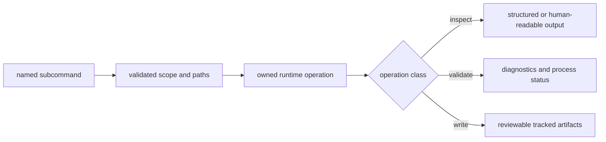

# CLI Surface

The `bijux-pollenomics` command is the canonical operational interface. Every
subcommand belongs to collection, evidence inspection, validation, or
publication, and its effect on repository state should be knowable before it
runs.



## Command Families

| Family | Commands | State effect |
| --- | --- | --- |
| capability and ownership | `surface-map`, `product-scope`, `ownership-map`, `source-support` | read-only orientation |
| animal evidence structure | `adna-layout`, `adna-runtime-manifest`, `adna-artifact-plan`, `adna-curation-manifest`, `adna-normalization-bundle` | read-only manifests and plans |
| animal evidence review | `adna-archive-projects`, `adna-domestication-coverage`, `adna-species`, `adna-species-review`, `adna-release-bar`, `adna-release-readiness` | read-only coverage and release posture |
| validation | `validate-collection-summary` | validates an existing summary without recollection |
| collection and contract refresh | `collect-data`, `refresh-data-contract-surfaces`, `refresh-animal-adna-foundation` | writes governed data and, for the animal refresh, related publication surfaces |
| publication | `report-country`, `report-multi-country-map`, `publish-reports` | writes scoped report and atlas products |

## Command Synopsis

| Form | Result |
| --- | --- |
| `collect-data <sources...>` | collect one or more source families, or `all` |
| `adna-layout --species <name>` | canonical species evidence paths |
| `adna-runtime-manifest --species <name>` | source bundles and analysis boundaries for one species |
| `adna-artifact-plan --species <name>` | deterministic species rebuild paths and governed payloads |
| `adna-curation-manifest --species <name>` | curated, pending, and rejected projects |
| `adna-normalization-bundle --species <name>` | project summaries, study summaries, lineage, and refusals |
| `adna-archive-projects [--species <name>]` | archive inventory and project-side metadata that still needs to feed sample extraction |
| `adna-domestication-coverage` | cross-species curation coverage, including thin and unsupported areas |
| `adna-species` | canonical species identity, support status, and modality matrix |
| `adna-species-review --species <name>` | product role, assignment rule, archive integrity, and project admission reviews |
| `report-country <country>` | one AADR country report bundle |
| `report-multi-country-map <countries...>` | a shared geography surface with country toggles |
| `publish-reports` | the configured world, regional, and country publication tree |

`--output-root` defaults to `data` for collection or `docs/report` for
publication. Commands with additional roots expose them in subcommand help.

## Machine-Readable Inspection

Commands with `--json` expose the same governed result as their table form,
without presentation-oriented line parsing. For example:

```bash
bijux-pollenomics source-support --json
bijux-pollenomics adna-species-review --species "Bos taurus" --json
bijux-pollenomics adna-release-readiness --species "Bos taurus" --json
```

Species arguments accept a registered alias or Latin name. The resolved Latin
name remains the stable identity in evidence paths and result payloads. JSON
output makes the contract automatable, but callers must still interpret status,
refusal, and qualification fields instead of treating record presence as
readiness.

## Inspect Before Materializing

```bash
bijux-pollenomics product-scope
bijux-pollenomics ownership-map
bijux-pollenomics source-support
bijux-pollenomics adna-species
bijux-pollenomics publish-reports --help
```

Help is part of the interface contract. Use subcommand help to confirm required
inputs, default version, country scope, and destination before an operation
that writes files.

## Materialization Boundaries

Collection and publication accept explicit roots so source data and products
can be directed to a known destination:

```bash
bijux-pollenomics collect-data all --version v66 --output-root data
bijux-pollenomics publish-reports \
  --aadr-root data/aadr \
  --version v66 \
  --output-root docs/report \
  --context-root data
```

`collect-data` acquires the selected collector-managed families and updates
their collection state. It may use the network. `publish-reports` reads the
existing AADR and context roots and materializes world, regional, and country
products. It does not collect missing source data.

| Command | Required scope | Primary result | Does not establish |
| --- | --- | --- | --- |
| `collect-data` | one or more source names, or `all` | family captures, normalized data, and collection summary | publication admission |
| `refresh-data-contract-surfaces` | data root and AADR version | collection summary and checked-in contract surfaces | new upstream acquisition |
| `report-country` | one political-entity value | one AADR country report bundle | multi-source regional synthesis |
| `report-multi-country-map` | one or more political-entity values | one named shared evidence surface with country toggles | a global or default publication |
| `publish-reports` | country list, data roots, version, and output root | current world, regional, and country publication tree | stronger precision than the inputs provide |
| `refresh-animal-adna-foundation` | species, countries, and governed roots | animal capture, normalized evidence, and dependent animal publications | refresh of collector-managed environmental families |

## Command Impact Evidence

The command name alone is not an operation record. Retain the evidence that
matches its state effect:

| Command example | Before execution | Result to retain | After execution |
| --- | --- | --- | --- |
| `product-scope` | installed distribution identity | stdout or JSON-equivalent inspection result and process status | no governed file change |
| `source-support --json` | installed distribution and requested output mode | structured support matrix and process status | no governed file change |
| `validate-collection-summary` | summary path and content identity | validation status and diagnostics | validated file remains unchanged |
| `collect-data` | selected families, version, destination, and prior collection summary | capture metadata, hashes, normalization result, and process status | compare family-owned trees and new collection summary |
| `publish-reports` | AADR root, context root, countries, version, output root, and prior manifests | publication summary, manifests, review packets, and process status | compare membership and qualifications, not only rendered files |
| `refresh-animal-adna-foundation` | species scope, evidence roots, report roots, and prior animal manifests | refresh result, validation, review, and release posture | inspect the full animal evidence and publication dependency set |

For a writer, an unchanged process status with an unexpected semantic diff is
not enough evidence of correctness. For an inspector, an empty filesystem diff
is expected and does not mean the command produced no useful result.

## Failure Semantics

Argument errors—such as an unknown subcommand, missing required species, or
unsupported source name—fail before the operation runs. Contract and input
errors fail during the owned operation. Successful validation prints the
validated summary path; successful writers print a concise materialization
summary. Callers should rely on the process status and governed artifacts, not
on the presence of an output directory left by an earlier run.

Shell success is intentionally narrower than scientific success. Exit status
zero means the handler completed its contract. An inspector may report a
blocked release in valid JSON and still exit successfully because the refusal
is the requested result. Automation must read the status fields inside review
payloads rather than converting every successful process into admission.

Conversely, a non-zero exit means the requested contract did not complete; a
directory from a previous run is not evidence of partial success. Compare the
governing manifest or summary identity before and after the invocation to
determine which state remains authoritative.

### Automation Must Read Two Statuses

| Process status | Governed result status | Interpretation |
| --- | --- | --- |
| non-zero | no accepted new result | the operation contract did not complete; inspect diagnostics and retain the prior governed identity |
| zero | admitted or ready | execution completed and the named result reports positive fitness for its declared boundary |
| zero | qualified, excluded, blocked, or refused | execution completed by producing an accountable negative or restricted scientific result |
| zero | no scientific status field | use the command-specific contract; an orientation response is not an admission decision |

Automation that checks only `$?` can publish unsupported language. Automation
that treats every refusal payload as a process failure loses a valid governed
outcome. Record the process status, parse the command's documented result
fields, and resolve the manifest or review identity before acting.

## Alias Command

The `pollenomics` executable is supplied by the compatibility distribution and
forwards to the same runtime with a shorter program name. It does not own
separate handlers, defaults, evidence rules, or report logic. Durable
operational documentation and system ownership use the canonical
`bijux-pollenomics` name.

For Python imports, continue to the [API surface](api-surface.md). For safe
operation sequences, continue to [operator workflows](operator-workflows.md).
