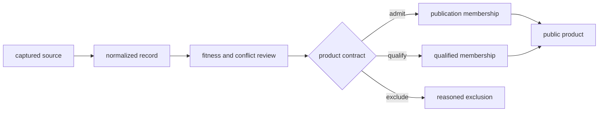

# Data Contracts

The data system distinguishes acquisition, normalization, scientific review,
publication, and transient execution. A record's location identifies its
lifecycle stage; its schema and evidence role determine what may be claimed
from it.

## Authority And Persistence

| Surface | Owns | Persistence | Does not establish |
| --- | --- | --- | --- |
| `data/<family>/raw/` | captured or source-shaped material and retrieval context | governed input | normalized comparability or publication fitness |
| `data/<family>/normalized/` | repository-owned identifiers, fields, geometry, and time semantics | governed derived evidence | admission to every product |
| `data/<family>/review/` | coverage, conflict, precision, and maturity findings | governed review evidence | universal scientific endorsement |
| `data/adna/governance/` | project, paper, supplement, sample, recovery, and admission authority | governed evidence decisions | facts absent from the governing source chain |
| `docs/report/` | versioned public membership, products, warnings, and exclusions | governed publication | authority over upstream scientific facts |
| `apis/bijux-pollenomics/v1/` | future HTTP compatibility shapes | versioned interface contract | availability of a running service |
| `artifacts/` | local logs, previews, environments, and verification output | transient | publication authority |

## Evidence Flow

Each transition must retain identifiers that lead backward. Publication may
select, qualify, or exclude; it may not manufacture missing locality,
chronology, taxonomy, or provenance.

## Cross-Family Invariants

- source identity survives normalization and downstream copying;
- missing, unresolved, approximate, substituted, and exact values remain
  distinguishable;
- direct evidence, contextual evidence, sampling context, and geographic
  framing keep different roles;
- normalized records remain addressable by stable repository-owned identity;
- review decisions state their target product and reason;
- publication membership is reproducible from governed repository state;
- replacement of a source-family tree occurs only after complete staging and
  contract validation.

## Structured Formats

| Format | Typical responsibility |
| --- | --- |
| JSON | manifests, provenance, governance, reviews, summaries, and nested evidence |
| CSV | stable tabular exchange and product members |
| GeoJSON | spatial features with evidence role, identity, and traceability properties |
| Markdown | citations, warnings, exclusions, interpretation, and human review |
| HTML | interactive presentation over governed structured inputs |

Markdown and HTML are explanatory or rendered surfaces. When a scientific
fact appears in both narrative and structured output, the owning evidence
record remains authoritative.

## Contract Anchors

- `data/collection_summary.json` records collected family status and hashes.
- `data/source_family_contracts.json` declares family roles and expected
  outputs.
- `data/source_fact_ownership_registry.json` assigns recurring facts to one
  governing surface.
- `data/evidence_artifact_contracts.json` declares recurring evidence-product
  shapes.
- `data/adna/governance/animal_sample_foundation_truth.json` records animal
  sample-foundation posture.
- `docs/report/published_reports_summary.json` inventories public bundles.
- `docs/report/repository_truth_posture.json` records cross-repository claim
  posture.

## Safe Reuse

Reuse begins with the owning contract, not with a visually convenient file.
Preserve identifiers, evidence roles, precision fields, and exclusions when
subsetting or joining. If those fields cannot travel with a derived product,
the derived product cannot inherit the original claim strength.
