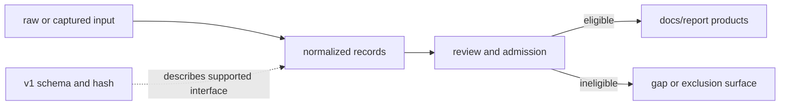

# Data Contracts

The command line reads and writes explicit repository surfaces. A path states
whether an object is captured evidence, normalized evidence, reviewed state, a
published product, an API description, or a local run artifact.

## Governing Roots

| Root | Contract | Persistence |
| --- | --- | --- |
| `data/<family>/raw/` | captured or source-shaped material | governed input state |
| `data/<family>/normalized/` | stable records for downstream use | governed derived state |
| `data/<family>/review/` | coverage, conflict, and maturity findings | governed review state |
| `data/adna/governance/` | project, paper, sample, and recovery authority | governed evidence state |
| `docs/report/` | versioned public bundles and review publications | governed publication state |
| `apis/bijux-pollenomics/v1/` | frozen OpenAPI schema and its digest | versioned interface contract |
| `artifacts/` | logs, previews, and local verification products | transient; not publication authority |

## Data Flow Invariants

- Source-family trees retain ownership; a generic merged file cannot erase
  source identity or semantics.
- Normalized records retain stable identity and a route back to captured
  evidence.
- Review outputs distinguish missing, unresolved, conflicting, and excluded
  states.
- Publication is downstream of admission and remains reproducible from the
  checked-in data state.
- Generated output written outside a governed destination has no authority
  until deliberately reviewed and admitted.
- `schema.hash` binds the pinned v1 API description to its declared bytes;
  changing the schema without changing the digest is contract drift.

## Machine-Readable Boundaries

JSON carries manifests, reviews, summaries, and structured evidence. CSV
provides tabular exchange where row semantics are stable. GeoJSON carries
geographic features with source and role metadata. Markdown and HTML explain
or render those products; they do not replace the structured authority behind
an evidence claim.

`validate-collection-summary` checks one collection ledger without recollecting
sources. `refresh-data-contract-surfaces` derives contract summaries from the
current data tree. These operations validate or derive structure; neither
upgrades weak evidence into an admissible record.

## Anchor Files

- `data/collection_summary.json`
- `data/adna/governance/animal_sample_foundation_truth.json`
- `docs/report/published_reports_summary.json`
- `docs/report/repository_truth_posture.json`
