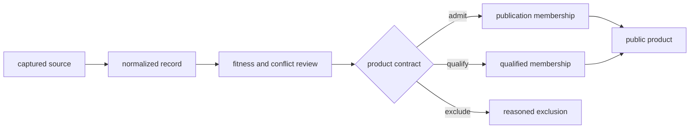

# Data Contracts

The data system distinguishes acquisition, normalization, scientific review,
publication, and transient execution. A record's location identifies its
lifecycle stage; its schema and evidence role determine what may be claimed
from it.

## Authority And Persistence

| Surface | Owns | Persistence | Does not establish |
| --- | --- | --- | --- |
| `data/<family>/raw/` | captured or source-shaped material and retrieval context | governed input | normalized comparability or publication fitness |
| `data/<family>/normalized/` | repository-owned identifiers, fields, geometry, and time semantics | governed derived evidence | admission to every product |
| `data/<family>/review/` | coverage, conflict, precision, and maturity findings | governed review evidence | universal scientific endorsement |
| `data/adna/governance/` | project, paper, supplement, sample, recovery, and admission authority | governed evidence decisions | facts absent from the governing source chain |
| `docs/report/` | versioned public membership, products, warnings, and exclusions | governed publication | authority over upstream scientific facts |
| `apis/bijux-pollenomics/v1/` | future HTTP compatibility shapes | versioned interface contract | availability of a running service |
| `artifacts/` | local logs, previews, environments, and verification output | transient | publication authority |

These roots are governing boundaries, not merely storage conventions. Moving
a file from one root to another changes neither its evidence role nor its
fitness automatically. The receiving owner must admit it through the relevant
schema, identity, lineage, and product rules.

## Contract, State, And Presentation

Three file roles recur across formats and must not be collapsed:

| Role | Purpose | Authority test |
| --- | --- | --- |
| contract | declares shape, ownership, roles, or admissible relationships | a producer and consumer can validate the same meaning before reading values |
| state | records captured facts, normalized evidence, review decisions, or product membership | stable identity and lineage resolve to the owner that produced the record |
| presentation | selects or renders governed state for a reader | every consequential value can be traced to state and its contract |

A JSON document can occupy any of these roles. Format therefore cannot answer
whether a file is authoritative. For example, an evidence contract, a sample
record, and a publication summary may all be JSON while owning different
decisions and replacement lifecycles.

## Evidence Flow

Each transition must retain identifiers that lead backward. Publication may
select, qualify, or exclude; it may not manufacture missing locality,
chronology, taxonomy, or provenance.

## Cross-Family Invariants

- source identity survives normalization and downstream copying;
- missing, unresolved, approximate, substituted, and exact values remain
  distinguishable;
- direct evidence, contextual evidence, sampling context, and geographic
  framing keep different roles;
- normalized records remain addressable by stable repository-owned identity;
- review decisions state their target product and reason;
- publication membership is reproducible from governed repository state;
- replacement of a source-family tree occurs only after complete staging and
  contract validation.

## Record Contract

A reusable record must make six properties recoverable:

| Property | Contract question |
| --- | --- |
| identity | Which stable repository record and source-native object is this? |
| lineage | Which capture, version, accession, or curation decision produced it? |
| semantics | What does each value mean in its source family and normalized form? |
| precision | Which spatial, temporal, or taxonomic detail is directly supported? |
| role | Is the record direct evidence, context, framing, a candidate, or a refusal? |
| fitness | For which named product or analysis is it admitted, qualified, or excluded? |

Omission is meaningful. A missing coordinate is different from an approximate
coordinate; an unknown chronology is different from a numeric zero; an empty
publication set is different from a failed collection. Consumers must not
collapse these states to simplify a join.

## Join Rules

Join by declared stable identifiers and verify cardinality before carrying
claims across families. Display labels, filenames, place names, rounded
coordinates, and row positions are not durable join keys. A successful
technical join does not establish scientific comparability: evidence role,
time semantics, precision, and product scope must also agree.

When a derived table denormalizes a fact, retain both the governing record
identifier and the source-family identity. If either is lost, the copied value
must be treated as presentation data rather than authoritative evidence.

Before joining across families, record the observation unit on both sides. A
project, paper, sample, site, lake, grid cell, heritage record, and country
bundle are not interchangeable merely because each has a name or coordinate.
Declare one-to-one, one-to-many, or many-to-many cardinality and retain the
unmatched population; otherwise a technically valid join can silently erase
ambiguity or inflate the denominator.

## Structured Formats

| Format | Typical responsibility |
| --- | --- |
| JSON | manifests, provenance, governance, reviews, summaries, and nested evidence |
| CSV | stable tabular exchange and product members |
| GeoJSON | spatial features with evidence role, identity, and traceability properties |
| Markdown | citations, warnings, exclusions, interpretation, and human review |
| HTML | interactive presentation over governed structured inputs |

Markdown and HTML are explanatory or rendered surfaces. When a scientific
fact appears in both narrative and structured output, the owning evidence
record remains authoritative.

## Contract Anchors

- `data/collection_summary.json` records collected family status and hashes.
- `data/source_family_contracts.json` declares family roles and expected
  outputs.
- `data/source_fact_ownership_registry.json` assigns recurring facts to one
  governing surface.
- `data/evidence_artifact_contracts.json` declares recurring evidence-product
  shapes.
- `data/adna/governance/animal_sample_foundation_truth.json` records animal
  sample-foundation posture.
- `docs/report/published_reports_summary.json` inventories public bundles.
- `docs/report/repository_truth_posture.json` records cross-repository claim
  posture.

## Safe Reuse

Reuse begins with the owning contract, not with a visually convenient file.
Preserve identifiers, evidence roles, precision fields, and exclusions when
subsetting or joining. If those fields cannot travel with a derived product,
the derived product cannot inherit the original claim strength.

Schema validation is necessary but not sufficient for safe reuse. It proves
shape and declared relationships; it does not prove source completeness,
representative sampling, historical correctness, or fitness for a question
outside the named contract.

For a reusable extract, retain the contract version, source-family identity,
record identifiers, governing manifest, selected member population, excluded
or unresolved population, spatial and temporal posture, and content hashes.
That packet makes a downstream subset reviewable even after its rows leave the
repository layout.
