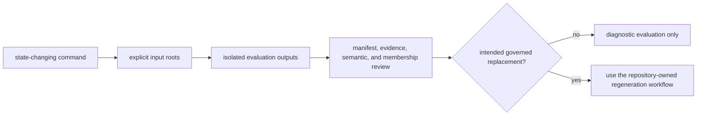

# Entrypoints and Examples

The installed `bijux-pollenomics` console script is the supported runtime
entrypoint. Commands fall into inspection, validation, collection, evidence
refresh, and publication classes. Choose the narrowest class that answers the
question because only some classes rewrite governed state.

## Discover The Interface

```bash
bijux-pollenomics --version
bijux-pollenomics --help
bijux-pollenomics collect-data --help
```

The executable resolves from the active environment. Record the reported
runtime version before creating evidence or publication artifacts.

## Verification Entry Points

```bash
bijux-pollenomics source-support --json
bijux-pollenomics adna-species
bijux-pollenomics adna-species-review --species ovis_aries --json
bijux-pollenomics adna-runtime-manifest --species ovis_aries --json
```

These commands inspect registered source or species state. They do not perform
a collection or publication refresh. Capture the command, runtime version,
explicit roots when applicable, and emitted identity so another reader can
repeat the same verification against the same state.

## Validate A Collection Ledger

```bash
bijux-pollenomics validate-collection-summary \
  --summary-path data/collection_summary.json
```

Validation checks the existing summary and is the appropriate first response
to a summary-contract question.

## Collection And Publication Examples

Use explicit isolated roots when learning a state-changing command. The
following evaluation keeps collected evidence and publications outside the
governed repository trees:

```bash
bijux-pollenomics collect-data all \
  --version v66 \
  --output-root artifacts/operator-evaluation/data

bijux-pollenomics publish-reports \
  --aadr-root artifacts/operator-evaluation/data/aadr \
  --version v66 \
  --context-root artifacts/operator-evaluation/data \
  --output-root artifacts/operator-evaluation/reports
```

`collect-data` writes source-family trees and the collection ledger under the
selected data root. `publish-reports` consumes that explicit state and writes
world, regional, country, review, and caveat products under the selected report
root. Publication does not recollect a source implicitly.



Copying selected evaluation files into governed roots is not promotion. A
governed replacement must use the owning workflow and review the complete
causal diff.

## Atlas And Country Surfaces

```bash
bijux-pollenomics report-country Sweden \
  --aadr-root artifacts/operator-evaluation/data/aadr \
  --version v66 \
  --context-root artifacts/operator-evaluation/data \
  --output-root artifacts/operator-evaluation/reports

bijux-pollenomics report-multi-country-map Sweden Norway Finland Denmark \
  --aadr-root artifacts/operator-evaluation/data/aadr \
  --version v66 \
  --context-root artifacts/operator-evaluation/data \
  --output-root artifacts/operator-evaluation/reports
```

`report-country` writes one country bundle. `report-multi-country-map` writes a
shared map for the named countries. They are narrower publication operations,
not shortcuts around the same evidence requirements.

## Mutation Boundaries

| Command family | Reads | Writes |
| --- | --- | --- |
| `source-support`, `adna-*` inspection | current governed state | standard output |
| `validate-collection-summary` | one summary file | standard output and exit status |
| `collect-data` | external sources and collector configuration | `data/` |
| `refresh-data-contract-surfaces` | current data tree | collection and contract summaries |
| `publish-reports`, `report-*` | governed data and geography configuration | `docs/report/` |

Inspect the resulting diff after every state-changing command. A successful
exit establishes command completion; the evidence and publication diffs still
require review.

The table names the repository-owned default roots. Explicit paths override
those defaults, as in the isolated examples above. Before execution, resolve
every relative path against the current working directory and record the full
input and output identities.
