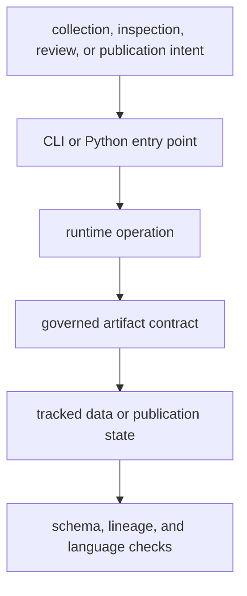

# Commands and Contracts

The runtime exposes operations through two supported interfaces: the
`bijux-pollenomics` command and the top-level `bijux_pollenomics` Python API.
Both lead to the same evidence and publication owners. Interface convenience
does not create a second scientific implementation.

## Contract Layers

| Contract | Guarantees | Reference |
| --- | --- | --- |
| CLI | named operations, explicit arguments, help, and process status | [CLI surface](cli-surface.md) |
| Python API | supported imports for collection, publication, and architecture inspection | [API surface](api-surface.md) |
| data roots | ownership and meaning of tracked source and evidence locations | [Data contracts](data-contracts.md) |
| artifacts | identity, schema, membership, and destination of emitted files | [Artifact contracts](artifact-contracts.md) |
| workflows | safe ordering for verification, refresh, and publication | [Operator workflows](operator-workflows.md) |

## Operations By Intent

| Intent | Typical interface | Repository effect |
| --- | --- | --- |
| inspect capability or ownership | `product-scope`, `ownership-map`, `source-support` | read-only structured output |
| inspect animal evidence maturity | `adna-*` review commands | read-only evidence, coverage, or release posture |
| validate collected state | `validate-collection-summary` | validation result without source refresh |
| acquire or refresh evidence | `collect-data`, `refresh-animal-adna-foundation` | replaces governed tracked data surfaces |
| derive public products | `report-country`, `report-multi-country-map`, `publish-reports` | writes governed report and atlas outputs |

Commands that write tracked state deserve explicit output roots and diff
review. Inspection commands are the safer starting point when the goal is to
understand capability or evidence posture.

The [entrypoint examples](entrypoints-and-examples.md) show concrete invocations.
Scientific meaning remains governed by the [data and evidence system](../../pollenomics-data/index.md),
not by the interface used to reach it.
