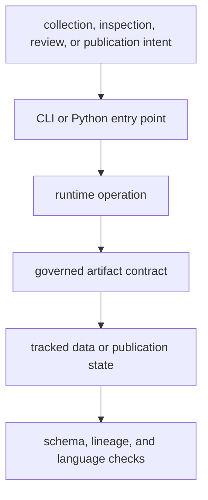

# Commands and Contracts

The runtime exposes operations through two supported interfaces: the
`bijux-pollenomics` command and the top-level `bijux_pollenomics` Python API.
Both lead to the same evidence and publication owners. Interface convenience
does not create a second scientific implementation.

## Contract Layers

| Contract | Guarantees | Reference |
| --- | --- | --- |
| CLI | named operations, explicit arguments, help, and process status | [CLI surface](cli-surface.md) |
| Python API | supported imports for collection, publication, and architecture inspection | [API surface](api-surface.md) |
| data roots | ownership and meaning of tracked source and evidence locations | [Data contracts](data-contracts.md) |
| artifacts | identity, schema, membership, and destination of emitted files | [Artifact contracts](artifact-contracts.md) |
| workflows | safe ordering for verification, refresh, and publication | [Operator workflows](operator-workflows.md) |

## Choose An Interface By Question

| Question | Begin with | What a successful result establishes |
| --- | --- | --- |
| What does the installed runtime claim? | `product-scope` | the boundary between implemented atlas work and unsupported engine claims |
| Which source families and countries are represented? | `source-support --json` | the runtime's declared support matrix, not the completeness of every source |
| Is one collection summary structurally valid? | `validate-collection-summary` | schema and cross-field validity without network access or recollection |
| What is known about one animal species? | `adna-species-review --species … --json` | the governed role, assignment rule, evidence bucket, and archive findings |
| Which files would a species rebuild own? | `adna-artifact-plan --species …` | a deterministic artifact plan without performing the rebuild |
| Can current evidence support a publication? | `adna-release-readiness --species …` | cross-surface readiness and named refusals; it does not create a publication |
| How is a public geography bundle produced? | `report-country`, `report-multi-country-map`, or `publish-reports` | materialized products under an explicit output root |

The command families distinguish inspection from materialization. Inspection
commands print current governed state. Validation commands accept or reject an
existing contract. Collection and publication commands write files. A
successful process status means the requested operation completed; it does not
turn missing evidence into a positive scientific claim.

## Stable Result Shapes

- inspection commands support either a compact table or `--json` when the
  command advertises that option;
- validation reports the path and collected-source count after the payload has
  passed its contract;
- collection reports the selected source families and writes a collection
  summary alongside family-owned data;
- publication writes manifests, subsets, traceability, and reader-facing
  products beneath the chosen report root; and
- invalid arguments and contract failures produce a non-zero process status
  instead of a partial success claim.

The [entrypoint examples](entrypoints-and-examples.md) show concrete invocations.
Scientific meaning remains governed by the [data and evidence system](../../pollenomics-data/index.md),
not by the interface used to reach it.
