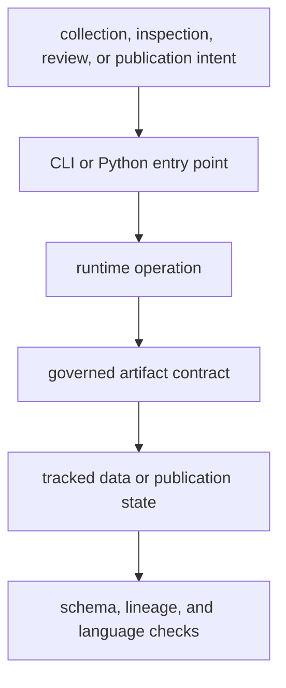
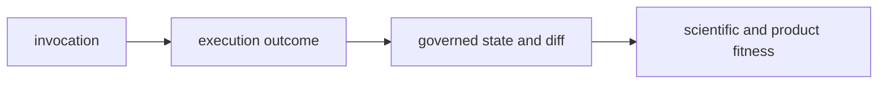

# Commands and Contracts

The runtime exposes operations through two supported interfaces: the
`bijux-pollenomics` command and the top-level `bijux_pollenomics` Python API.
Both lead to the same evidence and publication owners. Interface convenience
does not create a second scientific implementation.

Persisted files are supported consumption contracts, not a third execution
engine. The frozen OpenAPI description is narrower still: it specifies shapes
that a future HTTP adapter must preserve, but there is no server process or
deployed endpoint in the current package.

## Contract Layers

| Contract | Guarantees | Reference |
| --- | --- | --- |
| CLI | named operations, explicit arguments, help, and process status | [CLI surface](cli-surface.md) |
| Python API | supported imports for collection, publication, and architecture inspection | [API surface](api-surface.md) |
| data roots | ownership and meaning of tracked source and evidence locations | [Data contracts](data-contracts.md) |
| artifacts | identity, schema, membership, and destination of emitted files | [Artifact contracts](artifact-contracts.md) |
| workflows | safe ordering for verification, refresh, and publication | [Operator workflows](operator-workflows.md) |

## Choose An Interface By Question

| Question | Begin with | What a successful result establishes |
| --- | --- | --- |
| What does the installed runtime claim? | `product-scope` | the boundary between implemented atlas work and unsupported engine claims |
| Which source families and countries are represented? | `source-support --json` | the runtime's declared support matrix, not the completeness of every source |
| Is one collection summary structurally valid? | `validate-collection-summary` | schema and cross-field validity without network access or recollection |
| What is known about one animal species? | `adna-species-review --species … --json` | the governed role, assignment rule, evidence bucket, and archive findings |
| Which files would a species rebuild own? | `adna-artifact-plan --species …` | a deterministic artifact plan without performing the rebuild |
| Can current evidence support a publication? | `adna-release-readiness --species …` | cross-surface readiness and named refusals; it does not create a publication |
| How is a public geography bundle produced? | `report-country`, `report-multi-country-map`, or `publish-reports` | materialized products under an explicit output root |

The command families distinguish inspection from materialization. Inspection
commands print current governed state. Validation commands accept or reject an
existing contract. Collection and publication commands write files. A
successful process status means the requested operation completed; it does not
turn missing evidence into a positive scientific claim.

## Public Surface Versus Internal Reachability

Python makes many modules importable, and a repository checkout makes every
file readable. Neither fact alone creates a supported interface.

| Reachable surface | Support posture | Consumer obligation |
| --- | --- | --- |
| package-root exports | supported Python facade | pin the distribution version and honor typed results and failures |
| documented public subpackages | specialized supported composition | retain the same governed roots, evidence roles, and result contracts |
| deeper implementation modules | internal | expect layout changes and do not make them an external compatibility promise |
| governed structured files | persisted contract | consume with the owning manifest, schema, identity, and qualification |
| rendered HTML or Markdown | reader presentation | trace consequential facts to structured evidence |
| pinned OpenAPI description | frozen compatibility specification | do not assume transport availability |

This distinction lets integrators choose a durable seam without confusing
source-code visibility with a stability guarantee.

## Read A Result At Four Levels

CLI output and Python return values are only the first layer of a governed
operation. Interpret a result in this order:

| Level | Question | Evidence to retain |
| --- | --- | --- |
| invocation | what was requested? | interface, arguments, configuration, roots, and installed version |
| execution | did the software complete? | process status or typed result plus diagnostics |
| state | what was read or written? | input identity, output manifest, stable member IDs, and semantic diff |
| fitness | what may be claimed from it? | admission, qualification, refusal, warnings, and unresolved recovery work |

An execution can succeed while fitness remains qualified or refused. A caller
that keeps only standard output loses product membership; a caller that keeps
only generated files loses the request and software outcome that produced
them.

### Record Which Distribution Supplied The Runtime

The repository contains a canonical runtime distribution, a maintainer
distribution, and a compatibility distribution. Only the canonical runtime
owns scientific behavior. A reproducible invocation record therefore names:

| Field | Example role |
| --- | --- |
| executable | `bijux-pollenomics`, or the delegated `pollenomics` alias |
| distribution | installed `bijux-pollenomics` version and environment identity |
| runtime owner | `bijux_pollenomics`, regardless of which supported executable invoked it |
| governed roots | explicit `data/`, AADR, context, and report roots used by the command |
| result identity | manifest, review packet, or validation target produced or inspected |

This distinction prevents an editable checkout, a compatibility executable,
and an installed wheel from becoming three unnamed execution contexts. The
scientific result must still resolve to the same runtime owner and governed
artifact contracts.

## Stable Result Shapes

- inspection commands support either a compact table or `--json` when the
  command advertises that option;
- validation reports the path and collected-source count after the payload has
  passed its contract;
- collection reports the selected source families and writes a collection
  summary alongside family-owned data;
- publication writes manifests, subsets, traceability, and reader-facing
  products beneath the chosen report root; and
- invalid arguments and contract failures produce a non-zero process status
  instead of a partial success claim.

The [entrypoint examples](entrypoints-and-examples.md) show concrete invocations.
Scientific meaning remains governed by the [data and evidence system](../../pollenomics-data/index.md),
not by the interface used to reach it.
