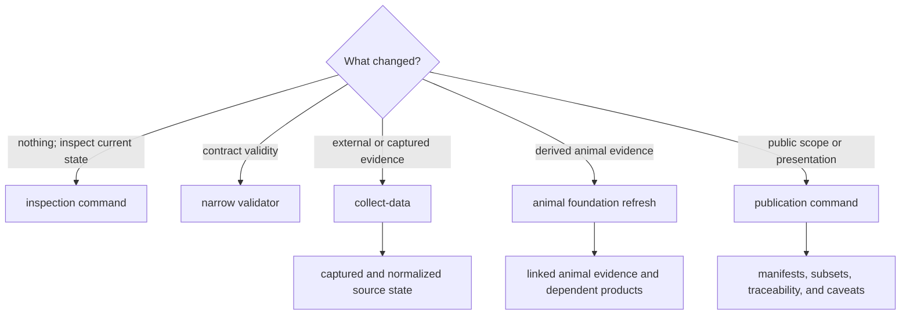

# Operator Workflows

Operations are separated by authority boundary: inspect current state, validate
a contract, collect evidence, refresh derived evidence surfaces, or publish a
product. The boundary determines network use, expected files, and what a
successful result can legitimately mean.

## Workflow Selection



## Verify Only

Inspection commands are the safest starting point for source support, species
membership, runtime manifests, and review posture. A narrow validator is
preferable when the question concerns one contract such as
`data/collection_summary.json`. Neither operation should rewrite evidence.

```bash
bijux-pollenomics source-support --json
bijux-pollenomics validate-collection-summary \
  --summary-path data/collection_summary.json
```

The first answers a capability question. The second proves that one existing
summary satisfies its structural contract. Neither demonstrates that every
upstream source is complete or every normalized record is publishable.

## Refresh Data

`collect-data` may contact external sources and replace the selected family
trees plus the collection summary. Its observable evidence should include:

- acquisition metadata, retrieval dates, licences, and source versions;
- captured and normalized hashes;
- record counts and source-specific review outputs;
- the family status and any explicit block or degraded condition.

Collection success means the pipeline completed. It does not mean every source
record is publication-ready.

A data refresh is broader than retrieval. Review the source-family contract to
determine whether the family materializes capture only, capture plus
normalization, or additional review evidence. Never infer an absent lifecycle
stage from a later publication. When only one family changed, validate and
review that family's causal descendants rather than presenting an unrelated
repository-wide rewrite as evidence of success.

## Refresh Animal Evidence

The animal foundation workflow spans project capture, sample identity,
locality, chronology, coordinate review, species normalization, and dependent
publication. Use it only when that end-to-end boundary is intended. For one
species or one review question, prefer species inspection and the narrower
governed refresh surface.

The foundation result is meaningful only when project and paper links, sample
identity, locality, chronology, coordinate basis, and admission posture remain
connected. Gap, conflict, substitution, and exclusion records are part of the
result; they are not noise to discard before reading the visible points.

## Publish Outputs

`publish-reports` reads the current governed data state and rebuilds public
world, regional, country, review, and caveat outputs. The publication can be
audited through:

- `docs/report/published_reports_summary.json` for product membership;
- geography manifests and subset validation for scope integrity;
- point traceability and source-family roles for semantic preservation;
- `docs/report/repository_truth_posture.md` and refusal surfaces for limits.

Publishing the same evidence under a new scope is a publication change, not a
source refresh. Conversely, collecting new evidence without publishing leaves
the public product unchanged.

## Interpret Completion

| Operation | Completion signal | Remaining scientific question |
| --- | --- | --- |
| inspection | requested table or JSON was emitted | is this posture sufficient for the proposed use? |
| validation | named payload passed and was identified in output | does the source content support the intended claim? |
| collection | selected families and collection summary were materialized | which records survive normalization, review, and product admission? |
| animal foundation refresh | linked evidence surfaces and dependent products were materialized | which gaps, conflicts, substitutions, or refusals remain? |
| publication | manifests and products agree under the requested scope | are the labels, denominators, precision, and caveats suitable for the audience? |

Logs can explain execution, but they do not become scientific authority. The
durable evidence is the source identity, governed records, admission decisions,
product manifests, and explicit qualifications that remain after the command
finishes.
