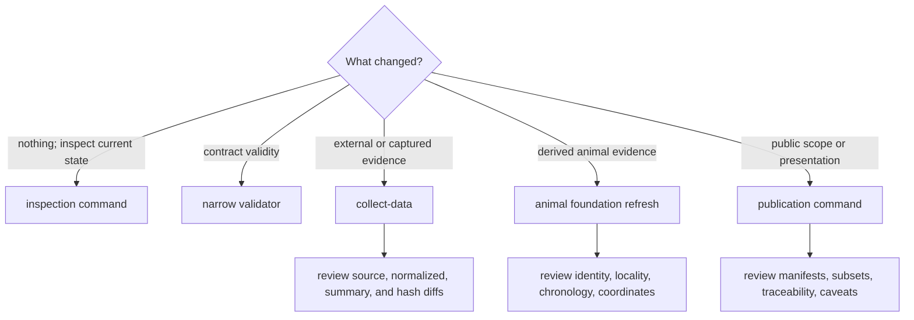

# Operator Workflows

Operations are separated by authority boundary: inspect current state, validate
a contract, collect evidence, refresh derived evidence surfaces, or publish a
product. The boundary determines expected writes and the review required after
the command finishes.

## Workflow Selection

## Inspect Or Validate

Inspection commands are the safest starting point for source support, species
membership, runtime manifests, and review posture. A narrow validator is
preferable when the question concerns one contract such as
`data/collection_summary.json`. Neither operation should rewrite evidence.

## Collect Source Families

`collect-data` may contact external sources and rewrite the selected family
trees plus the collection summary. Review:

- acquisition metadata, retrieval dates, licences, and source versions;
- captured and normalized hashes;
- record counts and source-specific review outputs;
- deletions, renames, and unexpected changes outside the selected families.

Collection success means the pipeline completed. It does not mean every source
record is publication-ready.

## Refresh Animal Evidence

The animal foundation workflow spans project capture, sample identity,
locality, chronology, coordinate review, species normalization, and dependent
publication. Use it only when that end-to-end boundary is intended. For one
species or one review question, prefer species inspection and the narrower
governed refresh surface.

Review project and paper linkages before species output, then review gap,
conflict, substitution, and exclusion ledgers before accepting new visible
points.

## Publish Products

`publish-reports` reads the current governed data state and rebuilds public
world, regional, country, review, and caveat outputs. Review:

- `docs/report/published_reports_summary.json` for product membership;
- geography manifests and subset validation for scope integrity;
- point traceability and source-family roles for semantic preservation;
- `docs/report/repository_truth_posture.md` and refusal surfaces for limits.

Publishing the same evidence under a new scope is a publication change, not a
source refresh. Conversely, collecting new evidence without publishing leaves
the public product unchanged.

## Completion Evidence

An operation is complete when its expected root changed coherently, unrelated
roots did not change, the narrow contract checks pass, and the resulting
evidence or product diff has been reviewed. Logs in `artifacts/` support that
review but do not become part of the scientific authority chain.
