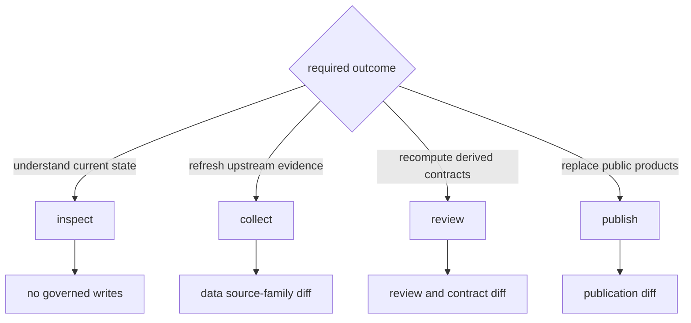

# Common Workflows

Choose a workflow by the state that must change. Inspection reads governed
state, collection replaces evidence-family state, review derives posture, and
publication replaces public products. Keeping those actions separate makes
scientific changes explainable.

## Workflow Map



## Fresh Checkout Orientation

Start with installation and read-only capability inspection:

```bash
make install
artifacts/root/check-venv/bin/bijux-pollenomics --version
artifacts/root/check-venv/bin/bijux-pollenomics product-scope
artifacts/root/check-venv/bin/bijux-pollenomics source-support
```

Then enter the documentation through the product, data, or claim you need to
understand. Do not begin with collection or `make app-state`: a fresh checkout
already contains governed evidence and reports, while those commands request
replacement of scientific state.

## Preflight A State Change

Before collection, contract refresh, or publication, record four decisions:

| Decision | Required answer |
| --- | --- |
| owner | Which source family, contract surface, or product owns the change? |
| input | Which governed version and scope will be read? |
| write boundary | Which complete tree may be replaced? |
| acceptance | Which identities, relationships, counts, warnings, and exclusions must be reviewed? |

If the write boundary cannot be named precisely, the workflow is too broad.
If acceptance is only “the command exited zero,” the scientific review is too
weak.

## Inspect Current Capability

Use read-only commands before selecting a state-changing workflow:

```bash
bijux-pollenomics product-scope
bijux-pollenomics surface-map
bijux-pollenomics source-support
bijux-pollenomics adna-species
```

These surfaces distinguish implemented capability, source-family support,
species posture, and repository ownership. They are orientation records, not a
substitute for the evidence behind one published feature.

## Refresh A Source Family

Collection should name the source family whenever a complete cross-family
refresh is unnecessary:

```bash
bijux-pollenomics collect-data neotoma --output-root data
bijux-pollenomics validate-collection-summary data/collection_summary.json
```

Review the capture, normalized records, retrieval metadata, source hashes,
counts, removals, and review findings as one causal change. A successful
download establishes acquisition; it does not establish unchanged meaning or
publication readiness.

### Data Refresh Review

Review the refresh in causal order: source identity and retrieval context,
captured payload, normalized record identities, schema and relationship
findings, coverage deltas, removals, changed precision, and downstream
admission effects. A hash change without a normalized change may be packaging;
a stable row count may still conceal member replacement or semantic change.

## Recompute Data Contracts

When governed source files already contain the intended state, contract
surfaces can be derived without recollecting sources:

```bash
bijux-pollenomics refresh-data-contract-surfaces --data-root data
```

This workflow is appropriate for summaries and contracts that are stale
relative to the checked-in tree. It must not be used to disguise an incomplete
or partially replaced source family.

## Review Animal Evidence

```bash
bijux-pollenomics adna-species-review --species ovis_aries --json
bijux-pollenomics adna-runtime-manifest --species ovis_aries --json
bijux-pollenomics adna-release-readiness --species ovis_aries --json
```

Read sample identity, project and paper lineage, locality, chronology,
coordinate basis, archive integrity, and product role together. Project-level
context cannot fill a missing sample-owned claim merely because the project is
otherwise well documented.

## Publish Governed Products

```bash
bijux-pollenomics publish-reports \
  --aadr-root data/aadr \
  --context-root data \
  --output-root docs/report \
  --countries Sweden Norway Finland Denmark
```

Publication acceptance has four parts:

1. the intended data state is already governed;
2. world, regional, and country membership follows declared scope;
3. traceability, warnings, citations, and exclusions remain connected;
4. the product diff can be explained by evidence, policy, scope, or rendering.

Those causes should never be collapsed into “the reports changed.”

### Publication Review

Begin with the publication summary and each affected bundle manifest. Compare
member identifiers before aggregate counts, then follow additions, removals,
and modified members to admission and evidence records. Finally confirm that
CSV, JSON, GeoJSON, Markdown, HTML, citations, warnings, and exclusions agree
on scope and role.

A rendering-only change is safe to describe as such only when structured
membership and meaning are unchanged. A zero-diff publication is still useful
evidence when it shows that a source or curation change did not cross the
product contract.

## Rebuild All Governed State

`make app-state` combines collection, publication, and documentation build. It
is appropriate only when all of those changes are intentional. If a stage
fails, later stages cannot be assumed current; use [failure
recovery](failure-recovery.md) to identify the last coherent boundary.
