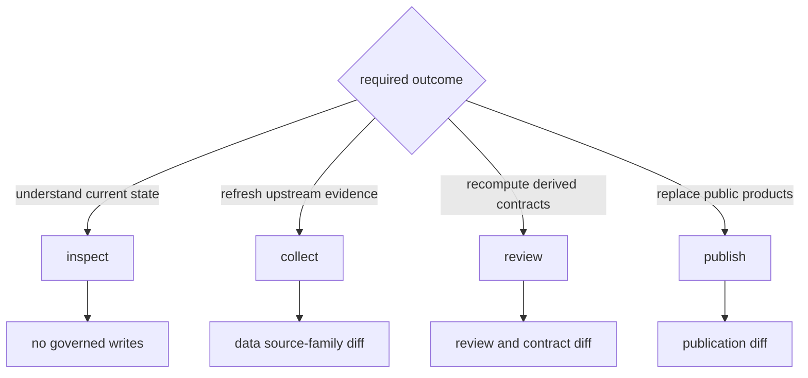

# Common Workflows

Choose a workflow by the state that must change. Inspection reads governed
state, collection replaces evidence-family state, review derives posture, and
publication replaces public products. Keeping those actions separate makes
scientific changes explainable.

## Workflow Map



## Inspect Current Capability

Use read-only commands before selecting a state-changing workflow:

```bash
bijux-pollenomics product-scope
bijux-pollenomics surface-map
bijux-pollenomics source-support
bijux-pollenomics adna-species
```

These surfaces distinguish implemented capability, source-family support,
species posture, and repository ownership. They are orientation records, not a
substitute for the evidence behind one published feature.

## Refresh A Source Family

Collection should name the source family whenever a complete cross-family
refresh is unnecessary:

```bash
bijux-pollenomics collect-data neotoma --output-root data
bijux-pollenomics validate-collection-summary data/collection_summary.json
```

Review the capture, normalized records, retrieval metadata, source hashes,
counts, removals, and review findings as one causal change. A successful
download establishes acquisition; it does not establish unchanged meaning or
publication readiness.

## Recompute Data Contracts

When governed source files already contain the intended state, contract
surfaces can be derived without recollecting sources:

```bash
bijux-pollenomics refresh-data-contract-surfaces --data-root data
```

This workflow is appropriate for summaries and contracts that are stale
relative to the checked-in tree. It must not be used to disguise an incomplete
or partially replaced source family.

## Review Animal Evidence

```bash
bijux-pollenomics adna-species-review --species ovis_aries --json
bijux-pollenomics adna-runtime-manifest --species ovis_aries --json
bijux-pollenomics adna-release-readiness --species ovis_aries --json
```

Read sample identity, project and paper lineage, locality, chronology,
coordinate basis, archive integrity, and product role together. Project-level
context cannot fill a missing sample-owned claim merely because the project is
otherwise well documented.

## Publish Governed Products

```bash
bijux-pollenomics publish-reports \
  --aadr-root data/aadr \
  --context-root data \
  --output-root docs/report \
  --countries Sweden Norway Finland Denmark
```

Publication acceptance has four parts:

1. the intended data state is already governed;
2. world, regional, and country membership follows declared scope;
3. traceability, warnings, citations, and exclusions remain connected;
4. the product diff can be explained by evidence, policy, scope, or rendering.

Those causes should never be collapsed into “the reports changed.”

## Rebuild All Governed State

`make app-state` combines collection, publication, and documentation build. It
is appropriate only when all of those changes are intentional. If a stage
fails, later stages cannot be assumed current; use [failure
recovery](failure-recovery.md) to identify the last coherent boundary.
