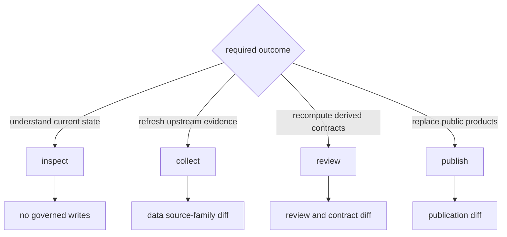
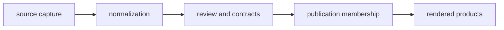

# Common Workflows

Choose a workflow by the state that must change. Inspection reads governed
state, collection replaces evidence-family state, review derives posture, and
publication replaces public products. Keeping those actions separate makes
scientific changes explainable.

## Workflow Map



## Fresh Checkout Orientation

Start with installation and read-only capability inspection:

```bash
make install
artifacts/root/check-venv/bin/bijux-pollenomics --version
artifacts/root/check-venv/bin/bijux-pollenomics product-scope
artifacts/root/check-venv/bin/bijux-pollenomics source-support
```

Then enter the documentation through the product, data, or claim you need to
understand. Do not begin with collection or `make app-state`: a fresh checkout
already contains governed evidence and reports, while those commands request
replacement of scientific state.

## Preflight A State Change

Before collection, contract refresh, or publication, record four decisions:

| Decision | Required answer |
| --- | --- |
| owner | Which source family, contract surface, or product owns the change? |
| input | Which governed version and scope will be read? |
| write boundary | Which complete tree may be replaced? |
| acceptance | Which identities, relationships, counts, warnings, and exclusions must be reviewed? |

If the write boundary cannot be named precisely, the workflow is too broad.
If acceptance is only “the command exited zero,” the scientific review is too
weak.

Capture the baseline at the same boundary that the command will own. For a
repository-root collection or publication run, a compact baseline is:

```bash
git rev-parse HEAD
git status --short -- data docs/report
bijux-pollenomics --version
```

After the operation, run the same status command and inspect the affected
manifests before opening individual rendered files. This separates changes
created by the operation from changes that were already present and keeps
review anchored to stable member identity.

## Inspect Current Capability

Use read-only commands before selecting a state-changing workflow:

```bash
bijux-pollenomics product-scope
bijux-pollenomics surface-map
bijux-pollenomics source-support
bijux-pollenomics adna-species
```

The remaining examples use `bijux-pollenomics` for readability. In a source
checkout, invoke the executable from `artifacts/root/check-venv/bin/` so the
operation uses the lock-resolved editable workspace established during setup.
An executable found elsewhere on `PATH` may be a valid installation while
still being the wrong runtime for a repository-state replacement.

These surfaces distinguish implemented capability, source-family support,
species posture, and repository ownership. They are orientation records, not a
substitute for the evidence behind one published feature.

## Refresh A Source Family

Collection should name the source family whenever a complete cross-family
refresh is unnecessary:

```bash
bijux-pollenomics collect-data neotoma --output-root data
bijux-pollenomics validate-collection-summary \
  --summary-path data/collection_summary.json
```

`--output-root` is a data root, not a scratch directory name that the command
silently relocates. Use an explicit alternate root for an isolated candidate;
use `data` only when replacement of the repository-owned collection state is
intended.

Review the capture, normalized records, retrieval metadata, source hashes,
counts, removals, and review findings as one causal change. A successful
download establishes acquisition; it does not establish unchanged meaning or
publication readiness.

For an upstream source whose payload or normalization behavior may have
changed, build an isolated candidate first:

```bash
bijux-pollenomics collect-data neotoma \
  --output-root artifacts/neotoma-collection-candidate
bijux-pollenomics validate-collection-summary \
  --summary-path artifacts/neotoma-collection-candidate/collection_summary.json
```

The candidate can establish acquisition and contract behavior without
replacing `data/neotoma/`. It cannot be copied piecemeal into the governed
tree. After review, rerun the same bounded collection against `data/` so the
runtime performs its complete owned replacement and regenerates the root
summary consistently.

### Data Refresh Review

Review the refresh in causal order: source identity and retrieval context,
captured payload, normalized record identities, schema and relationship
findings, coverage deltas, removals, changed precision, and downstream
admission effects. A hash change without a normalized change may be packaging;
a stable row count may still conceal member replacement or semantic change.

## Propagate Invalidation Forward

An accepted change invalidates the downstream decisions that depend on it. It
does not automatically invalidate upstream evidence or authorize recollection.



| Changed boundary | Re-evaluate | Do not assume |
| --- | --- | --- |
| capture identity or payload | normalization, review, contracts, publication, and rendering | equal byte size or row count means equal evidence |
| normalization rule or member identity | review, comparison contracts, publication, and rendering | the source must be recollected |
| review or admission policy | product membership, warnings, exclusions, and rendering | normalized evidence changed |
| publication scope or membership | every format in the affected bundle | capture or normalization changed |
| rendering only | presentation parity and links | scientific membership needs rebuilding |

Follow the dependency direction and stop when the semantic diff no longer
propagates. This keeps a typography correction from becoming an evidence
refresh and prevents a source change from being accepted after only the final
HTML looks plausible.

## Recompute Data Contracts

When governed source files already contain the intended state, contract
surfaces can be derived without recollecting sources:

```bash
bijux-pollenomics refresh-data-contract-surfaces --data-root data
```

This workflow is appropriate for summaries and contracts that are stale
relative to the checked-in tree. It must not be used to disguise an incomplete
or partially replaced source family.

## Review Animal Evidence

```bash
bijux-pollenomics adna-species-review --species ovis_aries --json
bijux-pollenomics adna-runtime-manifest --species ovis_aries --json
bijux-pollenomics adna-release-readiness --species ovis_aries --json
```

Read sample identity, project and paper lineage, locality, chronology,
coordinate basis, archive integrity, and product role together. Project-level
context cannot fill a missing sample-owned claim merely because the project is
otherwise well documented.

## Publish Governed Products

```bash
bijux-pollenomics publish-reports \
  --aadr-root data/aadr \
  --context-root data \
  --output-root docs/report \
  --countries Sweden Norway Finland Denmark
```

Publication acceptance has four parts:

1. the intended data state is already governed;
2. world, regional, and country membership follows declared scope;
3. traceability, warnings, citations, and exclusions remain connected;
4. the product diff can be explained by evidence, policy, scope, or rendering.

Those causes should never be collapsed into “the reports changed.”

The `--aadr-root` and `--version` pair select the release, `--context-root`
selects normalized context evidence, and `--output-root` owns the publication
tree. A correct country list with the wrong root pair is still the wrong
publication. Prefer explicit roots in retained commands even when they match
the defaults.

Publication can likewise be rehearsed beneath `artifacts/` with the real
governed inputs. Review the candidate manifest and structured membership before
running the governed publication. A candidate path is diagnostic state: cite
the accepted `docs/report/` product, not the rehearsal, after the governed
replacement and review succeed.

### Publication Review

Begin with the publication summary and each affected bundle manifest. Compare
member identifiers before aggregate counts, then follow additions, removals,
and modified members to admission and evidence records. Finally confirm that
CSV, JSON, GeoJSON, Markdown, HTML, citations, warnings, and exclusions agree
on scope and role.

A rendering-only change is safe to describe as such only when structured
membership and meaning are unchanged. A zero-diff publication is still useful
evidence when it shows that a source or curation change did not cross the
product contract.

## Retain An Operation Ledger

For any accepted state change, retain a compact ledger beside the review
evidence. It should be sufficient to explain the result without reconstructing
the terminal session:

| Ledger field | Record |
| --- | --- |
| operation | command or Python entry point, arguments, configuration, and runtime version |
| scope | selected source families, species, geographies, and explicit roots |
| prior identity | repository revision, source release, or prior manifest used as the baseline |
| resulting identity | collection summary, product manifest, and stable output members |
| causal diff | changed source identity, records, semantics, precision, policy, membership, or rendering |
| disposition | accepted, qualified, refused, or recovery-bound records and the reason for each class |
| verification | narrow checks performed against the resulting owned boundary |

The ledger is an index into governed evidence, not a replacement for it. A row
count without member identities cannot show replacement; a file hash without a
semantic diff cannot show whether scientific meaning changed.

## Rebuild All Governed State

`make app-state` combines collection, publication, and documentation build. It
is appropriate only when all of those changes are intentional. If a stage
fails, later stages cannot be assumed current; use [failure
recovery](failure-recovery.md) to identify the last coherent boundary.

The combined command is sequential rather than a repository-wide transaction.
An earlier source-family replacement can succeed even when a later publication
or documentation build fails. Review and recover each owned boundary by its
manifest and diff instead of assuming the entire checkout rolled back.
