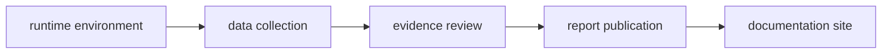

# Common Workflows

Workflows are selected by the state that must change. Installation changes the
local environment, collection changes governed evidence, publication changes
public products, and a full application-state refresh changes all three in
sequence.

## Fresh Checkout

1. Run `make install`.
2. Confirm the console script with
   `artifacts/root/check-venv/bin/bijux-pollenomics --version`
3. Inspect a read-only surface such as
   `artifacts/root/check-venv/bin/bijux-pollenomics source-support`.

Expected writes are limited to installation and run artifacts. Governed data
and reports should remain unchanged.

## Data Refresh Review

1. Record the current `data/collection_summary.json` version and hashes.
2. Run `make data-prep`, or invoke `collect-data` for named source families.
3. Inspect changed `raw/`, `normalized/`, and `review/` surfaces separately.
4. Compare retrieval metadata, licences, hashes, record counts, and deletions.
5. Validate the collection summary without recollecting:
   `bijux-pollenomics validate-collection-summary`.

Source retrieval may succeed while normalization or review exposes weaker
coverage. Preserve that result as an explicit review state; do not describe
pipeline completion as publication readiness.

## Publication Review

1. Confirm that the intended collection state is already checked in.
2. Run `make reports`, `publish-reports`, or a narrower `report-*` command.
3. Inspect `docs/report/published_reports_summary.json` and changed manifests.
4. Verify world-to-region-to-country subset lineage.
5. Review point traceability, warnings, exclusions, ranking sensitivity, and
   `docs/report/repository_truth_posture.md`.

The report diff must explain whether change came from evidence, geographic
selection, product rules, or rendering. These causes are not interchangeable.

## Species Evidence Review

1. Inspect `adna-species-review --species <name> --json`.
2. Inspect the species runtime manifest and normalized evidence files.
3. Follow project links for locality and chronology authority.
4. Review coordinate posture and archive-integrity findings.
5. Use the end-to-end animal refresh only when capture, normalization, and
   dependent publication are all intentionally in scope.

## Full Local Rebuild

`make app-state` spans source refresh, publication, and site state. Review each
governed root as a separate causal unit:

If an upstream stage fails, do not assume later roots are current. Preserve the
logs under `artifacts/`, inspect partial changes, and rerun only after the
governed state is understood.
