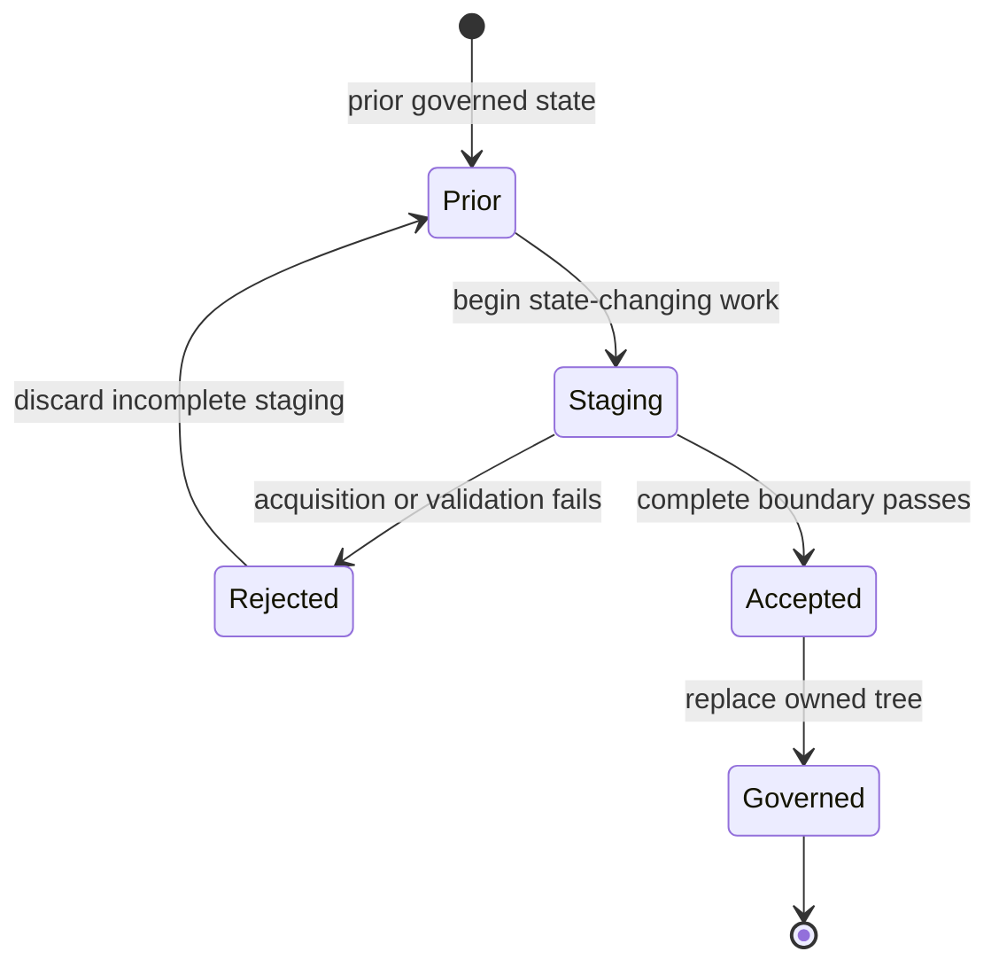
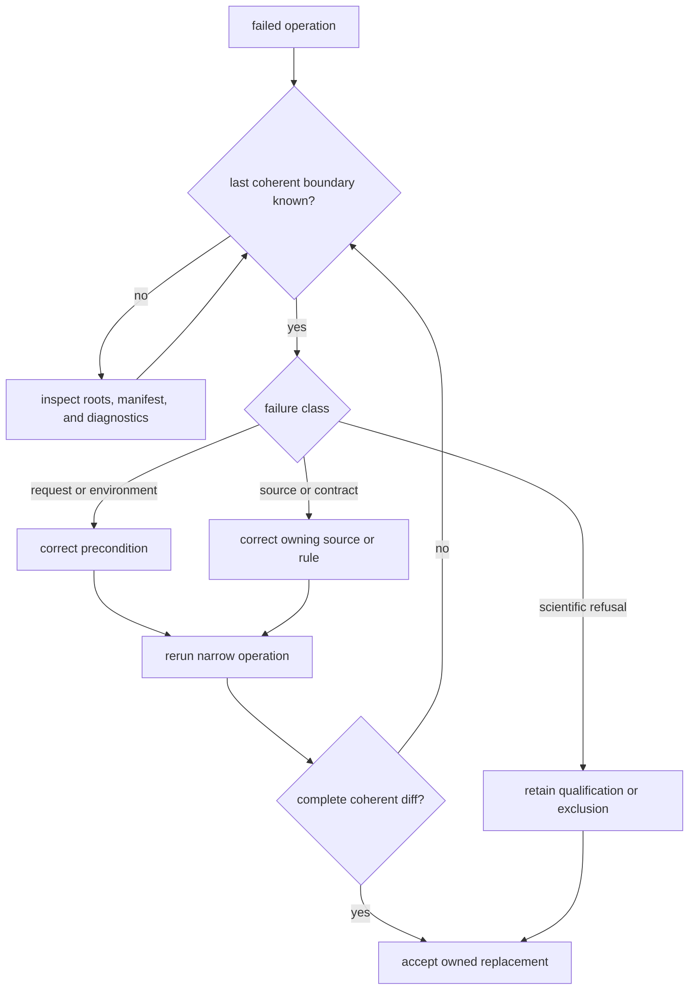

# Failure Recovery

Recovery begins by identifying the last coherent governed state. Retrying a
broad workflow before that boundary is known can enlarge the diff, obscure the
cause, and make partial output look authoritative.

## Locate The Failed Boundary

| Symptom | Likely boundary | State to inspect |
| --- | --- | --- |
| command rejected arguments | parsing or precondition | no governed write should have occurred |
| source capture failed | network, identity, license, or upstream format | staged capture and prior governed family tree |
| normalization failed | source semantics or schema | raw capture, normalized staging, and review findings |
| contract refresh failed | inconsistent governed tree | collection summary and family contracts |
| publication failed | admission, scope, traceability, or rendering | publication staging and previous `docs/report/` tree |
| claim gate refused output | evidence or language exceeded the declared contract | refusal, exclusion, readiness, and truth-posture records |

Collectors and publishers use staging so a failed boundary can preserve the
previous governed tree. Confirm that preservation explicitly; do not infer it
from a single successful log line.

## Failure Questions

Answer these questions before retrying:

1. Which command, inputs, scope, and explicit roots were used?
2. Did failure occur before staging, during candidate construction, during
   validation, or during replacement?
3. Which path owns the incomplete work, and is it governed or transient?
4. Does the previous manifest still resolve every governed member?
5. Is the failure operational, a contract inconsistency, or a valid
   scientific refusal?
6. What is the narrowest operation that can demonstrate recovery?

This separates a retryable transport failure from a source-semantic change or
an evidence gap. The same symptom—such as a missing output—can require a very
different response at each boundary.

## Recovery Procedure

1. Stop at the first failed boundary.
2. Preserve the error and transient diagnostics under `artifacts/`.
3. Inspect tracked changes only within the operation's declared write root.
4. Compare the current tree with the last coherent manifest, hashes, counts,
   and membership.
5. Correct the owning source, contract, evidence decision, or publication rule.
6. Rerun the narrow operation and review its complete output before expanding
   scope.

## Recovery Route

Do not manually splice a subset of staged files into a governed tree. That
breaks the atomic boundary and can leave a manifest describing members that do
not exist. Repair the owner or input, then let the narrow operation rebuild and
validate its complete candidate state.

## Scientific Failure Modes

Some failures are valid evidence outcomes rather than software defects:

- a paper is known but its sample-bearing supplement is unavailable;
- a project is recoverable but a sample cannot be linked to a named site;
- chronology exists only at project level;
- a coordinate is too broad for exact-point publication;
- a contextual source cannot support the direct claim requested;
- a known candidate falls outside the product's geographic or evidence scope.

Preserve these states as qualified records, recovery work, or reasoned
exclusions. Replacing them with inferred values would make the workflow appear
successful by weakening the evidence.

## When A Broader Rebuild Is Safe

A broader rebuild is appropriate after the failed owner is understood, the
previous governed state is confirmed, and the narrow operation produces a
coherent reviewable diff. It is not a recovery mechanism for uncertainty about
which boundary failed.

After recovery, preserve enough evidence to explain the incident: the failing
operation and scope, diagnostics, affected owner, whether prior state was
retained, the correction, and the manifest or review evidence that established
coherence. Transient details belong under `artifacts/`; lasting scientific
qualifications belong with their governed evidence.
