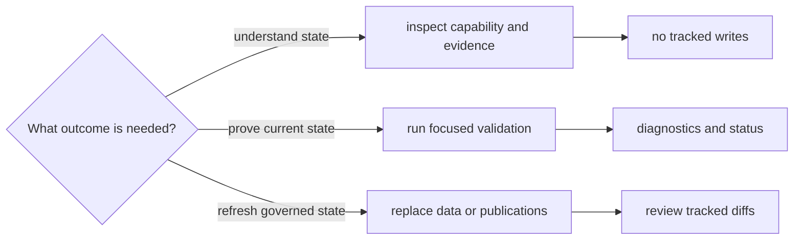

# Install, Verify, And Rebuild

Repository operations fall into three classes: inspection, validation, and
state replacement. Choosing the class before choosing the command prevents a
review request from accidentally becoming a data or publication rebuild.

## Operation Classes

| Class | Typical operations | Expected effect |
| --- | --- | --- |
| inspection | `product-scope`, `ownership-map`, `source-support`, `adna-species` | prints current contracts or evidence posture |
| validation | lock checks, focused tests, strict documentation build, collection-summary validation | reports drift or defects without source refresh |
| data refresh | `collect-data`, animal foundation refresh, contract-surface refresh | replaces governed files under `data/` and related review surfaces |
| publication rebuild | country, multi-country, and complete report publication | replaces derived products under `docs/report/` |

Data and report rebuilds are intentionally state-changing. They may require
network access, take longer than focused checks, and produce large tracked
diffs. A rebuild is appropriate when refreshed governed output is the desired
result—not as a default proof that unrelated code or prose is correct.

## Supported Routes

| Outcome | Route |
| --- | --- |
| create the locked local environment | [Installation and setup](installation-and-setup.md) |
| choose the narrowest inspect, validate, refresh, or publication path | [Common workflows](common-workflows.md) |
| recover from an interrupted or failed operation | [Failure recovery](failure-recovery.md) |
| distinguish supported automation from scientific inference | [Operational boundaries](operational-boundaries.md) |
| inspect exact subcommands and write effects | [CLI surface](../interfaces/cli-surface.md) |
| understand the proof behind a published claim | [Verification evidence](../quality/test-strategy.md) |

Every state-changing operation ends with the same obligation: inspect the
resulting files as evidence or publication changes, then run the checks that
govern that surface. Successful execution is necessary; a coherent and honest
diff is the acceptance criterion.
