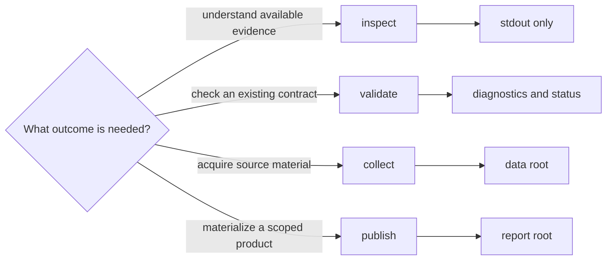
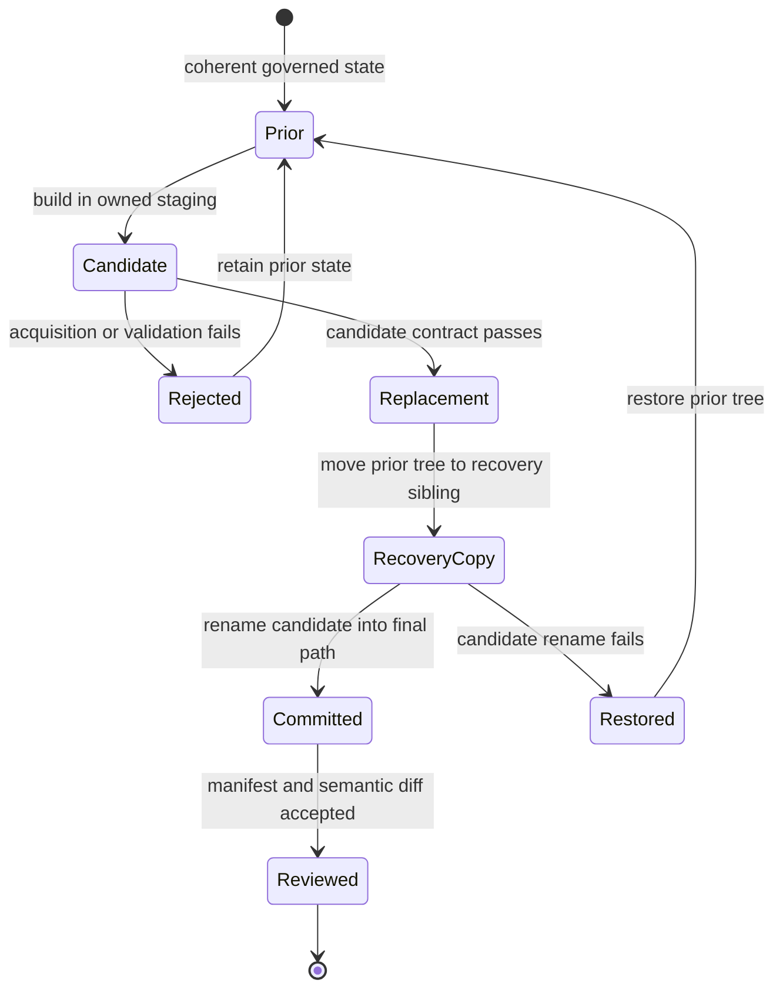

# Install, Verify, And Rebuild

Pollenomics operations fall into four classes: inspect, validate, collect, and
publish. The class tells you whether a command needs the network, which files
it can create, and what its success can prove.

## Operation Classes

| Class | Typical operations | Network | Expected effect |
| --- | --- | --- | --- |
| inspection | `product-scope`, `source-support`, `adna-species-review` | no | prints current contracts or evidence posture |
| validation | `validate-collection-summary` | no | accepts or rejects an existing summary without recollection |
| collection | `collect-data` | normally yes | captures and normalizes selected source families under a data root |
| contract materialization | `refresh-data-contract-surfaces` | no | derives collection contracts from the current data tree |
| publication | country, multi-country, and complete report commands | no when inputs are local | writes scoped products beneath a report root |
| animal foundation refresh | `refresh-animal-adna-foundation` | may use the network | refreshes linked animal evidence and its dependent publications |

The important boundary is not whether a command feels small. It is whether the
command owns a governed write. A one-source collection and a one-country report
are still replacements of complete owned products; a broad inspection remains
read-only even when it traverses many records.

Collection and publication are intentionally state-changing. Use inspection
or validation when the question can be answered from current state. Use a
writer only when acquiring evidence or materializing a product is the intended
outcome.

## State-Change Contract

A state-changing operation is accepted as a complete owned replacement, not as
a collection of individually plausible files. Collection and publication build
a candidate in a sibling staging directory before replacement:

| Boundary | Required evidence |
| --- | --- |
| prior | resolvable manifest or complete owned tree at a known revision |
| candidate | explicit input identity, scope, destination, and diagnostics |
| replacement | complete candidate, known final destination, and a recovery sibling protecting the prior tree during the final rename |
| commit | replacement completed and the new manifest resolves every governed member |
| review | identity, meaning, precision, membership, warning, and exclusion diff |

Do not copy a few successful candidate files into a governed tree after a
failed operation. That can pair a new member with an old manifest or leave a
derived product ahead of its evidence. Recover at the failed owner and rebuild
the narrow complete boundary.

The implementation protects the prior tree during candidate construction and
final replacement. It moves the prior tree to a recovery sibling, promotes the
candidate, and removes recovery state only after promotion succeeds. If the
candidate rename fails, the prior tree is restored before the error returns.
This is one owned-tree replacement, not a transaction spanning several source
families or later publication work.

## Three Meanings Of Success

Operational success, contract validity, and scientific acceptance are distinct:

| Result | What it establishes | What it does not establish |
| --- | --- | --- |
| process success | the command completed its implemented execution path | that the inputs were the intended inputs |
| contract validity | required members, schemas, references, and manifests agree | that every admissible record is scientifically persuasive |
| scientific acceptance | the reviewed evidence, qualifications, exclusions, and product role support the intended claim | that a broader claim is now justified |

A release or publication decision needs all three at the applicable boundary.
Treat warnings and explicit refusals as part of the result: they explain where
the system declined to convert available context into a stronger claim.

## Supported Routes

| Outcome | Route |
| --- | --- |
| install the package or create the locked contributor environment | [Installation and setup](installation-and-setup.md) |
| choose the narrowest inspect, validate, collection, or publication path | [Common workflows](common-workflows.md) |
| recover from an interrupted or failed operation | [Failure recovery](failure-recovery.md) |
| distinguish supported automation from scientific inference | [Operational boundaries](operational-boundaries.md) |
| inspect exact subcommands and write effects | [CLI surface](../interfaces/cli-surface.md) |
| understand the proof behind a published claim | [Verification evidence](../quality/test-strategy.md) |

Every state-changing result should be read through its manifest, source
identity, counts, qualifications, and refusals. A zero process status means the
software contract completed. Scientific acceptance still depends on the
evidence and product contracts represented in the output.
