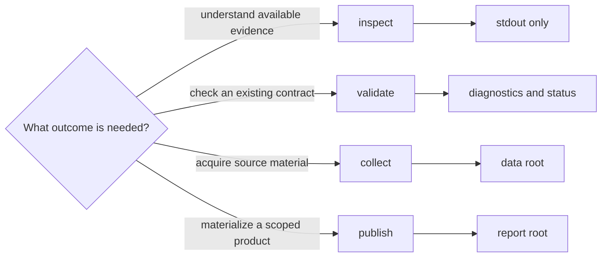

# Install, Verify, And Rebuild

Pollenomics operations fall into four classes: inspect, validate, collect, and
publish. The class tells you whether a command needs the network, which files
it can create, and what its success can prove.

## Operation Classes

| Class | Typical operations | Network | Expected effect |
| --- | --- | --- | --- |
| inspection | `product-scope`, `source-support`, `adna-species-review` | no | prints current contracts or evidence posture |
| validation | `validate-collection-summary` | no | accepts or rejects an existing summary without recollection |
| collection | `collect-data` | normally yes | captures and normalizes selected source families under a data root |
| contract materialization | `refresh-data-contract-surfaces` | no | derives collection contracts from the current data tree |
| publication | country, multi-country, and complete report commands | no when inputs are local | writes scoped products beneath a report root |
| animal foundation refresh | `refresh-animal-adna-foundation` | may use the network | refreshes linked animal evidence and its dependent publications |

Collection and publication are intentionally state-changing. Use inspection
or validation when the question can be answered from current state. Use a
writer only when acquiring evidence or materializing a product is the intended
outcome.

## Supported Routes

| Outcome | Route |
| --- | --- |
| install the package or create the locked contributor environment | [Installation and setup](installation-and-setup.md) |
| choose the narrowest inspect, validate, collection, or publication path | [Common workflows](common-workflows.md) |
| recover from an interrupted or failed operation | [Failure recovery](failure-recovery.md) |
| distinguish supported automation from scientific inference | [Operational boundaries](operational-boundaries.md) |
| inspect exact subcommands and write effects | [CLI surface](../interfaces/cli-surface.md) |
| understand the proof behind a published claim | [Verification evidence](../quality/test-strategy.md) |

Every state-changing result should be read through its manifest, source
identity, counts, qualifications, and refusals. A zero process status means the
software contract completed. Scientific acceptance still depends on the
evidence and product contracts represented in the output.
