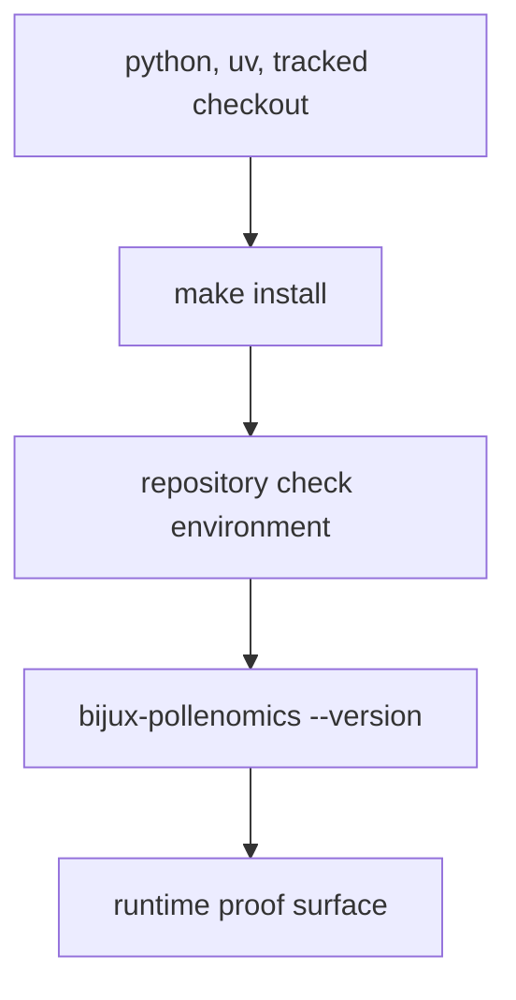

# Installation and Setup

The supported setup path is repository-first.

That means the repository checkout itself is the supported environment. The aim
is not to chase every possible Python invocation. The aim is to reach the
known-good command path quickly and then stay on it.

## Setup Model



The point is to reach a known-good local command path quickly.

## Expected Prerequisites

- Python 3.11
- `uv`
- a checkout that includes tracked `data/`, `docs/`, and `apis/` surfaces

## Recommended Setup Flow

```bash
make install
artifacts/root/check-venv/bin/bijux-pollenomics --version
```

`make install` creates the editable repository environment used for package,
docs, and verification work. Treat that environment as the supported local
entrypoint before troubleshooting command behavior elsewhere.

## Typical Rebuild Path

```bash
artifacts/root/check-venv/bin/bijux-pollenomics collect-data all --output-root data
artifacts/root/check-venv/bin/bijux-pollenomics publish-reports --aadr-root data/aadr --context-root data --output-root docs/report --countries Sweden Norway Finland Denmark
```

## First Proof Check

- `make install`
- `artifacts/root/check-venv/bin/bijux-pollenomics --version`
- `packages/bijux-pollenomics/tests/`

If those three checks are not working, it is too early to trust broader rebuild
results.
