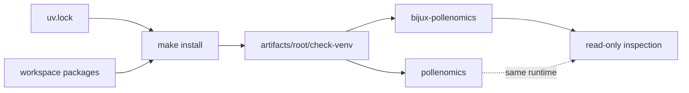

# Installation And Setup

The supported local environment is created from the repository lock and kept
under `artifacts/`. Installation prepares the command surface without
refreshing governed evidence or rebuilding public reports.

## Prerequisites

- Python 3.11;
- `uv` available on `PATH`;
- a complete checkout containing `data/`, `docs/`, `apis/`, and `uv.lock`.

From the repository root:

```bash
python3.11 --version
uv --version
make install
artifacts/root/check-venv/bin/bijux-pollenomics --version
```

`make install` creates or refreshes the editable locked environment at
`artifacts/root/check-venv/`. The command does not collect sources or publish
reports.


```mermaid
flowchart LR
    Lock["uv.lock"] --> Install["make install"]
    Packages["workspace packages"] --> Install
    Install --> Environment["artifacts/root/check-venv"]
    Environment --> Canonical["bijux-pollenomics"]
    Environment --> Alias["pollenomics"]
    Canonical --> Inspect["read-only inspection"]
    Alias -. "same runtime" .-> Inspect
```

## Confirm The Environment

These commands inspect installed identity and repository posture without
rewriting governed data or reports:

```bash
artifacts/root/check-venv/bin/bijux-pollenomics --version
artifacts/root/check-venv/bin/bijux-pollenomics product-scope
artifacts/root/check-venv/bin/bijux-pollenomics source-support
artifacts/root/check-venv/bin/bijux-pollenomics ownership-map
```

The two console scripts must report the same runtime behavior. A difference
between them is a compatibility defect, not an optional package variation.

## Understand Write Scope Before Execution

| Operation | Expected writes | Network access |
| --- | --- | --- |
| installation | transient environment under `artifacts/` | package resolution may require it when caches are incomplete |
| inspection commands | none | no |
| collection | governed source-family state under `data/` | usually yes |
| data-contract refresh | summaries derived from the current `data/` tree | no collection required |
| publication | governed products under `docs/report/` | no, when required data is present |
| documentation build | rendered site under `artifacts/` | no |

Do not use collection or publication as an installation check: both are
state-changing scientific workflows. Continue with [common
workflows](common-workflows.md) only when changing those governed surfaces is
the intended outcome.

## Troubleshooting Setup

If installation fails, keep the diagnosis at the environment boundary:

1. confirm the Python and `uv` versions;
2. confirm the checkout includes the lock and all workspace packages;
3. inspect the installation error before invoking any data command;
4. recreate only transient state under `artifacts/` when needed.

A failed environment setup does not justify changing tracked data, reports, or
the lock file.
