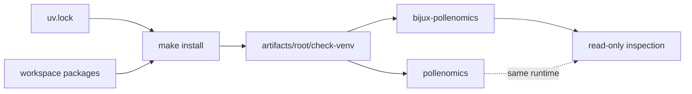

# Installation And Setup

Install the runtime package to inspect contracts or work with evidence from
Python. Use the locked repository environment when reproducing the checked-in
data and publication workflows. Neither installation route collects evidence
or builds reports by itself.

## Install The Runtime

Python 3.11 or later is required:

```bash
python3.11 -m venv .venv
.venv/bin/python -m pip install --upgrade pip
.venv/bin/python -m pip install bijux-pollenomics
.venv/bin/bijux-pollenomics --version
```

This route installs the canonical `bijux_pollenomics` import package and
`bijux-pollenomics` command. Install `pollenomics` only when an application
needs the compatibility import or shorter executable; it depends on the
canonical distribution and does not contain a second scientific engine.

Choose the installation by the work being performed:

| Context | Installation | Governed repository state available? |
| --- | --- | --- |
| application integration | released `bijux-pollenomics` distribution | only when supplied separately |
| compatibility integration | released `pollenomics` distribution and its canonical dependency | only when supplied separately |
| reproducible repository work | locked editable workspace via `make install` | yes, from the checkout |

An installed wheel can expose every runtime interface while having no local
data release or publication tree. Package identity and evidence identity must
therefore be recorded separately.

The package metadata describes the current runtime as alpha software. Treat
the command and Python contracts as versioned integration surfaces, while
treating the checked-in data and publications as separately versioned evidence
products. Upgrading the wheel does not upgrade a captured source tree, and
copying a newer data tree does not establish which runtime produced it.

## Reproduce The Repository Environment

The source checkout requires Python 3.11, `uv`, `uv.lock`, and all three
workspace packages. From the repository root:

```bash
python3.11 --version
uv --version
make install
artifacts/root/check-venv/bin/bijux-pollenomics --version
```

`make install` creates or refreshes an editable, lock-resolved environment at
`artifacts/root/check-venv/`. This is the supported route for reproducing the
checked-in data and report workflows.


```mermaid
flowchart LR
    Lock["uv.lock"] --> Install["make install"]
    Packages["workspace packages"] --> Install
    Install --> Environment["artifacts/root/check-venv"]
    Environment --> Canonical["bijux-pollenomics"]
    Environment --> Alias["pollenomics"]
    Canonical --> Inspect["read-only inspection"]
    Alias -. "same runtime" .-> Inspect
```

## Confirm Runtime Identity

These commands inspect installed identity and repository posture without
rewriting governed data or reports:

```bash
artifacts/root/check-venv/bin/bijux-pollenomics --version
artifacts/root/check-venv/bin/bijux-pollenomics product-scope
artifacts/root/check-venv/bin/bijux-pollenomics source-support
artifacts/root/check-venv/bin/bijux-pollenomics ownership-map
```

When the compatibility distribution is installed, its console script must
report the same runtime behavior. A difference is a compatibility defect, not
an optional scientific variation.

For a result that may be reviewed later, retain the runtime and checkout
identity before executing a writer:

```bash
artifacts/root/check-venv/bin/bijux-pollenomics --version
git rev-parse HEAD
git status --short
```

The revision identifies tracked inputs, while `git status --short` exposes
local evidence or report changes that the revision alone cannot identify. A
clean status is not mandatory, but unexplained pre-existing changes make a
later causal diff ambiguous.

## Understand Relative Roots

Default data and report roots are relative to the current working directory:

| Default | Meaning |
| --- | --- |
| `data/` | collector-managed context and animal evidence state |
| `data/aadr/v66/` | default AADR release input |
| `docs/report/` | default publication destination |
| Sweden, Norway, Finland, Denmark | default country publication scope |

The effective default AADR input is `data/aadr/v66/`: `data/aadr/` is the
`--aadr-root`, and `v66` is the default `--version`. Record both values when a
different release is selected; a path without its release identity is
insufficient provenance.

Run repository workflows from the checkout root, or pass every relevant root
explicitly. Otherwise a valid command can read or write a different tree than
the one you intended.

To establish context in a source checkout:

```bash
git rev-parse --show-toplevel
git status --short --branch
artifacts/root/check-venv/bin/bijux-pollenomics product-scope
artifacts/root/check-venv/bin/bijux-pollenomics source-support
```

The Git commands identify the checkout; the runtime commands identify declared
product and source capability. Neither proves that a source family is complete
or a product is current. That evidence lives in collection summaries,
readiness records, and publication manifests.

## Understand Write Scope Before Execution

| Operation | Expected writes | Network access |
| --- | --- | --- |
| installation | transient environment under `artifacts/` | package resolution may require it when caches are incomplete |
| inspection commands | none | no |
| collection | governed source-family state under `data/` | usually yes |
| data-contract refresh | summaries derived from the current `data/` tree | no collection required |
| publication | governed products under `docs/report/` | no, when required data is present |
| documentation build in a source checkout | rendered site under `artifacts/` | no |

Do not use collection or publication as an installation check. The read-only
`--version`, `product-scope`, and `source-support` commands establish that the
runtime is installed without changing scientific state.

For a write-path rehearsal, direct the complete owned result to a new path
under `artifacts/` and inspect its manifests there. Do not point a rehearsal at
`data/` or `docs/report/`: publication and collection writers own their
destinations as replaceable trees, not as append-only folders.

## Troubleshooting Setup

If source installation fails, keep the diagnosis at the environment boundary:

1. confirm the Python and `uv` versions;
2. confirm the checkout includes the lock and all workspace packages;
3. inspect the installation error before invoking any data command;
4. recreate only transient state under `artifacts/` when needed.

A failed environment setup does not justify changing governed data or reports.
Changing the lock is a dependency decision, not a recovery technique.

If the console script exists but imports fail, verify that the script belongs
to `artifacts/root/check-venv/` and that the checkout still contains all three
workspace packages. Do not work around the package boundary by adding source
directories to `PYTHONPATH`; that can conceal a broken installation and test a
different import graph from the supported environment.
