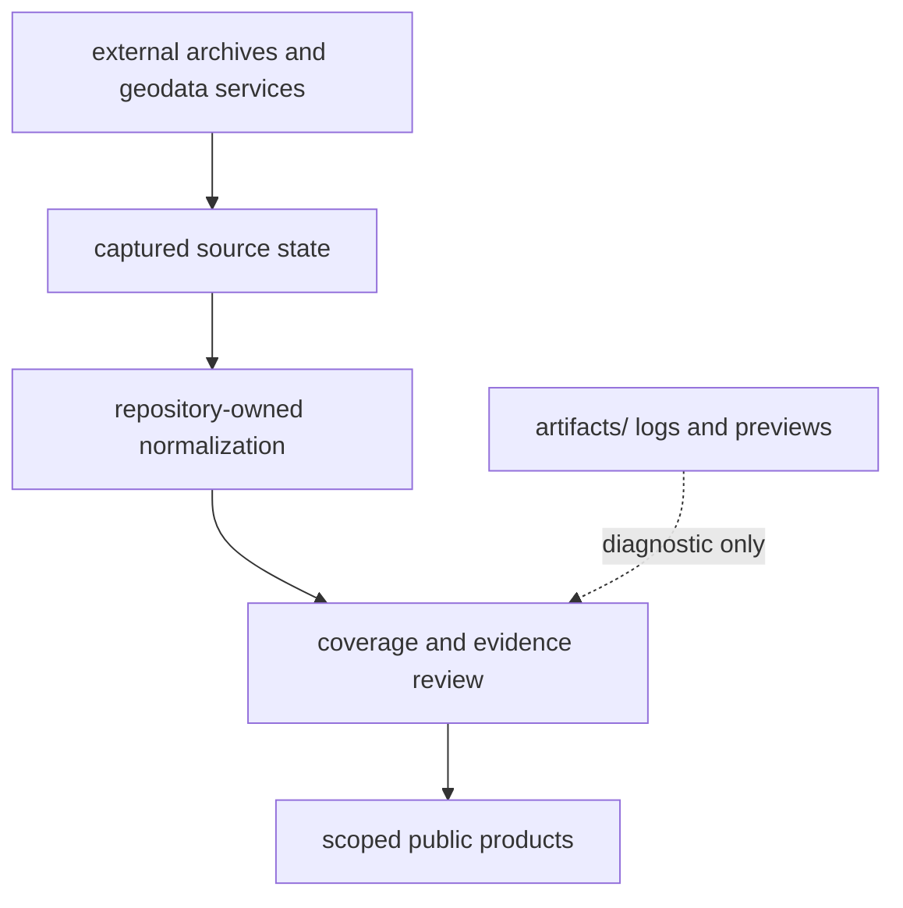

# Operational Boundaries

Operational boundaries prevent a local command, external response, or rendered
product from silently becoming scientific authority. The runtime exposes
where network access occurs, which roots may change, and which evidence classes
remain outside a product.

## Trust Boundaries

External content is untrusted input. Capture preserves origin, retrieval
metadata, content identity, and source-specific licence posture. Normalization
may make structure consistent but cannot manufacture missing provenance,
precision, or permission.

## Network Boundary

Only acquisition-oriented operations should require external services.
`collect-data` retrieves the selected collector-managed families; the animal
foundation refresh may retrieve archive and publication material. Inspection,
collection-summary validation, contract materialization, and report
publication operate from local state.

An upstream response is captured input, not authority merely because retrieval
succeeded. Source identity, retrieval metadata, licence posture, hashes, and
source-native values must survive normalization.

## Observability And Diagnostics

Every consequential operation should expose enough evidence to identify the
request, inputs, owned write boundary, result, and refusal posture. Useful
diagnostics name source or product identity and the failed contract; they do
not dump credentials, private URLs, licensed payloads, or unrelated records.

| Signal | Establishes | Does not establish |
| --- | --- | --- |
| exit status | whether the software operation completed | which scientific claims were admitted |
| structured result | counts, paths, and statuses returned by the owner | durable membership without its manifest |
| manifest | product identity, scope, and members | completeness of upstream recovery |
| warning or exclusion | bounded reason a candidate is qualified or absent | that the underlying source record is false |
| local log under `artifacts/` | execution context for diagnosis | governed evidence authority |

## Local Development And Filesystem Boundaries

| Operation | Authorized root | Boundary |
| --- | --- | --- |
| package installation | chosen virtual environment and installer cache | no governed evidence authority |
| source-checkout installation and local checks | caches and `artifacts/` | no governed evidence authority |
| source collection | selected trees under `data/` | external retrieval and normalization |
| contract refresh | declared summary and review files under `data/` | derives from current checked-in tree |
| report publication | `docs/report/` | consumes governed data; does not recollect implicitly |
| documentation build | site output under `artifacts/` unless explicitly publishing | rendered preview is not a governed report |

A command that changes an unexpected root has crossed its operational
boundary. The output must not be treated as a governed replacement until the
cause and ownership are understood.

Relative defaults make the current working directory part of the call. Explicit
`--data-root`, `--aadr-root`, `--context-root`, and `--output-root` arguments
are the clearest contract when the command is not launched from the repository
root.

## Partial Failure And Recovery

Collectors and publishers can touch multiple files. A non-zero exit may leave
staging or partial local changes. Collection hashes, manifests, summaries, and
diagnostics identify which boundary completed. Do not delete that recovery
evidence before the last coherent state is known.

Rerunning is safe only after inputs, versions, destinations, and partial output
are understood. A successful rerun does not excuse unexplained deletions or
scope drift.

## Security And Safety

- Do not place credentials, access tokens, private URLs, or licensed source
  payloads into public reports or logs intended for publication.
- Keep source terms and retrieval metadata attached to collected families.
- Treat compressed captures, supplements, and archive members as data, not
  executable content.
- Keep local logs and previews under `artifacts/`; they support diagnosis but
  are not evidence or release products.
- Preserve coordinate precision and source caveats when exporting or reusing
  public rows.

Public availability is not a universal reuse licence. A product can combine
families with different terms, attribution needs, and precision constraints.
Reuse decisions must follow the source-level licence and provenance attached
to each family.

Safety also includes scientific integrity. Do not make a command appear to
succeed by dropping unresolved records, weakening admission, or replacing an
unknown coordinate or date with a convenient default. Retain the finding and
the last coherent governed state.

## Determinism Boundary

Given the same local captured inputs, version, country scope, species scope,
and explicit roots, validation and publication are designed to be repeatable.
Collection is not equivalent to replay: upstream services, access, and payloads
can change. Retrieval date and content identity are therefore part of the
evidence needed to compare collection runs.

## Performance Posture

Collection and complete publication traverse large governed trees. Inspection,
single-summary validation, one-species review, and one-country publication are
available so a narrow question does not require an unrelated rebuild. Choose
scope by the required state transition.

Performance evidence must name the input revision, scope, cache posture,
hardware, and operation. A faster result obtained by reading a retained
product is not evidence that the owning source-to-publication rebuild became
faster.

## Release And Versioning

Runtime version, evidence revision, and publication identity are separate.
The package version identifies producer behavior; a source release or capture
hash identifies input state; a bundle manifest identifies the selected public
members. A reproducible release records all three.

Distribution publication cannot qualify evidence retroactively. PyPI, GHCR,
GitHub Release, and documentation deployment are independent publication
surfaces that must be reconciled to the same intended revision and artifact
identity.

## Claim Boundary

Operational success proves that a command completed under its software
contract. It does not prove source completeness, scientific correctness,
coordinates suitable for unrestricted reuse, or final-release maturity. Those
claims remain governed by evidence review and publication gates.
