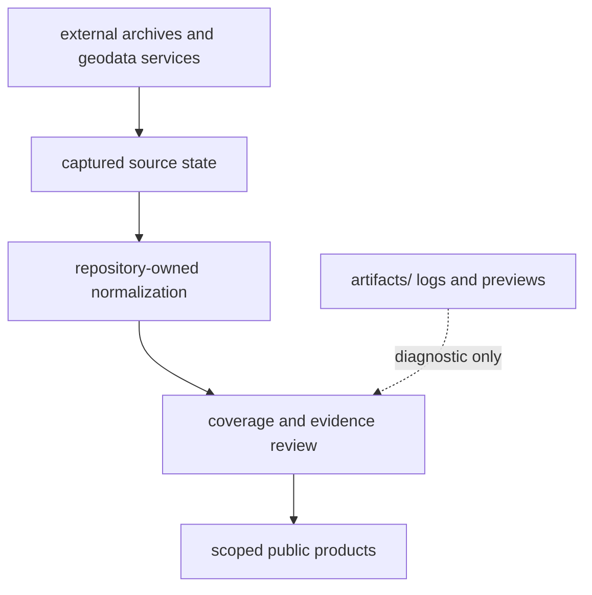

# Operational Boundaries

Operational boundaries prevent a local command, external response, or rendered
product from silently becoming scientific authority. The runtime exposes
where network access occurs, which roots may change, and which evidence classes
remain outside a product.

## Trust Boundaries

External content is untrusted input. Capture preserves origin, retrieval
metadata, content identity, and source-specific licence posture. Normalization
may make structure consistent but cannot manufacture missing provenance,
precision, or permission.

## Write Boundaries

| Operation | Authorized root | Boundary |
| --- | --- | --- |
| install and local checks | `.venv/`, caches, `artifacts/` | no governed evidence authority |
| source collection | selected trees under `data/` | external retrieval and normalization |
| contract refresh | declared summary and review files under `data/` | derives from current checked-in tree |
| report publication | `docs/report/` | consumes governed data; does not recollect implicitly |
| documentation build | site output under `artifacts/` unless explicitly publishing | rendered preview is not a governed report |

A command that changes an unexpected root has crossed its operational
boundary. Stop and inspect before accepting or publishing the result.

## Partial Failure And Recovery

Collectors and publishers can touch multiple files. A non-zero exit may leave
partial local changes. Treat the worktree diff, collection hashes, manifests,
and summary validators as the recovery record. Do not delete the evidence of a
partial run before identifying which stages completed.

Rerunning is safe only after inputs, versions, destinations, and partial output
are understood. A successful rerun does not excuse unexplained deletions or
scope drift.

## Security And Reuse

- Do not place credentials, access tokens, private URLs, or licensed source
  payloads into public reports or logs intended for publication.
- Keep source terms and retrieval metadata attached to collected families.
- Treat compressed captures, supplements, and archive members as data, not
  executable content.
- Keep local logs and previews under `artifacts/`; they support diagnosis but
  are not evidence or release products.
- Preserve coordinate precision and source caveats when exporting or reusing
  public rows.

## Performance Boundary

Collection and full publication traverse large governed trees. Inspection,
single-summary validation, one-species review, and one-country publication are
available so a narrow question need not trigger an unrelated rebuild. Choose
scope by the required state transition, then validate the affected contract.

## Claim Boundary

Operational success proves that a command completed under its software
contract. It does not prove source completeness, scientific correctness,
reference-grade coordinates, or final-release maturity. Those claims remain
governed by evidence review and publication gates.
