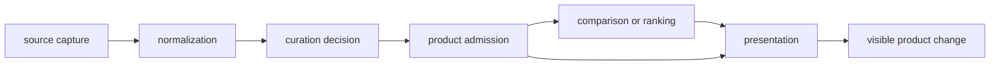
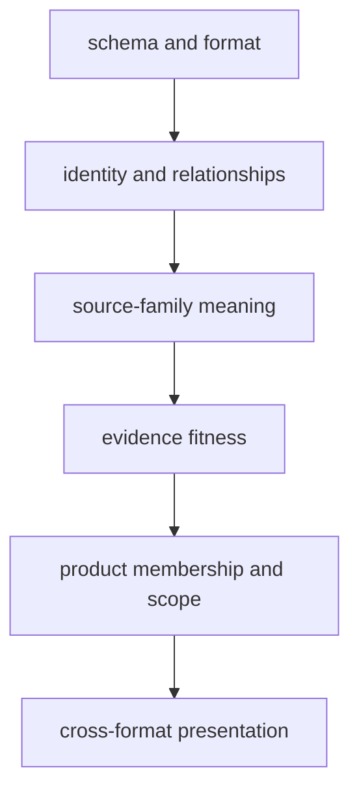
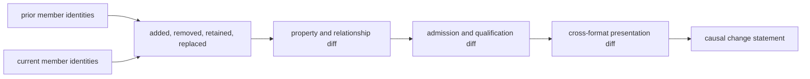

# Change Evidence

A changed map, count, ranking, or review posture has a cause. Bijux
Pollenomics separates changes in source material, curation, product scope,
analysis, and rendering so a visible difference can be interpreted instead of
treated as an unexplained new result.

## Causal Chain

Several causes can affect one product, but they should remain distinguishable
in its manifests, evidence rows, reviews, and generated diff.

## Change Classes

| Class | Typical visible effect | Evidence needed to interpret it |
| --- | --- | --- |
| source | added, removed, or revised upstream records | version, retrieval context, hashes, license posture, and source diff |
| normalization | changed identifiers, geometry, dates, or field representation | source-native value, normalization basis, and affected records |
| curation | changed linkage, ambiguity resolution, evidence class, or precision | governing decision, reason, and prior posture |
| admission | changed membership, qualification, or exclusion | named product rule, scope, and decision record |
| analysis | changed rank, score, sensitivity, or comparison | method identity, inputs, scenarios, and stability evidence |
| rendering | changed layout, labels, colors, or interaction | proof that structured membership and meaning stayed unchanged |

## Validation Layers

Each layer depends on the preceding layer but answers a different question.
A syntactically valid record can still point to the wrong source; a correctly
linked record can still have unresolved chronology; a strong evidence record
can still fall outside one product; and a correct manifest can still be
misrepresented by a rendering.

Validation should therefore stop at the first failed layer and preserve its
finding. Passing later presentation checks cannot compensate for an upstream
identity or evidence failure.

## Breadth Rule

Documentation breadth is semantic coverage, not page count. A change preserves
breadth only when a reader can still discover the same governing boundaries,
understand their meaning, operate them safely, and trace the evidence promised
by the public interface. Combining pages is valid when the resulting page
retains those capabilities; leaving a title or redirect without the governing
content is not.

| Documentation change | Acceptance evidence |
| --- | --- |
| page renamed or moved | navigation, inbound links, stable subject, and governing anchors resolve at the new path |
| pages merged | every distinct contract, procedure, limit, and proof path remains findable in the merged surface |
| page retired | a named replacement answers the same reader question, or the public capability is explicitly withdrawn |
| command or data contract changed | reference, examples, defaults, mutation boundary, and failure semantics agree with runtime behavior |
| evidence family changed | source role, lifecycle materialization, authority path, coverage, and publication consequences remain explained |
| generated report changed | its handwritten entry point still explains meaning, authority, interpretation limits, and how to inspect the governed state |

A passing link check proves reachability; it does not prove breadth. Review the
reader questions lost or gained, the authority paths affected, and the claims
that would become impossible to audit. A smaller documentation tree is an
improvement only when it removes duplication without removing meaning.

## Counts Are Not Explanations

An increased count may reflect recovered evidence, broader scope, repaired
deduplication, or a weakened admission rule. A decreased count may reflect
upstream removal, corrected identity, narrower scope, or failed collection.
The number alone cannot identify which happened.

Stable counts can also hide meaningful change: one member may replace another,
coordinates may become less precise, chronology may be reclassified, or a
direct-evidence row may become contextual.

## Build A Semantic Diff Packet

A reviewable change packet compares identities before totals and meaning before
rendering. For every affected population, retain:

| Packet component | Required content | Question answered |
| --- | --- | --- |
| boundary identity | source family, evidence surface, product, version, and scope | what population is being compared? |
| member sets | stable identifiers added, removed, retained, and replaced | did the population change even if its size did not? |
| property changes | source identity, role, geometry, chronology, precision, qualification, and fact owner | did retained members change meaning? |
| relationship changes | joins, aliases, sample–site links, comparison edges, and lineage independence | did the evidence graph change? |
| decision changes | admission, qualification, exclusion, refusal, and reason | did policy or evidence fitness change visibility? |
| presentation parity | structured formats and rendered views compared against the same manifest | is the visible change faithful to governed state? |

The packet should make a zero-count change visible. If one member disappears
and another enters, or a retained member loses coordinate precision, the total
may stay constant while the evidence population changes materially.

## Reading A Product Difference

1. Identify the product and recorded scope.
2. Compare bundle membership and feature identifiers.
3. Separate additions, removals, and modified members.
4. Follow modified members to their admission and governing evidence records.
5. Compare source identity, curation reason, precision, role, warnings, and
   exclusions.
6. Treat rendering-only change as neutral only when structured meaning is
   demonstrably unchanged.

The final explanation should name both cause and consequence: for example,
“two members were excluded after sample-owned locality review” or “labels
changed while manifest membership and feature properties remained stable.”
“The product was regenerated” describes an operation, not the change.

## Evidence Required By Change Type

| Changed surface | Minimum review evidence |
| --- | --- |
| source-family tree | source identity, version, capture diff, normalized identity diff, coverage, and removals |
| evidence or governance record | governing source chain, previous decision, new reason, precision, and affected consumers |
| product scope or admission | old and new rule, member-level diff, qualifications, exclusions, and affected bundles |
| analysis output | exact inputs, method identity, scenarios, sensitivity, and interpretation boundary |
| public bundle | manifest and member diff, traceability, cross-format consistency, warnings, and citations |
| narrative only | proof that no governed identity, role, scope, precision, or membership changed |

These layers expose what a result changed and how that meaning can be traced.
They do not by themselves establish historical correctness or fitness for a
question outside the named contract.

## Interpretation Outcomes

| Outcome | Appropriate statement |
| --- | --- |
| stronger evidence recovered | the named records gained a stated source-backed property |
| qualification introduced | the records remain visible under a narrower claim |
| scope changed | membership changed because the product boundary changed |
| analysis changed | ranking or comparison changed under a named method or scenario |
| presentation changed only | the view changed while structured evidence and membership remained stable |
| cause unresolved | do not interpret the visible difference as scientific change |

Change evidence protects against a common error: describing every regenerated
product as new scientific evidence. Regeneration is an operation; the causal
record determines what, if anything, changed scientifically.
