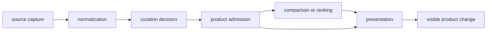

# Change Evidence

A changed map, count, ranking, or review posture has a cause. Bijux
Pollenomics separates changes in source material, curation, product scope,
analysis, and rendering so a visible difference can be interpreted instead of
treated as an unexplained new result.

## Causal Chain

Several causes can affect one product, but they should remain distinguishable
in its manifests, evidence rows, reviews, and generated diff.

## Change Classes

| Class | Typical visible effect | Evidence needed to interpret it |
| --- | --- | --- |
| source | added, removed, or revised upstream records | version, retrieval context, hashes, license posture, and source diff |
| normalization | changed identifiers, geometry, dates, or field representation | source-native value, normalization basis, and affected records |
| curation | changed linkage, ambiguity resolution, evidence class, or precision | governing decision, reason, and prior posture |
| admission | changed membership, qualification, or exclusion | named product rule, scope, and decision record |
| analysis | changed rank, score, sensitivity, or comparison | method identity, inputs, scenarios, and stability evidence |
| rendering | changed layout, labels, colors, or interaction | proof that structured membership and meaning stayed unchanged |

## Counts Are Not Explanations

An increased count may reflect recovered evidence, broader scope, repaired
deduplication, or a weakened admission rule. A decreased count may reflect
upstream removal, corrected identity, narrower scope, or failed collection.
The number alone cannot identify which happened.

Stable counts can also hide meaningful change: one member may replace another,
coordinates may become less precise, chronology may be reclassified, or a
direct-evidence row may become contextual.

## Reading A Product Difference

1. Identify the product and recorded scope.
2. Compare bundle membership and feature identifiers.
3. Separate additions, removals, and modified members.
4. Follow modified members to their admission and governing evidence records.
5. Compare source identity, curation reason, precision, role, warnings, and
   exclusions.
6. Treat rendering-only change as neutral only when structured meaning is
   demonstrably unchanged.

## Interpretation Outcomes

| Outcome | Appropriate statement |
| --- | --- |
| stronger evidence recovered | the named records gained a stated source-backed property |
| qualification introduced | the records remain visible under a narrower claim |
| scope changed | membership changed because the product boundary changed |
| analysis changed | ranking or comparison changed under a named method or scenario |
| presentation changed only | the view changed while structured evidence and membership remained stable |
| cause unresolved | do not interpret the visible difference as scientific change |

Change evidence protects against a common error: describing every regenerated
product as new scientific evidence. Regeneration is an operation; the causal
record determines what, if anything, changed scientifically.
