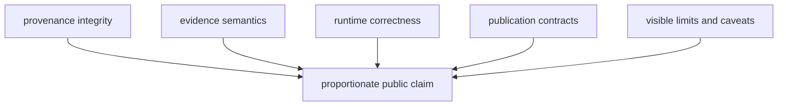
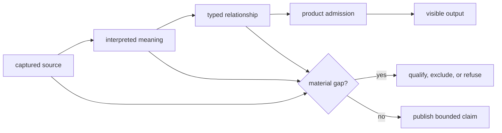

# Verification And Limits

Quality is the agreement between source lineage, evidence meaning, runtime
behavior, publication membership, and public language. Successful software
verification can show that encoded contracts hold; it cannot make incomplete
evidence complete or convert a contextual layer into direct support.

## Quality Model

| Dimension | Required evidence |
| --- | --- |
| provenance integrity | source identity, version or retrieval context, hashes where governed, and transformation lineage |
| evidence semantics | preserved nulls, precision, chronology meaning, locality basis, and ambiguity decisions |
| runtime correctness | focused unit behavior, regression contracts, and end-to-end effects at owned boundaries |
| publication integrity | declared scope, deterministic membership, feature traceability, and exclusion accountability |
| public honesty | wording that stays within the weakest governing evidence and exposes material limits |

## Validation By Risk

| Change | Minimum proof direction |
| --- | --- |
| scientific normalization or eligibility | focused unit tests plus evidence and publication regression contracts |
| collection behavior | source-family tests, staging/replacement behavior, and collection-summary validation |
| map or report generation | scoped publication tests, traceability checks, and reviewed generated diffs |
| public documentation | strict site build, link/navigation contracts, and claim-language checks |
| packaging or release behavior | package-specific build, metadata, smoke, and workflow checks |

The exact command depends on the changed owner. Validation should expand with
risk, not with habit.

## The Weakest-Link Rule

A public claim inherits the narrowest valid posture along its evidence chain.
High-quality processing cannot compensate for a missing scientific fact:

For example, exact map rendering does not make a region-level locality exact,
and a resolved archive project does not make an unresolved sample date
sample-specific. The downstream representation must preserve the upstream
limit or become more conservative.

## Claim Posture

A visible output may be:

- **descriptive**: it reports governed membership or source-backed fields;
- **contextual**: it frames another record without becoming direct evidence;
- **decision support**: it ranks or compares under declared inputs and limits;
- **qualified**: it remains visible with a material precision or coverage caveat;
- **refused**: required evidence is absent or the stronger claim is unsupported.

Refusal is a quality outcome when publication would otherwise overstate the
evidence.

## Evaluate A Public Result

A trustworthy result lets a reader answer five questions without inferring
from presentation alone:

1. **What is counted?** Identify the observation unit: sample, site, sequence,
   grid cell, locality, project, or publication.
2. **Which population is counted?** Separate captured, normalized, reviewed,
   eligible, admitted, and published records.
3. **What role does the layer play?** Direct evidence, primary context,
   contextual domain, sampling context, and geographic framing support
   different claims.
4. **How precise are place and time?** A visible point or date label must not
   be read more precisely than its provenance permits.
5. **Where are non-members explained?** Scope exclusions, unresolved evidence,
   source gaps, and scientific refusals should remain visible.

The order matters. Starting from a compelling map and reasoning backward can
mistake symbol precision for evidence precision. Start with the observation
unit and eligible population, then inspect role, time, place, and exclusions.

For example, the Nordic bundle contains 2,172 mapped SEAD sites while its
reviewed inventory contains 2,195 rows. The difference is accounted for by 23
rows without country assignment. That is stronger quality evidence than
calling either number the unqualified “SEAD total.”

## Quality Is Not Uniformity

The source families do not become equally complete or directly comparable by
passing through one runtime. Quality means preserving their differences:

| Family example | Legitimate quality claim | Overstatement |
| --- | --- | --- |
| AADR | release and panel identity are pinned for selected sample rows | the country filter is representative of past populations |
| LandClim or Neotoma | pollen context retains source and temporal posture | every site measures the same time interval or method |
| SEAD or RAÄ | archaeological context is mapped within declared coverage | contextual density directly explains aDNA or pollen observations |
| animal aDNA | admitted points retain sample, locality, chronology, and coordinate lineage | all samples expected from every tracked project were recovered |
| boundaries | the product scope is geographically explicit | polygons provide scientific evidence about the features they contain |

## Governing References

- [Runtime invariants and limits](runtime-invariants-and-limits.md) define the
  conditions that must remain true.
- [Verification evidence](test-strategy.md) explains what each proof layer can
  and cannot establish for a public claim.
- [Change evidence](change-validation.md) separates source, curation, scope,
  analysis, and rendering causes behind a visible difference.
- [Evidence vocabulary](public-language-guide.md) defines roles, postures,
  strength verbs, and scope language.
- [Claim review](review-checklist.md) traces a public statement through object,
  role, precision, provenance, and admission.

Current generated posture remains visible in the
[animal atlas readiness](../../../report/animal_atlas_readiness.md),
[animal exclusion report](../../../report/animal_atlas_exclusion_report.md),
[repository truth posture](../../../report/repository_truth_posture.md), and
[repository claim audit](../../../report/repository_claim_audit.md). Those
surfaces report current state; they do not override the source and evidence
records that govern individual claims.
