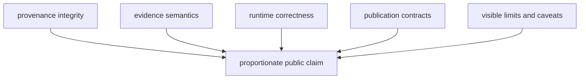

# Verification And Limits

Quality is the agreement between source lineage, evidence meaning, runtime
behavior, publication membership, and public language. A green test suite can
show that encoded contracts hold; it cannot make incomplete evidence complete
or convert a contextual layer into direct support.

## Quality Model

| Dimension | Required evidence |
| --- | --- |
| provenance integrity | source identity, version or retrieval context, hashes where governed, and transformation lineage |
| evidence semantics | preserved nulls, precision, chronology meaning, locality basis, and ambiguity decisions |
| runtime correctness | focused unit behavior, regression contracts, and end-to-end effects at owned boundaries |
| publication integrity | declared scope, deterministic membership, feature traceability, and exclusion accountability |
| public honesty | wording that stays within the weakest governing evidence and exposes material limits |

## Validation By Risk

| Change | Minimum proof direction |
| --- | --- |
| scientific normalization or eligibility | focused unit tests plus evidence and publication regression contracts |
| collection behavior | source-family tests, staging/replacement behavior, and collection-summary validation |
| map or report generation | scoped publication tests, traceability checks, and reviewed generated diffs |
| public documentation | strict site build, link/navigation contracts, and claim-language checks |
| packaging or release behavior | package-specific build, metadata, smoke, and workflow checks |

The exact command depends on the changed owner. Validation should expand with
risk, not with habit.

## Claim Posture

A visible output may be:

- **descriptive**: it reports governed membership or source-backed fields;
- **contextual**: it frames another record without becoming direct evidence;
- **decision support**: it ranks or compares under declared inputs and limits;
- **qualified**: it remains visible with a material precision or coverage caveat;
- **refused**: required evidence is absent or the stronger claim is unsupported.

Refusal is a quality outcome when publication would otherwise overstate the
evidence.

## Governing References

- [Runtime invariants and limits](runtime-invariants-and-limits.md) define the
  conditions that must remain true.
- [Verification evidence](test-strategy.md) explains what each proof layer can
  and cannot establish for a public claim.
- [Change validation](change-validation.md) defines proof proportional to a
  changed surface.
- [Public language](public-language-guide.md) constrains claims and caveats.
- [Review checklist](review-checklist.md) connects runtime, evidence,
  publication, and documentation review.

Current generated posture remains visible in the
[animal atlas readiness](../../../report/animal_atlas_readiness.md),
[animal exclusion report](../../../report/animal_atlas_exclusion_report.md),
[repository truth posture](../../../report/repository_truth_posture.md), and
[repository claim audit](../../../report/repository_claim_audit.md). Those
surfaces report current state; they do not override the source and evidence
records that govern individual claims.
