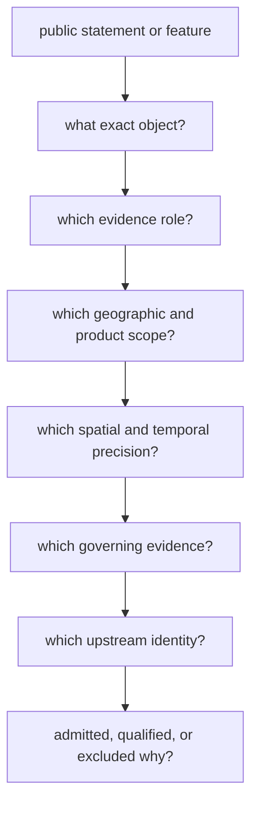
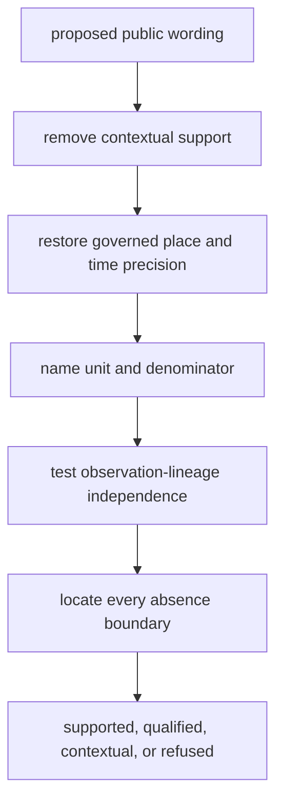

# Claim Review

A public claim can be reviewed by tracing its object, evidence role, scope,
precision, provenance, and product decision. The visible map or summary is the
starting point, not the complete proof.

## Review Path

## Questions That Must Resolve

| Question | Evidence to seek | Warning sign |
| --- | --- | --- |
| What is the object? | sample, site, project, paper, source record, grid cell, boundary, or product member identity | one label used for several object types |
| What role does it play? | direct evidence, primary context, contextual domain, sampling context, comparator, or geographic framing | context described as direct support |
| Which scope governs it? | world, Europe-plus, Nordic, country, lake, or another named product | geographic selection presented as representativeness |
| How precise is it? | reported and normalized place/time plus basis and evidence class | decimals or narrow ranges without matching support |
| Who owns the fact? | governing evidence record and fact-ownership relation | reliance on a convenient downstream copy |
| Where did it originate? | dataset, version, accession, DOI, sample label, retrieval context, and source capture | citation without recoverable record linkage |
| Why is it visible? | admission, qualification, comparison, or framing decision | presence on a map treated as equal evidential weight |

## Direct And Contextual Evidence

Direct evidence supports a claim about its governed sample or observation.
Contextual evidence supports interpretation around that claim. Boundaries and
hydrography frame scope or sampling. These roles can coexist in one product,
but they cannot be substituted for one another.

For example, archaeological density around a lake can affect fieldwork
prioritization without proving that one animal sample originated at that lake.
A project description can guide recovery without supplying sample-owned
chronology.

## Precision Review

Spatial and temporal precision must be supported independently:

- a named region is not an exact point;
- a site coordinate is not automatically sample-owned;
- a project date is not a sample interval;
- a normalized interval retains the reported text and conversion basis;
- a missing value remains missing when no defensible transformation exists.

## Decision Review

An admitted record satisfies the named product contract. A qualified record
satisfies it only under an explicit caveat. A comparator is present for
structured contrast. An exclusion records why a known candidate is absent.

None of these states implies that the underlying source program is complete.
Review the relevant readiness, coverage, truth-posture, and exclusion surfaces
before making collection-wide statements.

## Cross-Surface Agreement

When a claim appears in several formats, compare them by identifier rather
than by visual similarity:

- the manifest names the product scope and admitted members;
- JSON or CSV exposes structured values and relationships;
- GeoJSON carries geometry and feature-level evidence properties;
- Markdown or HTML explains interpretation, citations, and limits;
- warning and exclusion surfaces account for qualification and absence.

Counts, labels, roles, geography, and precision should agree across those
surfaces. A disagreement is not resolved by preferring the most polished view;
it is an unresolved publication defect.

## Challenge The Claim Before Accepting It

Positive traceability is necessary but can still conceal an overclaim. Apply
these counterchecks to the exact proposed wording:

| Challenge | If the answer is no |
| --- | --- |
| If contextual layers were hidden, would the direct claim still be supported by its owned evidence? | reduce the claim to context or recover direct evidence |
| If the map were unavailable, could the feature still be resolved from manifest identity to governing source? | treat the publication lineage as unresolved |
| Does every stated count name one observation unit and denominator? | separate samples, people, sites, sequences, cells, and source rows before counting |
| Would the claim survive replacement of a precise marker with the source-reported spatial precision? | narrow the geographic wording |
| Would the claim survive replacement of a display date with the governed temporal posture and caveat? | narrow or withhold the temporal wording |
| Are two supporting records independent at the observation-lineage level? | describe agreement as shared or unresolved context, not corroboration |
| Can absence be located at capture, normalization, admission, publication, or current view? | do not interpret non-visibility as evidence absence |

These checks do not demand maximal evidence for every statement. They ensure
that the wording does not gain strength from visual proximity, aggregation,
formatting precision, or duplicated lineage.

## Review Verdicts

| Verdict | Meaning | Reader action |
| --- | --- | --- |
| supported | identity, role, scope, precision, lineage, and decision all resolve | use within the declared contract |
| supported with qualification | the chain resolves but one or more explicit limits narrow the claim | preserve the qualification in reuse |
| contextual only | the record informs interpretation but does not directly support the target claim | describe it as context |
| unresolved | a required link or owner cannot be recovered | narrow or withhold the claim |
| contradicted | governing evidence conflicts with the claim | reject the claim and follow the conflict record |
| out of scope | evidence may be sound but the named product or question does not admit it | do not infer absence from exclusion |

A verdict attaches to a specific claim and scope, not permanently to the
underlying record. The same record can directly support one statement, provide
context for another, and remain out of scope for a third.

## Example: Reviewing A Map Point

For an animal ancient-DNA marker, identify the sample rather than stopping at
the project or species label. Follow its bundle member to the governing sample
record, then verify project and paper lineage, sample-owned locality,
chronology, coordinate basis, evidence role, and the point-admission decision.
Finally confirm that the map geometry and narrative qualification agree with
those records.

If only project geography is available, the review may support a project-level
regional statement while refusing an exact sample point. That is a successful
review outcome: it preserves the supported claim without concealing the
missing evidence.

## Review Outcome

A claim is supportable when every link resolves and its wording stays within
the weakest governing evidence. If identity, role, precision, provenance, or
admission cannot be recovered, the appropriate outcome is a narrower claim or
an explicit refusal.
