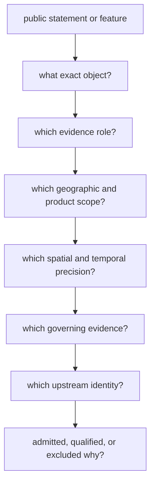

# Claim Review

A public claim can be reviewed by tracing its object, evidence role, scope,
precision, provenance, and product decision. The visible map or summary is the
starting point, not the complete proof.

## Review Path

## Questions That Must Resolve

| Question | Evidence to seek | Warning sign |
| --- | --- | --- |
| What is the object? | sample, site, project, paper, source record, grid cell, boundary, or product member identity | one label used for several object types |
| What role does it play? | direct evidence, primary context, contextual domain, sampling context, comparator, or geographic framing | context described as direct support |
| Which scope governs it? | world, Europe-plus, Nordic, country, lake, or another named product | geographic selection presented as representativeness |
| How precise is it? | reported and normalized place/time plus basis and evidence class | decimals or narrow ranges without matching support |
| Who owns the fact? | governing evidence record and fact-ownership relation | reliance on a convenient downstream copy |
| Where did it originate? | dataset, version, accession, DOI, sample label, retrieval context, and source capture | citation without recoverable record linkage |
| Why is it visible? | admission, qualification, comparison, or framing decision | presence on a map treated as equal evidential weight |

## Direct And Contextual Evidence

Direct evidence supports a claim about its governed sample or observation.
Contextual evidence supports interpretation around that claim. Boundaries and
hydrography frame scope or sampling. These roles can coexist in one product,
but they cannot be substituted for one another.

For example, archaeological density around a lake can affect fieldwork
prioritization without proving that one animal sample originated at that lake.
A project description can guide recovery without supplying sample-owned
chronology.

## Precision Review

Spatial and temporal precision must be supported independently:

- a named region is not an exact point;
- a site coordinate is not automatically sample-owned;
- a project date is not a sample interval;
- a normalized interval retains the reported text and conversion basis;
- a missing value remains missing when no defensible transformation exists.

## Decision Review

An admitted record satisfies the named product contract. A qualified record
satisfies it only under an explicit caveat. A comparator is present for
structured contrast. An exclusion records why a known candidate is absent.

None of these states implies that the underlying source program is complete.
Review the relevant readiness, coverage, truth-posture, and exclusion surfaces
before making collection-wide statements.

## Review Outcome

A claim is supportable when every link resolves and its wording stays within
the weakest governing evidence. If identity, role, precision, provenance, or
admission cannot be recovered, the appropriate outcome is a narrower claim or
an explicit refusal.
