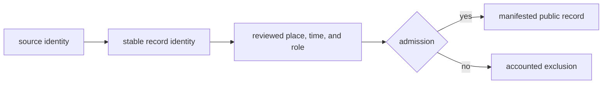

# Runtime Invariants and Limits

The runtime preserves a small set of observable guarantees across collection,
curation, analysis, and publication. These guarantees make a public record
traceable even when its source family is incomplete or its scientific posture
remains qualified.

## Observable Guarantees

| Guarantee | Observable consequence |
| --- | --- |
| source ownership | every record retains a source-family tree and identity |
| lineage preservation | normalized and published records lead back to governed evidence |
| explicit admission | publication follows review; file presence alone is insufficient |
| semantic stability | narrower geographies preserve feature identity and role |
| precision honesty | locality, chronology, and coordinates do not become more exact downstream |
| accountable absence | blocked and excluded records remain visible in review or refusal surfaces |
| reproducible scope | manifests bind products to inputs, version, geography, and product rules |

## Runtime Boundaries

Collection can establish that material was retrieved and normalized. It cannot
establish that every source row was recovered or is scientifically comparable.
Validation can establish structural and relational invariants. It cannot prove
that a historical interpretation is correct. Publication can establish that a
record passed a product contract. It cannot make the underlying evidence more
complete or precise.

## Current Scientific Limits

- Animal ancient-DNA recovery remains uneven across projects, supplements,
  species, localities, and chronology.
- Atlas membership is a qualified publication decision, not a census of all
  available or historically present evidence.
- Source families have different observation units and temporal capability;
  spatial co-location does not make them equivalent.
- A broad geographic product may contain more records while providing less
  local specificity than a country surface.
- Rankings depend on declared inputs and models; they are decision support, not
  field confirmation.
- Source access, licensing, and unrecovered supporting material can limit what
  is redistributed or admitted.

## Interpreting A Passing Product

A passing product demonstrates that its declared inputs, identities,
relationships, geography, and publication rules were internally consistent at
the recorded version. Stronger claims—complete recovery, representative
sampling, exact historical abundance, coordinates suitable for unrestricted
reuse, or final scientific consensus—require evidence beyond that software
contract.

See [operational boundaries](../operations/operational-boundaries.md),
[publication types](../../pollenomics-data/publications/publication-types.md),
and [publication limits](../../pollenomics-data/publications/limits.md).
