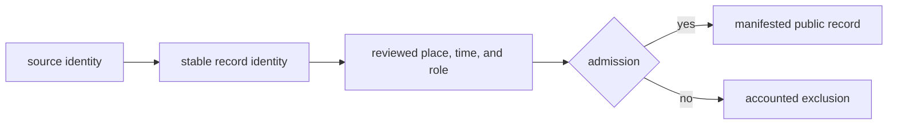
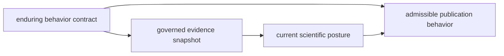

# Runtime Invariants and Limits

The runtime preserves a small set of observable guarantees across collection,
curation, analysis, and publication. These guarantees make a public record
traceable even when its source family is incomplete or its scientific posture
remains qualified.

## Invariants

| Guarantee | Observable consequence |
| --- | --- |
| source ownership | every record retains a source-family tree and identity |
| lineage preservation | normalized and published records lead back to governed evidence |
| explicit admission | publication follows review; file presence alone is insufficient |
| semantic stability | narrower geographies preserve feature identity and role |
| precision honesty | locality, chronology, and coordinates do not become more exact downstream |
| accountable absence | blocked and excluded records remain visible in review or refusal surfaces |
| reproducible scope | manifests bind products to inputs, version, geography, and product rules |

## Where Each Guarantee Is Visible

| Boundary | Evidence of conformance | Evidence of refusal or limit |
| --- | --- | --- |
| collection | source identity, retrieval context, hashes, and family summary | failed capture, missing expected asset, or retained prior family tree |
| normalization | source-linked stable record and declared field semantics | unresolved, conflicting, approximate, or unsupported value |
| curation | governing decision with fact owner and reason | open recovery item, qualification, or explicit non-linkage |
| analysis | named inputs, method, scenario, and sensitivity result | unstable rank, unsupported comparison, or withheld conclusion |
| publication | scope, manifest, member identities, traceability, and warnings | exclusion, empty admitted set, or preserved previous bundle |

The negative column is part of the system contract. A guarantee is credible
only when failure remains observable instead of being converted to a default,
an inferred value, or an unexplained omission.

## Separate Invariants From Snapshot Posture

Runtime invariants describe behavior that must hold for every governed
snapshot. Scientific posture describes what the current evidence happens to
support. Mixing them makes a temporary count look like a permanent guarantee
or makes an enduring safety property appear optional.

| Statement | Kind | How to read it |
| --- | --- | --- |
| a published member resolves to governed source identity | invariant | failure is a traceability defect in any snapshot |
| the current Neotoma review contains 170 members admitted to numeric comparison | snapshot posture | the count may change when governed evidence or review changes |
| downstream geometry does not exceed source-supported precision | invariant | a more precise rendering must be refused or qualified |
| the current SEAD materialization has no linked dating rows | snapshot posture | it limits this capture but does not claim upstream absence |
| an excluded candidate retains an accountable reason | invariant | omission without a decision record violates the contract |
| one source family is currently context-only for temporal comparison | snapshot posture | stronger evidence may change the posture through review |

A new snapshot may legitimately change counts, members, or fitness decisions
while still satisfying every invariant. Conversely, preserving counts does not
demonstrate conformance if lineage, precision, exclusion accountability, or
manifest scope has been broken.

## Runtime Boundaries

Collection can establish that material was retrieved and normalized. It cannot
establish that every source row was recovered or is scientifically comparable.
Validation can establish structural and relational invariants. It cannot prove
that a historical interpretation is correct. Publication can establish that a
record passed a product contract. It cannot make the underlying evidence more
complete or precise.

Structural validation and scientific review answer different questions.
Schema, type, and referential checks can show that a record is internally
coherent. They cannot show that an unavailable supplement was fully recovered,
that historical sampling was representative, or that two evidence families
measure the same phenomenon.

## What The Runtime Does Not Guarantee

| Non-guarantee | Consequence for interpretation |
| --- | --- |
| exhaustive discovery | tracked projects and sources are not a census of all relevant evidence |
| source representativeness | source density cannot be read as historical abundance or sampling equality |
| automatic conflict resolution | conflicting facts require an owned decision or remain visibly unresolved |
| cross-family equivalence | samples, sites, sequences, density cells, and observations retain distinct meanings |
| inferred precision | a precise coordinate or date is not manufactured from broader project or regional context |
| analytical universality | a ranking is valid only for its declared inputs, scenario, and sensitivity posture |

These are deliberate limits, not missing convenience features. Automating them
without stronger evidence would turn an unknown or contextual fact into an
apparently authoritative result.

## Definition Of Done

A runtime change is complete when the owning behavior, public contract,
governed descendants, and focused proof agree. A data or publication change
also accounts for admitted, qualified, excluded, and unresolved members by
identity. A successful command or unchanged total is not sufficient when the
semantic diff remains unexplained.

| Changed boundary | Completion evidence |
| --- | --- |
| command or Python interface | accepted inputs, result meaning, failure behavior, compatibility posture, and focused tests |
| source or normalized record | source identity, field lineage, relation integrity, and affected descendant review |
| curation or admission rule | declared population, reasoned outcomes, exclusions, manifests, and public language |
| renderer or publication format | manifest agreement, stable member identity, warnings, traceability, and structured/rendered parity |

## Dependency Governance

Dependencies may supply parsing, transformation, serialization, or rendering
mechanics. Repository contracts retain ownership of source meaning, precision,
evidence roles, and product admission. New dependencies must have a bounded
purpose, compatible licence, maintained version policy, and no hidden transfer
of scientific decisions into an opaque adapter.

Optional tooling and documentation dependencies remain outside the minimal
runtime contract. Compatibility packages delegate to the canonical runtime
instead of carrying an independently drifting dependency graph.

## Known Limits

- Animal ancient-DNA recovery remains uneven across projects, supplements,
  species, localities, and chronology.
- Atlas membership is a qualified publication decision, not a census of all
  available or historically present evidence.
- Source families have different observation units and temporal capability;
  spatial co-location does not make them equivalent.
- A broad geographic product may contain more records while providing less
  local specificity than a country surface.
- Rankings depend on declared inputs and models; they are decision support, not
  field confirmation.
- Source access, licensing, and unrecovered supporting material can limit what
  is redistributed or admitted.

## Operational Limits

- Collection depends on upstream availability and may require network access;
  the prior governed family remains the reference when a refresh fails.
- The checked-in OpenAPI v1 files define a compatibility target, not an
  operated public service.
- Local documentation builds and previews under `artifacts/` are not governed
  publications.
- The compatibility package delegates to the canonical runtime; it does not
  offer an independently versioned scientific implementation.
- A successful command establishes completion of its declared operation, not
  correctness for an undeclared downstream use.

## Risk Posture

| Risk | Preserved control | Residual limit |
| --- | --- | --- |
| upstream drift or loss | capture identity, hashes, and retained governed snapshot | inaccessible material can still block refresh or redistribution |
| false precision | source wording, precision posture, qualification, and refusal | some records remain unsuitable for exact point or numeric-time use |
| cross-family overinterpretation | evidence roles, observation units, and comparison contracts | co-location can still be misread outside the governed product |
| publication drift | manifests, stable members, subset validation, and traceability | copied renderings lose authority when separated from their packet |
| runtime compatibility drift | public facades, frozen contracts, aliases, and focused checks | alpha status permits explicit evolution with a compatibility decision |

The posture is intentionally conservative: preserve a narrower supported claim
and a visible recovery path instead of converting uncertainty into a clean but
unsupported product.

## Interpreting A Passing Product

A passing product demonstrates that its declared inputs, identities,
relationships, geography, and publication rules were internally consistent at
the recorded version. Stronger claims—complete recovery, representative
sampling, exact historical abundance, coordinates suitable for unrestricted
reuse, or final scientific consensus—require evidence beyond that software
contract.

The strongest defensible statement is bounded by the weakest link in the
chain. A fully validated bundle containing a region-level locality still
supports only region-level spatial interpretation; perfect rendering cannot
upgrade that precision.

Conversely, a refusal does not imply that the underlying record is false. It
means the record does not currently satisfy the evidence and product contract
for the proposed claim. Recovery should strengthen or relink the governing
evidence, then rerun review and admission; it should not weaken the contract or
fill the gap with a default.

See [operational boundaries](../operations/operational-boundaries.md),
[publication types](../../pollenomics-data/publications/publication-types.md),
and [publication limits](../../pollenomics-data/publications/limits.md).
