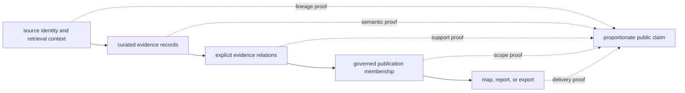

# Verification Evidence

Every published claim sits on several independently reviewable proof layers.
Verification establishes whether encoded contracts hold across those layers;
it does not enlarge the underlying evidence or erase uncertainty recorded by a
source.

## Proof Layers

| Layer | What is verified | What remains a review judgment |
| --- | --- | --- |
| source integrity | known source identity, retrieval context, expected assets, and governed hashes where available | whether the source is suitable for a new scientific question |
| curation semantics | required fields, preserved nulls, normalized identifiers, chronology meaning, and precision rules | whether an ambiguous record should support a stronger interpretation |
| evidence relations | typed links resolve to governed records and retain their declared role | whether contextual evidence can be promoted to direct support |
| publication scope | deterministic membership, exclusions, traceability, and declared geographic or thematic boundaries | whether the publication scope is sufficient for a reader's intended inference |
| runtime delivery | installed commands, artifacts, and failure behavior conform to their public contracts | whether a technically valid output communicates uncertainty well |
| scientific review | source-specific assumptions and visible caveats receive human review | whether later evidence warrants a revised interpretation |

No single layer substitutes for another. A valid artifact with missing lineage
is not fully traceable; a traceable record outside a publication contract is
not silently included; and a passing runtime check does not certify scientific
completeness.

## Reading A Verification Result

| Result | Supported conclusion | Unsupported conclusion |
| --- | --- | --- |
| source checks pass | governed inputs have the expected identity and structure | the source has complete spatial, temporal, or taxonomic coverage |
| curation checks pass | encoded transformations preserve declared invariants | every ambiguity has one scientifically correct resolution |
| relation checks pass | evidence links are structurally valid and typed | every linked record provides direct support |
| publication checks pass | the product contains the membership its contract declares | omitted records are irrelevant to every possible analysis |
| delivery checks pass | the supported interface produces conforming outputs | the output is appropriate for an undeclared use case |

The decisive question is therefore not simply whether verification passed. It
is whether the proof that passed governs the claim being made.

## Failure And Refusal

Verification failures preserve information. Depending on the boundary, the
system can reject malformed input, preserve a qualified record, exclude a
record with an explicit reason, or refuse publication. These outcomes are
preferable to manufacturing certainty or silently weakening a contract.

An exclusion report is consequently part of the evidence, not a secondary
debug artifact. It identifies the boundary between what a publication can
support and what remains outside its declared claim.

## Review Surfaces

- [Runtime invariants and limits](runtime-invariants-and-limits.md) state the
  conditions the supported system must preserve.
- [Change validation](change-validation.md) explains how proof follows the
  boundary that changed.
- [Public language](public-language-guide.md) constrains the claim that may be
  made from verified evidence.
- [Animal atlas readiness](../../../report/animal_atlas_readiness.md) and the
  [animal exclusion report](../../../report/animal_atlas_exclusion_report.md)
  expose current publication readiness and refusal reasons.
