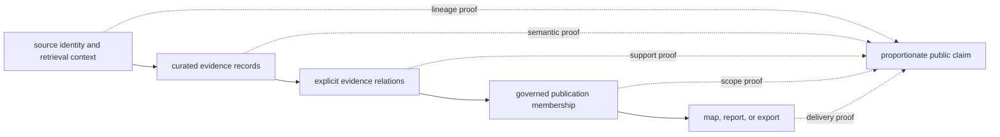

# Verification Evidence

Every published claim sits on several independently reviewable proof layers.
Verification establishes whether encoded contracts hold across those layers;
it does not enlarge the underlying evidence or erase uncertainty recorded by a
source.

## Proof Layers

| Layer | What is verified | What remains a review judgment |
| --- | --- | --- |
| source integrity | known source identity, retrieval context, expected assets, and governed hashes where available | whether the source is suitable for a new scientific question |
| curation semantics | required fields, preserved nulls, normalized identifiers, chronology meaning, and precision rules | whether an ambiguous record should support a stronger interpretation |
| evidence relations | typed links resolve to governed records and retain their declared role | whether contextual evidence can be promoted to direct support |
| publication scope | deterministic membership, exclusions, traceability, and declared geographic or thematic boundaries | whether the publication scope is sufficient for a reader's intended inference |
| runtime delivery | installed commands, artifacts, and failure behavior conform to their public contracts | whether a technically valid output communicates uncertainty well |
| scientific review | source-specific assumptions and visible caveats receive human review | whether later evidence warrants a revised interpretation |

No single layer substitutes for another. A valid artifact with missing lineage
is not fully traceable; a traceable record outside a publication contract is
not silently included; and a passing runtime check does not certify scientific
completeness.

## Reading A Verification Result

| Result | Supported conclusion | Unsupported conclusion |
| --- | --- | --- |
| source checks pass | governed inputs have the expected identity and structure | the source has complete spatial, temporal, or taxonomic coverage |
| curation checks pass | encoded transformations preserve declared invariants | every ambiguity has one scientifically correct resolution |
| relation checks pass | evidence links are structurally valid and typed | every linked record provides direct support |
| publication checks pass | the product contains the membership its contract declares | omitted records are irrelevant to every possible analysis |
| delivery checks pass | the supported interface produces conforming outputs | the output is appropriate for an undeclared use case |

The decisive question is therefore not simply whether verification passed. It
is whether the proof that passed governs the claim being made.

## Match Proof To Failure Mode

Different checks catch different classes of error. A credible review names the
failure mode and selects evidence capable of detecting it:

| Possible failure | Decisive proof | Insufficient proof by itself |
| --- | --- | --- |
| wrong upstream release | source identity, retrieval metadata, and governed hashes | unchanged published count |
| record meaning changed during normalization | field-level semantic comparison and focused normalization behavior | schema validity |
| evidence attached to the wrong sample or site | stable identifiers and relation resolution across the chain | valid individual records |
| eligible member missing from a product | admission inventory, exclusion ledger, and manifest membership comparison | successful rendering |
| product scope changed | declared geography and product contract diff | unchanged file names |
| caveat disappeared from presentation | structured warning plus rendered-output review | structured artifact validity |

This is why a broad green test run is not a complete evidence statement. Its
value depends on whether the relevant assertion was present and whether the
reviewed artifact is the one the assertion governed.

## Worked Verification Paths

### A mapped SEAD site

A reader can begin with one feature in the Nordic bundle and verify, in order:

1. the feature is named by the regional manifest;
2. its stable site identity resolves to the normalized SEAD record;
3. its country assignment explains regional admission;
4. the source page preserves the SEAD identity and current source limitations;
5. the layer role remains environmental-archaeology context.

That chain verifies membership, geography, identity, and role. It does not
establish a dated event because the current SEAD capture lacks dating, period,
and bibliography rows.

### An animal atlas point

An animal point has a longer path: product membership, point traceability,
admission decision, sample master, sample-to-site relation, locality evidence,
chronology evidence, coordinate provenance, paper and supplement identity, and
archive project. Verification must follow the links used by the visible
claim. A valid project link cannot substitute for a missing sample locality;
a valid site cannot substitute for sample chronology.

### A source-family count

The collection summary can verify that a family was captured and record its
count. A publication manifest can verify how many members entered one product.
Those counts use different populations. Comparing them is meaningful only
after the record unit, geography, and admission rule are named.

## Verification Evidence Hierarchy

| Public statement | Minimum evidence that should be recoverable |
| --- | --- |
| “1,231 AADR samples are in the Nordic bundle” | bundle manifest, sample identities, four-country selection, and `v66` release lineage |
| “200 Neotoma sites provide pollen context” | normalized site identities, source linkage, temporal review, and primary-context role |
| “23 SEAD rows are not mapped” | reviewed inventory denominator and explicit missing-country state |
| “two animal localities are published in the Nordic product” | two admitted feature identities plus sample, locality, chronology, coordinate, and source links |
| “one fieldwork location is shown” | observation record, site identity, coordinates, date, contributor, and sampling-context role |

The hierarchy is claim-specific. It does not award one repository-wide
confidence score or treat a longer provenance path as inherently stronger.

## Failure And Refusal

Verification failures preserve information. Depending on the boundary, the
system can reject malformed input, preserve a qualified record, exclude a
record with an explicit reason, or refuse publication. These outcomes are
preferable to manufacturing certainty or silently weakening a contract.

An exclusion report is consequently part of the evidence, not a secondary
debug artifact. It identifies the boundary between what a publication can
support and what remains outside its declared claim.

Absence also needs a type. “Not captured,” “captured but unresolved,” “resolved
but ineligible,” and “eligible but outside this product scope” describe
different populations and different recovery actions. Collapsing all four
into a missing row destroys the information needed to audit completeness.

## Review Surfaces

- [Runtime invariants and limits](runtime-invariants-and-limits.md) state the
  conditions the supported system must preserve.
- [Change evidence](change-validation.md) distinguishes scientific, product,
  analytical, and presentation causes behind a visible difference.
- [Evidence vocabulary](public-language-guide.md) constrains the claim that may
  be made from verified evidence.
- [Claim review](review-checklist.md) provides a reader path from a public
  statement to its governing source and decision.
- [Animal atlas readiness](../../../report/animal_atlas_readiness.md) and the
  [animal exclusion report](../../../report/animal_atlas_exclusion_report.md)
  expose current publication readiness and refusal reasons.
