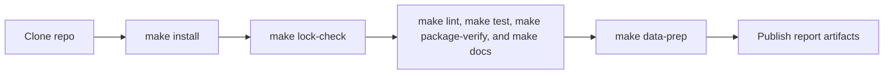

# Workflows

This section is the shortest honest path from a fresh checkout to a verified environment, a rebuilt `data/` tree, and regenerated publication artifacts.

It is ordered by mutation boundary:

1. prove the environment
2. rebuild tracked source data
3. republish tracked report artifacts
4. troubleshoot the workflow that failed

## Pages in This Section

- [Install and verify](install-and-verify.md)
- [Rebuild the data tree](rebuild-data-tree.md)
- [Publish report artifacts](publish-report-artifacts.md)
- [Troubleshoot local setup](troubleshoot-local-setup.md)

## Use This Section When You Need To

- prepare a clean machine for local work
- separate verification failures from data-collection failures
- know which commands rewrite tracked repository state
- republish `docs/report/` without guessing which prerequisites are required first

## Workflow Boundary

This section is operational. It explains when to run a command, what tracked state it rewrites, and what success should leave behind. It is not the place for architectural justification or full command inventories; those live in [Architecture](../architecture/index.md) and [Reference](../reference/index.md).

## Reading Rule

Start with [Install and verify](install-and-verify.md) even if you already know the repository. That page defines the proof surface that should pass before any data or report outputs are regenerated.

## Purpose

This page organizes rebuild work by precondition and mutation scope instead of by command popularity.
