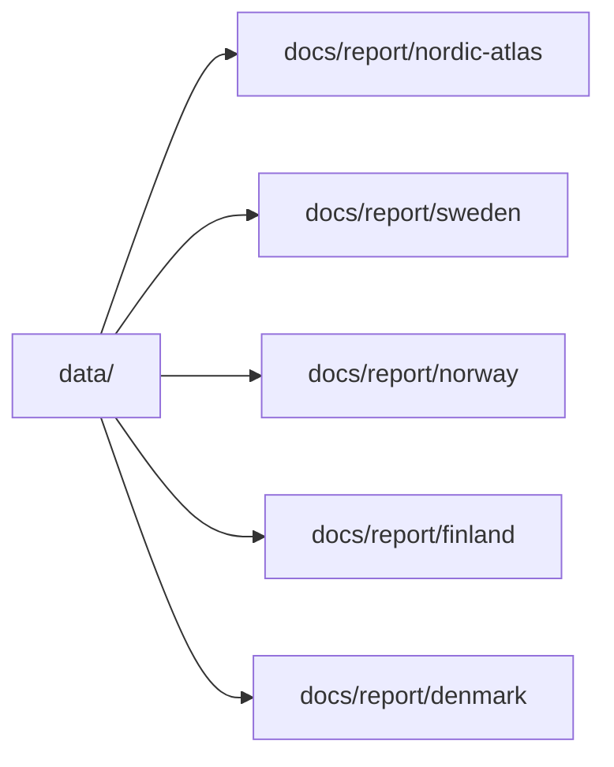

# Publish Report Artifacts

Once the data tree exists, generate the shared map and any country reports you want to publish or inspect. This workflow rewrites tracked files under `docs/report/`.

This page is about publication output, not data collection.

## Canonical Publication Command

```bash
make reports
```

Equivalent direct command:

```bash
artifacts/.venv/bin/bijux-pollenomics publish-reports --aadr-root data/aadr --version v62.0 --output-root docs/report --context-root data
```

That command is the direct match for the checked-in publication workflow. It rebuilds the Nordic Evidence Atlas bundle and the four published country bundles in one pass.

Publication now uses staging directories and swaps the finished tree into place only after success. A failed regeneration should not delete the previously published `docs/report/` tree.

## When To Use This Workflow

Use this page when:

- `data/` is already current and publication artifacts need regeneration
- reporting code changed and the checked-in bundles need to be refreshed
- you need to review `docs/report/` diffs against the current source tree

## Which Command To Use

- use `publish-reports` when you want the current checked-in publication tree rebuilt under `docs/report/`
- use `report-multi-country-map` when you only want the shared multi-country HTML map bundle
- use `report-country` when you want one country bundle without republishing everything else

Those commands overlap, but they are not interchangeable.

## Mutation Boundary

- `publish-reports` rewrites `docs/report/`
- it does not recollect `data/`
- it uses staging so a failed regeneration should leave the previous published tree in place
- it is the canonical command for the checked-in atlas plus the four checked-in country bundles

## Nordic Evidence Atlas

```bash
artifacts/.venv/bin/bijux-pollenomics report-multi-country-map Sweden Norway Finland Denmark --version v62.0 --name nordic-atlas --title "Nordic Evidence Atlas" --context-root data
```

That command reads:

- AADR `.anno` files from `data/aadr/v62.0/`
- normalized context layers from `data/boundaries/`, `data/landclim/`, `data/neotoma/`, `data/sead/`, and `data/raa/`

and writes the Nordic Evidence Atlas bundle under `docs/report/nordic-atlas/`.

What it does not do:

- it does not regenerate country bundles
- it does not rebuild `data/`
- it does not make the shared map fully offline because basemap tiles still come from external providers at runtime

Use this narrower command only when the shared atlas is the artifact under review.

## Country Reports

```bash
artifacts/.venv/bin/bijux-pollenomics report-country Sweden --version v62.0 --shared-map-label "Nordic Evidence Atlas" --shared-map-path "../nordic-atlas/nordic-atlas_map.html"
artifacts/.venv/bin/bijux-pollenomics report-country Norway --version v62.0 --shared-map-label "Nordic Evidence Atlas" --shared-map-path "../nordic-atlas/nordic-atlas_map.html"
artifacts/.venv/bin/bijux-pollenomics report-country Finland --version v62.0 --shared-map-label "Nordic Evidence Atlas" --shared-map-path "../nordic-atlas/nordic-atlas_map.html"
artifacts/.venv/bin/bijux-pollenomics report-country Denmark --version v62.0 --shared-map-label "Nordic Evidence Atlas" --shared-map-path "../nordic-atlas/nordic-atlas_map.html"
```

Each `report-country` command writes one country bundle under `docs/report/<country>/`.

Country report generation is intentionally file-oriented. It produces inventories and summaries, not a second standalone HTML map.

Use `report-country` when one country bundle is the only artifact under review. Use `publish-reports` when the checked-in publication tree itself is the thing being updated.

## Publication Checklist

Use this order when republishing checked-in outputs:

1. run [Install and verify](install-and-verify.md)
2. run [Rebuild data tree](rebuild-data-tree.md) if the source data needs refresh
3. run `make reports` to regenerate `docs/report/`
4. run `make docs` to verify that the documentation shell still builds against the regenerated artifacts
5. review diffs in `docs/report/` and any changed narrative pages together

## What Success Leaves Behind

- refreshed bundle files under `docs/report/nordic-atlas/` and the published country directories
- final `docs/report/...` output paths inside the generated summary JSON files
- no partially swapped report tree from a failed regeneration
- no implication that narrative pages under `docs/outputs/` were machine-generated

## Output Model



## Purpose

This page gives the publication workflow for the checked-in atlas and country bundles without conflating it with source collection.
