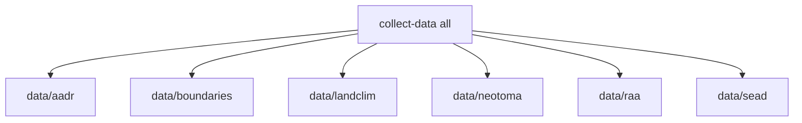

# Rebuild Data Tree

The repository uses one unified acquisition command, but that command rewrites tracked source outputs. Treat this workflow as a deliberate rebuild step, not as a harmless read-only refresh.

## Full Rebuild

```bash
make data-prep
```

Equivalent direct command:

```bash
PYTHONPATH=src artifacts/.venv/bin/python -m bijux_pollenomics.cli collect-data all --version v62.0 --output-root data
```

## Before You Run It

Expect the full rebuild to:

- require network access to multiple upstream providers
- overwrite tracked files under `data/`
- take longer than lint or test commands
- update `data/collection_summary.json` as part of the same run

If you only need environment verification, stop at the earlier [Install and verify](install-and-verify.md) workflow instead.

## What Gets Rebuilt



This command is designed so that deleting `data/` and rerunning it recreates the same top-level directory model and the currently collected normalized outputs.

When you rerun one source collector, that source directory is replaced before new files are written. That keeps recollection deterministic instead of leaving stale files from older runs in place.

The important consequence is that a source-specific recollection is not additive. It replaces the tracked snapshot for that source.

## Single-Source Rebuilds

```bash
PYTHONPATH=src artifacts/.venv/bin/python -m bijux_pollenomics.cli collect-data aadr --version v62.0 --output-root data
PYTHONPATH=src artifacts/.venv/bin/python -m bijux_pollenomics.cli collect-data raa --output-root data
```

Use source-specific runs when you are iterating on one acquisition area and do not want to refresh the entire tree.

The repository also supports:

```bash
PYTHONPATH=src artifacts/.venv/bin/python -m bijux_pollenomics.cli collect-data boundaries --output-root data
PYTHONPATH=src artifacts/.venv/bin/python -m bijux_pollenomics.cli collect-data landclim --output-root data
PYTHONPATH=src artifacts/.venv/bin/python -m bijux_pollenomics.cli collect-data neotoma --output-root data
PYTHONPATH=src artifacts/.venv/bin/python -m bijux_pollenomics.cli collect-data sead --output-root data
```

## Which Arguments Matter By Source

- `aadr` requires `--version` because the output path is versioned under `data/aadr/<version>/`
- `all` also requires `--version` because it includes the `aadr` collector
- `boundaries`, `landclim`, `neotoma`, `raa`, and `sead` do not use the AADR version flag for their own output layout

Using `--version v62.0` for a source that does not need it is harmless, but the versioned output contract is only meaningful for `aadr`.

## What A Successful Rebuild Leaves Behind

After a full successful run, the checked-in tree should contain:

- refreshed raw and normalized source directories under `data/`
- an updated `data/collection_summary.json`
- no stale files left behind inside a rebuilt source directory from earlier collector versions

The data collector does not regenerate `docs/report/`. Report publishing is a separate workflow documented in [Publish report artifacts](publish-report-artifacts.md).

## Purpose

This page explains how the unified data collector maps directly onto the six tracked source categories.
