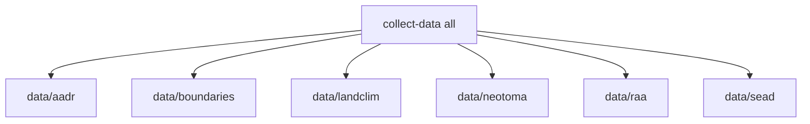

# Rebuild Data Tree

The repository uses one unified acquisition command, but that command rewrites tracked source outputs. Treat this workflow as a deliberate rebuild step, not as a harmless read-only refresh.

This page is about the `data/` tree only. It does not republish `docs/report/`.

## Full Rebuild

```bash
make data-prep
```

Equivalent direct command:

```bash
BIJUX_POLLENOMICS_ALLOW_INSECURE_TLS=1 \
artifacts/.venv/bin/bijux-pollenomics collect-data all --version v62.0 --output-root data
```

`make data-prep` sets the same TLS fallback automatically. Use the environment variable only when you bypass the `Makefile` and invoke the CLI directly.

## When To Use This Workflow

Use this page when:

- collector code changed
- a tracked source snapshot needs refresh
- report publication depends on new source files
- you need to prove that `data/` can still be rebuilt from the current repository state

## Before You Run It

Expect the full rebuild to:

- require network access to multiple upstream providers
- overwrite tracked files under `data/`
- take longer than lint or test commands
- update `data/collection_summary.json` as part of the same run
- retry once with opt-in insecure TLS only when an upstream provider fails certificate verification because of an incomplete CA chain

If you only need environment verification, stop at the earlier [Install and verify](install-and-verify.md) workflow instead.

## What Gets Rebuilt



This command is designed so that deleting `data/` and rerunning it recreates the same top-level directory model and the currently collected normalized outputs.

When you rerun one source collector, that source directory is replaced before new files are written. That keeps recollection deterministic instead of leaving stale files from older runs in place.

The important consequence is that a source-specific recollection is not additive. It replaces the tracked snapshot for that source.

## Mutation Boundary

- `collect-data` rewrites `data/`
- it updates `data/collection_summary.json` as part of the same operation
- it does not rewrite `docs/report/`
- it does not hide which source roots changed; each source keeps its own top-level directory

## Single-Source Rebuilds

```bash
artifacts/.venv/bin/bijux-pollenomics collect-data aadr --version v62.0 --output-root data
artifacts/.venv/bin/bijux-pollenomics collect-data raa --output-root data
```

Use source-specific runs when you are iterating on one acquisition area and do not want to refresh the entire tree.

The repository also supports:

```bash
artifacts/.venv/bin/bijux-pollenomics collect-data boundaries --output-root data
artifacts/.venv/bin/bijux-pollenomics collect-data landclim --output-root data
artifacts/.venv/bin/bijux-pollenomics collect-data neotoma --output-root data
artifacts/.venv/bin/bijux-pollenomics collect-data sead --output-root data
```

## Review Expectations

After a source-specific rebuild, review:

- the changed source directory under `data/<source>/`
- any changed raw inventories, manifests, or summaries
- `data/collection_summary.json` if output-root metadata changed

Do not treat a single-source rebuild as safe simply because the CLI command was narrower. It still replaces the tracked snapshot for that source.

## Which Arguments Matter By Source

- `aadr` requires `--version` because the output path is versioned under `data/aadr/<version>/`
- `all` also requires `--version` because it includes the `aadr` collector
- `boundaries`, `landclim`, `neotoma`, `raa`, and `sead` do not use the AADR version flag for their own output layout

Using `--version v62.0` for a source that does not need it is harmless, but the versioned output contract is only meaningful for `aadr`.

## What A Successful Rebuild Leaves Behind

After a full successful run, the checked-in tree should contain:

- refreshed raw and normalized source directories under `data/`
- an updated `data/collection_summary.json`
- no stale files left behind inside a rebuilt source directory from earlier collector versions

The data collector does not regenerate `docs/report/`. Report publishing is a separate workflow documented in [Publish report artifacts](publish-report-artifacts.md).

## After The Rebuild

- if the changed source data should affect publication artifacts, continue to [Publish report artifacts](publish-report-artifacts.md)
- if the rebuild failed, use [Troubleshoot local setup](troubleshoot-local-setup.md) to classify whether the failure was environment, collector, or upstream-data related

## Purpose

This page explains how the unified data collector rewrites the tracked `data/` tree without blurring the boundaries between sources.
