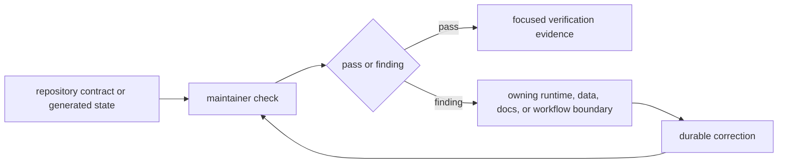

# bijux-pollenomics-dev

Maintainer-only package for repository-health checks, docs integrity, and
release support in the `bijux-pollenomics` monorepo.

It is not the owner of runtime commands, source collection, animal aDNA
intake, sample extraction, chronology normalization, coordinate provenance,
evidence review, or atlas publication logic. Those durable scientific
boundaries live in the runtime package.

Use this package when the real question is "is the repository healthy enough to
ship or review?" rather than "how does the scientific runtime work?"

Install it only when you are working on repository checks, release support, or
documentation integrity. Regular users of the runtime should not need this
package.

<!-- bijux-pollenomics-badges:generated:start -->

<!-- bijux-pollenomics-badges:generated:end -->

## Audience

- maintainers working in the monorepo
- contributors changing docs, release checks, badge sync, or repository truth logic

## Choose This Package When

- you are checking whether the repository is ready to review or release
- you are working on docs integrity, release tooling, or repository truth
  checks
- you need maintainer-facing helpers without pulling scientific ownership into
  a maintainer package

## What This Package Owns

- repository and documentation integrity checks
- release-support helpers and maintainer-facing contract coverage
- badge, handbook, and report-surface verification that should not live in the
  runtime package

## Check Contract

| Check family | Evidence inspected | Authority limit |
| --- | --- | --- |
| API freeze | canonical schema, pinned representation, and digest | detects drift; runtime API remains product-owned |
| badges and package identity | README badge blocks and release metadata | verifies presentation; does not publish a release |
| repository operations | Make and documentation guidance | verifies routes; Make owners define execution |
| release guards | generated posture and required repository contracts | blocks unsupported release claims; does not strengthen evidence |
| workspace layout | package and governed root boundaries | detects ownership drift; does not redefine package behavior |

A check failure must be corrected at the boundary that owns the disputed fact
or behavior. The maintainer package reports and enforces the mismatch; it does
not create a parallel scientific contract.

## What It Does Not Own

- runtime command handling
- source collection and normalization
- sample truth, chronology, or coordinate provenance
- atlas publication semantics
- scientific ranking logic such as the Sweden lake evidence program

## Read Next

- internal guide: [`docs/internal/index.md`](../../docs/internal/index.md)
- maintainer handbook: [`docs/internal/maintain/index.md`](../../docs/internal/maintain/index.md)
- documentation integrity: [`docs/internal/pollenomics-dev/documentation-integrity.md`](../../docs/internal/pollenomics-dev/documentation-integrity.md)
- release support: [`docs/internal/pollenomics-dev/release-support.md`](../../docs/internal/pollenomics-dev/release-support.md)
