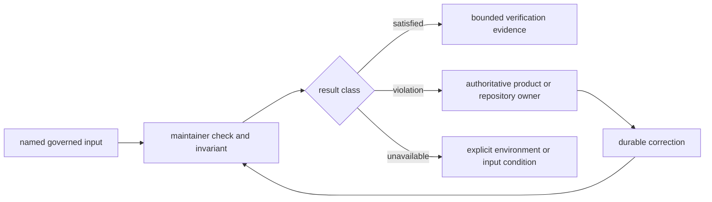

# bijux-pollenomics-dev

Maintainer-only package for repository-health checks, documentation integrity,
API freezes, and release support in the `bijux-pollenomics` repository.

It is not the owner of runtime commands, source collection, animal aDNA
intake, sample extraction, chronology normalization, coordinate provenance,
scientific review, ranking policy, or publication membership. Those decisions
remain with the canonical runtime and governed evidence boundaries.

<!-- bijux-pollenomics-badges:generated:start -->
[](https://github.com/bijux/bijux-pollenomics)
[](https://github.com/bijux/bijux-pollenomics/blob/main/LICENSE)
[](https://github.com/bijux/bijux-pollenomics/actions/workflows/verify.yml?query=branch%3Amain)
[](https://github.com/bijux/bijux-pollenomics/actions/workflows/release-pypi.yml)
[](https://github.com/bijux/bijux-pollenomics/actions/workflows/release-ghcr.yml)
[](https://github.com/bijux/bijux-pollenomics/actions/workflows/release-github.yml)
[](https://github.com/bijux/bijux-pollenomics/actions/workflows/deploy-docs.yml)
<!-- bijux-pollenomics-badges:generated:end -->

## Package Boundary

Use this package when the question is whether a named repository contract
agrees at a specific revision. Regular runtime users do not need it.

| It may | It must not |
| --- | --- |
| compare declared and observed repository state | choose a locality, chronology, taxonomy, or sample identity |
| validate documentation structure and generated presentation | create scientific truth to make a page pass |
| detect API, dependency, package, or release drift | redefine the public API or package ownership |
| materialize narrowly owned badge or legal-file blocks | rewrite unrelated evidence or report trees |
| refuse unsupported repository or release claims | strengthen missing evidence or erase a blocker |

Its outputs are bounded findings, not scientific observations. Passing one
check establishes only the contract, inputs, execution scope, and revision
that check actually evaluated.

## Maintainer Modules

| Module | Mode | Owned result |
| --- | --- | --- |
| `bijux_pollenomics_dev.api.freeze_contracts` | check | schema YAML, canonical JSON, and digest agreement |
| `bijux_pollenomics_dev.api.openapi_drift` | check | breaking API-field findings against the selected baseline |
| `bijux_pollenomics_dev.docs.badge_sync` | check or sync | generated README badge blocks from package metadata |
| `bijux_pollenomics_dev.quality.deptry_scan` | check wrapper | package dependency findings under repository configuration |
| `bijux_pollenomics_dev.release.license_assets` | check or sync | package legal-file copies from root authorities |
| `bijux_pollenomics_dev.release.version_resolver` | inspect | package version resolved from metadata, Hatch, or tags |
| `bijux_pollenomics_dev.release.publication_guard` | check | prerelease, local-version, and built-artifact findings |

Check modes do not rewrite governed files. Sync modes have narrow write sets:
badge sync owns only marked badge blocks; license sync owns only package legal
copies. Source catalogs, scientific evidence, runtime schemas, and generated
reports remain outside those writers' authority.

## Finding Contract



Keep these outcomes distinct:

| Outcome | Meaning | Correct response |
| --- | --- | --- |
| contract satisfied | observed state agrees for the named inputs | retain focused verification; do not generalize |
| contract violation | evaluation completed and found disagreement | route expected and observed state to the owner |
| invalid invocation | arguments or paths do not satisfy the command contract | correct invocation without claiming repository status |
| unavailable environment | a prerequisite prevented evaluation | record the exact condition required to rerun |
| publication refusal | evidence was evaluated and does not support the requested claim | preserve the refusal until its evidence owner changes |

A finding should name its governed input, invariant, observed state, expected
state, affected identities, revision, and non-destructive next inspection.

## Generated State

When a finding concerns a report, checksum, badge block, legal copy, or frozen
API representation, correct its authoritative input or producer and regenerate
the owned surface. Hand-editing the descendant leaves the next run guaranteed
to restore the disagreement.

Review generated output with:

- producer and exact command;
- input identities and repository revision;
- complete write set;
- added, removed, retained, merged, or split identities;
- semantic and population changes;
- unexpectedly unchanged dependents; and
- focused verification, warnings, and omitted broader lanes.

Successful execution and aggregate counts are summaries, not substitutes for
that evidence.

## Direct Module Checks

From the repository root:

```bash
python -m bijux_pollenomics_dev.api.freeze_contracts --repo-root .
python -m bijux_pollenomics_dev.api.openapi_drift --repo-root .
python -m bijux_pollenomics_dev.docs.badge_sync check
python -m bijux_pollenomics_dev.release.license_assets check
```

Repository Make targets compose these modules into broader maintainer lanes.
Run the narrowest owner-specific check first and retain outputs under
`artifacts/` when terminal status alone is not enough to reconstruct the
verification boundary.

## Documentation Boundary

| Surface | Owned content |
| --- | --- |
| `docs/public/` | product behavior, evidence meaning, workflows, interfaces, limitations, and traceability |
| `docs/internal/` | repository checks, generators, release mechanics, and maintenance ownership |
| `docs/report/` | governed publication, review, qualification, and refusal products |

Documentation checks may detect audience leakage or broken presentation. The
correction still belongs in the owning page, contract, input, or generator; a
maintainer helper does not become a parallel source of scientific meaning.

## Read Next

- [Maintainer package handbook](../../docs/internal/pollenomics-dev/index.md)
- [Repository maintenance](../../docs/internal/maintain/index.md)
- [Quality gates](../../docs/internal/pollenomics-dev/quality-gates.md)
- [Documentation integrity](../../docs/internal/pollenomics-dev/documentation-integrity.md)
