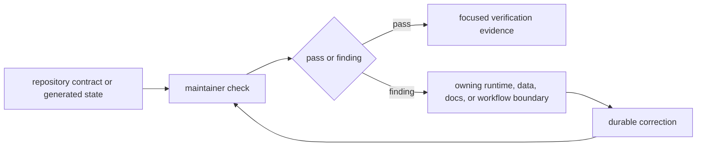
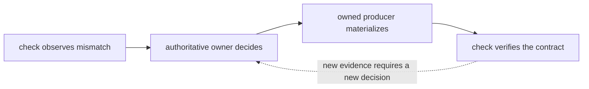
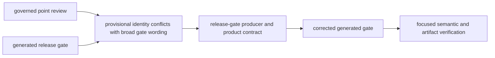
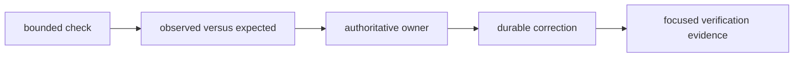
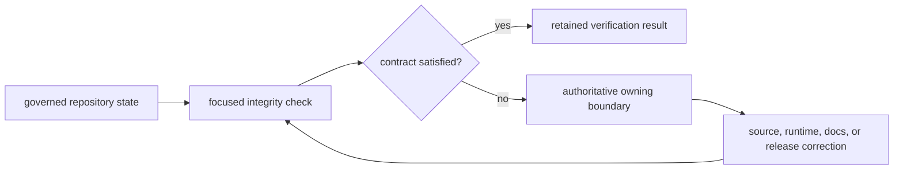

# bijux-pollenomics-dev

Maintainer-only package for repository-health checks, docs integrity, and
release support in the `bijux-pollenomics` monorepo.

It is not the owner of runtime commands, source collection, animal aDNA
intake, sample extraction, chronology normalization, coordinate provenance,
evidence review, or atlas publication logic. Those durable scientific
boundaries live in the runtime package.

Use this package when the real question is "is the repository healthy enough to
ship or review?" rather than "how does the scientific runtime work?"

Install it only when you are working on repository checks, release support, or
documentation integrity. Regular users of the runtime should not need this
package.

<!-- bijux-pollenomics-badges:generated:start -->
[](https://github.com/bijux/bijux-pollenomics)
[](https://github.com/bijux/bijux-pollenomics/blob/main/LICENSE)
[](https://github.com/bijux/bijux-pollenomics/actions/workflows/verify.yml?query=branch%3Amain)
[](https://github.com/bijux/bijux-pollenomics/actions/workflows/release-pypi.yml)
[](https://github.com/bijux/bijux-pollenomics/actions/workflows/release-ghcr.yml)
[](https://github.com/bijux/bijux-pollenomics/actions/workflows/release-github.yml)
[](https://github.com/bijux/bijux-pollenomics/actions/workflows/deploy-docs.yml)
<!-- bijux-pollenomics-badges:generated:end -->

## Audience

- maintainers working in the monorepo
- contributors changing docs, release checks, badge sync, or repository truth logic

## Choose This Package When

- you are checking whether the repository is ready to review or release
- you are working on docs integrity, release tooling, or repository truth
  checks
- you need maintainer-facing helpers without pulling scientific ownership into
  a maintainer package

## What This Package Owns

- repository and documentation integrity checks
- release-support helpers and maintainer-facing contract coverage
- badge, handbook, and report-surface verification that should not live in the
  runtime package

Its outputs are repository findings, not scientific observations. A passing
check proves that the inspected contract is internally consistent at that
revision; it does not prove that a source is complete, a chronology is precise,
or a published interpretation is scientifically sufficient.

### Admission Test For Maintainer Helpers

A helper belongs in this package only when all of these statements hold:

| Question | Required answer |
| --- | --- |
| What does it inspect? | an explicit repository, package, documentation, API, or release contract |
| What does it decide? | whether observed repository state conforms to that existing contract |
| What does it emit? | a bounded finding, verification result, or narrowly owned generated surface |
| What must it not decide? | source meaning, sample truth, scientific fitness, ranking policy, or publication membership |
| Where is the correction made? | in the authoritative runtime, data, documentation, package, or workflow owner |

If a proposed helper needs domain judgment to choose the correct locality,
chronology, identity, or admission outcome, that judgment belongs in the
canonical evidence contract. The maintainer helper may verify the resulting
relationship after the owner has made it explicit.

## Executable Module Map

The package intentionally exposes Python modules rather than a public runtime
console command. Repository Make targets compose these modules into maintainer
workflows.

| Module | Mode | Owned result |
| --- | --- | --- |
| `bijux_pollenomics_dev.api.freeze_contracts` | check | schema YAML, pinned JSON, and SHA-256 agreement for every API contract |
| `bijux_pollenomics_dev.api.openapi_drift` | check | breaking field-removal findings relative to the preceding revision |
| `bijux_pollenomics_dev.docs.badge_sync` | `check` or `sync` | generated badge blocks derived from package metadata and the badge catalog |
| `bijux_pollenomics_dev.quality.deptry_scan` | check wrapper | package dependency findings under merged repository configuration |
| `bijux_pollenomics_dev.release.license_assets` | `check` or `sync` | byte-identical package `LICENSE` and `NOTICE` files from root authorities |
| `bijux_pollenomics_dev.release.version_resolver` | inspect | package version resolved from metadata, Hatch, or matching tags |
| `bijux_pollenomics_dev.release.publication_guard` | check | prerelease, local-version, and built-artifact version findings |

Check modes do not rewrite governed files. Sync modes are narrow
materializers: badge sync owns generated README blocks; license sync owns only
package legal-asset copies. The source catalog, root legal files, package
metadata, runtime schemas, and scientific reports remain outside those
generators' authority.

Examples from the repository root:

```bash
python -m bijux_pollenomics_dev.api.freeze_contracts --repo-root .
python -m bijux_pollenomics_dev.api.openapi_drift --repo-root .
python -m bijux_pollenomics_dev.docs.badge_sync check
python -m bijux_pollenomics_dev.release.license_assets check
```

## Check Contract



| Check family | Evidence inspected | Authority limit |
| --- | --- | --- |
| API freeze | canonical schema, pinned representation, and digest | detects drift; runtime API remains product-owned |
| badges and package identity | README badge blocks and release metadata | verifies presentation; does not publish a release |
| repository operations | Make and documentation guidance | verifies routes; Make owners define execution |
| release guards | generated posture and required repository contracts | blocks unsupported release claims; does not strengthen evidence |
| workspace layout | package and governed root boundaries | detects ownership drift; does not redefine package behavior |

A check failure must be corrected at the boundary that owns the disputed fact
or behavior. The maintainer package reports and enforces the mismatch; it does
not create a parallel scientific contract.

### Observation and decision stay separate

Repository checks can compare declared state with observed state. They cannot
decide a new pollen identity, chronology, coordinate, product membership, or
scientific interpretation. That decision belongs to the evidence or runtime
owner and must remain reviewable after the check is gone.

| Responsibility | Owner | Durable output |
| --- | --- | --- |
| observe a mismatch | focused maintainer check | bounded finding with revision and inputs |
| decide the correct scientific or product state | source, evidence, review, or publication boundary | governed record, rule, or disposition |
| materialize an owned generated surface | the surface's generator | reproducible generated diff |
| establish that the correction satisfies the contract | focused maintainer check | named verification result |



This prevents a useful guard from becoming a hidden curation engine. If a
check needs domain knowledge to choose the expected value, encode that choice
in the owning domain contract and let the check verify the resulting relation.

## What A Passing Check Proves

| Passing check | Supported conclusion | Unsupported conclusion |
| --- | --- | --- |
| API freeze | declared schema, pinned rendering, and digest agree | an HTTP service is deployed or scientifically complete |
| documentation integrity | required routes, links, language boundaries, and contracts agree | every scientific statement is true for every source |
| package identity | names, versions, badges, and release surfaces are internally aligned | a release has been published successfully |
| repository truth | inspected claims match the governed inputs encoded by that check | missing evidence has become available |
| release guard | the declared release prerequisites passed | unresolved scientific limits no longer matter outside those prerequisites |

Checks establish bounded repository evidence. Their names and results should
be reported with the governing revision and inputs; “all checks passed” is too
broad when only one contract was inspected.

## Generated State Rule

When a finding concerns a generated report, checksum, badge block, or frozen
API representation, correct the authoritative producer or input and regenerate
the owned surface. Hand-editing the symptom can make one file look current
while leaving the next regeneration guaranteed to restore the defect.

Before accepting regenerated output, inspect both the governing input diff and
the generated diff. A generator that succeeds mechanically can still encode
an unsupported claim or an unexpectedly broad write boundary.

## Route Findings To The Owner

| Finding | Correct owner | Typical durable correction |
| --- | --- | --- |
| public API digest drift | canonical runtime API | reconcile the declared API surface and its frozen representation |
| badge or package count mismatch | package and release metadata | correct the governing metadata, then regenerate presentation |
| broken public route or navigation entry | documentation structure | repair the canonical page or navigation contract |
| stale generated report claim | runtime publication or review generator | correct the producer and regenerate the governed report |
| unsupported release language | evidence or release posture | strengthen the underlying evidence or retain the refusal |
| package ownership leakage | owning runtime or maintainer boundary | move behavior to the package that makes the authoritative decision |

Do not satisfy a repository check by weakening the assertion when the
underlying product contract is wrong. The finding is valuable precisely because
it identifies a disagreement between declared and observed state.

### Worked Finding: Passing Language Exceeds The Evidence Class

Suppose a generated release gate reports that every animal point retains
sample support, while the governed point review contains one member with
`sample_identity_resolution: provisional` and
`sample_evidence_status: not_yet_recoverable`.

The maintainer package may prove that the generated gate and its checked-in
inputs disagree in meaning. It must not relabel the provisional member as a
final sample or weaken unrelated traceability checks.



| Boundary | Correct action |
| --- | --- |
| evidence owner | preserve the provisional identity and source-recovery gap |
| publication owner | decide whether project context remains an admitted product class |
| gate producer | describe the admitted classes without calling every member a recovered sample |
| documentation owner | expose the distinction, but do not become the gate authority |
| maintainer check | detect future disagreement between these surfaces |

This routing keeps a documentation correction from masking a generated-product
defect and keeps a repository check from becoming a scientific curator.

## Report A Finding Precisely

A maintainer finding is actionable when it records:

| Field | Required content |
| --- | --- |
| contract | the exact invariant, policy, schema, route, or generated relation inspected |
| revision and inputs | the repository state and governed files used by the check |
| observed state | the value, path, membership, or behavior actually found |
| expected state | the owning contract's requirement |
| owner | the runtime, data, documentation, workflow, or release boundary that decides the correction |
| evidence | focused command result and any retained artifact path |
| disposition | corrected, intentionally deferred with reason, or still blocking |

“Documentation failed” or “repository truth is red” is not enough. The report
must name the disputed claim and owner so the correction can occur at the
authoritative boundary rather than in the check that detected it.

A stable machine-readable finding should also avoid embedding terminal color,
working-directory accidents, or an unordered filesystem traversal. Deterministic
ordering and repository-relative paths make the same finding comparable across
local runs and automation without turning the local environment into identity.



## Maintainer Evidence Flow



Run the narrowest check that proves the changed contract. Escalate to broader
repository lanes when the change crosses ownership boundaries or when release
evidence requires them.

## What It Does Not Own

- runtime command handling
- source collection and normalization
- sample truth, chronology, or coordinate provenance
- atlas publication semantics
- scientific ranking logic such as the Sweden lake evidence program

## Read Next

- internal guide: [`docs/internal/index.md`](../../docs/internal/index.md)
- maintainer handbook: [`docs/internal/maintain/index.md`](../../docs/internal/maintain/index.md)
- documentation integrity: [`docs/internal/pollenomics-dev/documentation-integrity.md`](../../docs/internal/pollenomics-dev/documentation-integrity.md)
- release support: [`docs/internal/pollenomics-dev/release-support.md`](../../docs/internal/pollenomics-dev/release-support.md)
