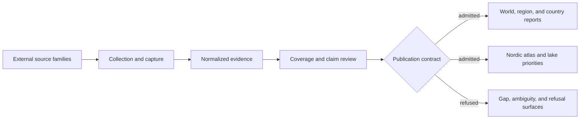

# bijux-pollenomics

`bijux-pollenomics` is the canonical runtime for collecting, normalizing,
reviewing, and publishing the evidence behind the Bijux Pollenomics atlas. It
keeps pollen, environmental archaeology, boundaries, lake registries, human
ancient DNA, and curated animal ancient DNA in distinct evidence roles while
building traceable world, regional, country, and lake-priority products.

The runtime is designed around evidence preservation: source capture remains
separate from normalization, review can refuse unsupported precision, and
publication emits only the subset admitted by a product contract.

<!-- bijux-pollenomics-badges:generated:start -->
[](https://pypi.org/project/bijux-pollenomics/)
[](https://github.com/bijux/bijux-pollenomics/blob/main/LICENSE)
[](https://github.com/bijux/bijux-pollenomics/actions/workflows/verify.yml?query=branch%3Amain)
[](https://github.com/bijux/bijux-pollenomics/actions/workflows/release-pypi.yml)
[](https://github.com/bijux/bijux-pollenomics/actions/workflows/release-ghcr.yml)
[](https://github.com/bijux/bijux-pollenomics/actions/workflows/release-github.yml)
[](https://github.com/bijux/bijux-pollenomics/actions/workflows/deploy-docs.yml)

[](https://pypi.org/project/bijux-pollenomics/)
[](https://pypi.org/project/pollenomics/)

[](https://github.com/bijux/bijux-pollenomics/pkgs/container/bijux-pollenomics%2Fbijux-pollenomics)
[](https://github.com/bijux/bijux-pollenomics/pkgs/container/bijux-pollenomics%2Fpollenomics)

[](https://bijux.io/bijux-pollenomics/public/pollenomics/)
[](https://bijux.io/bijux-pollenomics/public/pollenomics/)
<!-- bijux-pollenomics-badges:generated:end -->

## Install

```bash
python3.11 -m pip install bijux-pollenomics
bijux-pollenomics --help
```

Python 3.11 or newer is required. The core dependency set includes coordinate
transformation and safe XML handling; documentation and quality tooling live in
the `dev` extra.

## Runtime architecture



| Runtime boundary | Python ownership | Result |
| --- | --- | --- |
| Collection | `bijux_pollenomics.data_downloader` | tracked raw and normalized source-family data |
| Animal source recovery | `bijux_pollenomics.adna.sources` | project, paper, supplement, and artifact lineage |
| Sample evidence | `bijux_pollenomics.adna.projects` | stable samples, localities, chronology, and coordinate provenance |
| Scientific review | `bijux_pollenomics.evidence` and `bijux_pollenomics.analysis.review` | readiness, comparability, gaps, and explicit refusals |
| Ranking | `bijux_pollenomics.analysis` | candidate-site and Sweden lake decision-support surfaces |
| Publication | `bijux_pollenomics.reporting` | scoped reports, maps, traceability, and review products |
| Product contracts | `bijux_pollenomics.foundation` | ownership, scope, release posture, and language boundaries |

The repository's tracked `data/` tree is the evidence state. `docs/report/`
contains generated public and review products derived from that state. A report
does not replace the evidence record that governs it.

## Command-line surface

The CLI groups commands by durable responsibility:

```text
Collection        collect-data, refresh-data-contract-surfaces,
                  validate-collection-summary, source-support
Animal evidence   adna-archive-projects, adna-normalization-bundle,
                  adna-species, adna-species-review,
                  refresh-animal-adna-foundation
Publication       report-country, report-multi-country-map, publish-reports
Architecture      surface-map, product-scope, ownership-map
```

Use command-specific help before an operation that writes governed outputs:

```bash
bijux-pollenomics collect-data --help
bijux-pollenomics refresh-animal-adna-foundation --help
bijux-pollenomics publish-reports --help
```

Read-only orientation commands expose the runtime's declared boundaries and
source support without rebuilding the collection:

```bash
bijux-pollenomics product-scope
bijux-pollenomics ownership-map
bijux-pollenomics source-support
bijux-pollenomics adna-species
```

## Python API

The top-level API exposes stable collection, publication, and architecture
entry points:

```python
from bijux_pollenomics import (
    build_product_scope,
    build_surface_map,
    collect_data,
    generate_country_report,
    generate_multi_country_map,
    generate_published_reports,
)
```

`collect_data` and the report generators perform repository operations and
should receive explicit input and output paths from their own signatures. The
architecture functions are useful for discovering the supported surface before
building an integration:

```python
from bijux_pollenomics import build_ownership_map, build_product_scope

scope = build_product_scope()
ownership = build_ownership_map()
```

## Evidence guarantees

The runtime enforces the distinctions that make the published products
auditable:

- source-native identity and acquisition lineage survive normalization;
- direct evidence, contextual evidence, and geographic framing remain separate;
- sample-owned locality and chronology outrank broader project context;
- region-only geography is refused from animal point publication;
- broad or contextual chronology does not acquire synthetic numeric precision;
- product scope is explicit for world, region, and country subsets;
- excluded and unresolved records remain visible in review surfaces.

These guarantees constrain the published subset; they do not imply complete
recovery across every source family or animal project.

## Canonical and short names

Install `bijux-pollenomics` when dependency metadata, imports, operational
documentation, or scientific ownership should name the canonical runtime.
Install [`pollenomics`](../pollenomics/README.md) when a shorter executable and
import prefix are useful. The alias depends on this distribution and forwards
to the same modules; it does not carry a second implementation.

## Documentation

- [documentation home](https://bijux.io/bijux-pollenomics/)
- [runtime handbook](https://bijux.io/bijux-pollenomics/public/pollenomics/)
- [data and evidence handbook](https://bijux.io/bijux-pollenomics/public/pollenomics-data/)
- [Nordic Evidence Atlas](https://bijux.io/bijux-pollenomics/public/nordic-atlas/)
- [Sweden lake priorities](https://bijux.io/bijux-pollenomics/public/nordic-atlas/sweden-lake-priorities/)
- [package boundaries](docs/boundaries.md)
