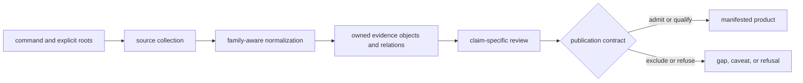

# bijux-pollenomics

`bijux-pollenomics` is the canonical runtime for the Pollenomics evidence and
publication system. It keeps pollen, environmental archaeology, boundaries,
lake registries, human ancient DNA, and curated animal ancient DNA in distinct
evidence roles while collecting, reviewing, ranking, and publishing governed
products.

The runtime applies contracts; it is not a bundled evidence database. Source
captures, curated records, review decisions, and report products are supplied
through explicit filesystem roots and retain versions independent of the
package version.

<!-- bijux-pollenomics-badges:generated:start -->
[](https://pypi.org/project/bijux-pollenomics/)
[](https://github.com/bijux/bijux-pollenomics/blob/main/LICENSE)
[](https://github.com/bijux/bijux-pollenomics/actions/workflows/verify.yml?query=branch%3Amain)
[](https://github.com/bijux/bijux-pollenomics/actions/workflows/release-pypi.yml)
[](https://github.com/bijux/bijux-pollenomics/actions/workflows/release-ghcr.yml)
[](https://github.com/bijux/bijux-pollenomics/actions/workflows/release-github.yml)
[](https://github.com/bijux/bijux-pollenomics/actions/workflows/deploy-docs.yml)

[](https://pypi.org/project/bijux-pollenomics/)
[](https://pypi.org/project/pollenomics/)

[](https://github.com/bijux/bijux-pollenomics/pkgs/container/bijux-pollenomics%2Fbijux-pollenomics)
[](https://github.com/bijux/bijux-pollenomics/pkgs/container/bijux-pollenomics%2Fpollenomics)

[](https://bijux.io/bijux-pollenomics/public/pollenomics/)
[](https://bijux.io/bijux-pollenomics/public/pollenomics/)
<!-- bijux-pollenomics-badges:generated:end -->

## Install

```bash
python3.11 -m pip install bijux-pollenomics
bijux-pollenomics --version
bijux-pollenomics product-scope --json
```

Python 3.11 or newer is required. Inspection commands work without repository
data. Collection, review, and publication commands require explicit governed
roots; their defaults are relative to the current working directory.

## Distribution Boundary

| Included in the wheel | Supplied separately |
| --- | --- |
| typed Python runtime and `py.typed` marker | captured and normalized source-family data |
| console parser and command handlers | literature, supplements, registries, and credentials |
| evidence, review, ranking, and publication behavior | curation decisions and recovery ledgers |
| schemas and artifact contracts | manifested world, regional, country, and atlas products |

The repository checkout is the reference environment when runtime, governed
evidence, and checked-in products must be inspected together. A wheel version
identifies behavior; a data revision identifies evidence state; a product
manifest identifies publication membership.

### Choose The Runtime Context Deliberately

| Context | Available authority | Appropriate use |
| --- | --- | --- |
| installed wheel | executable behavior, public API, schemas, and product contracts | integration, capability inspection, or operation over explicitly supplied external state |
| repository checkout | lock-resolved runtime plus tracked `data/` and `docs/report/` revisions | reproduce or challenge a checked-in evidence or publication claim |
| isolated candidate roots | runtime plus copied or newly collected state beneath `artifacts/` | rehearse collection or publication without replacing governed state |

These contexts can run identical Python code while answering different
questions. An installed-wheel result cannot identify which repository evidence
revision was intended. A checkout does not make every tracked product
rebuildable when its lifecycle matrix declares missing preparation stages. A
candidate proves only the state it contains until its identities and semantic
diff are accepted into a governed root.

## Choose An Operation

| Need | Read-only entry | Writer, when intended |
| --- | --- | --- |
| inspect product and ownership boundaries | `product-scope`, `surface-map`, `ownership-map` | none |
| inspect collector capability | `source-support` | `collect-data` |
| inspect animal evidence | `adna-species`, `adna-species-review`, `adna-runtime-manifest` | `refresh-animal-adna-foundation` |
| inspect a collection ledger | `validate-collection-summary` | `collect-data` |
| inspect publication products | existing bundle manifests and member files | `publish-reports` |

Begin with the read-only contract. A writer is appropriate only when its input
identity, output roots, replacement behavior, and post-write review are known.

## Runtime Architecture



| Boundary | Python ownership | Persistent meaning |
| --- | --- | --- |
| collection | `bijux_pollenomics.data_downloader` | captured identity, retrieval context, and normalized family state |
| animal evidence | `bijux_pollenomics.adna` | project, paper, supplement, sample, locality, chronology, and coordinate lineage |
| review and ranking | `bijux_pollenomics.evidence`, `bijux_pollenomics.analysis` | fitness, conflicts, qualifications, exclusions, and decision support |
| publication | `bijux_pollenomics.reporting` | scope, manifest membership, traceability, maps, tables, and reports |
| product contracts | `bijux_pollenomics.foundation` | product mode, ownership, source roles, and claim-language boundaries |

## Command Surface

```bash
bijux-pollenomics --help
bijux-pollenomics source-support --json
bijux-pollenomics adna-species-review --species ovis_aries --json
bijux-pollenomics collect-data --help
bijux-pollenomics publish-reports --help
```

Collection and publication are state-changing operations. Pass source, data,
context, AADR, and output roots explicitly in automation so a valid command
cannot silently address the wrong filesystem state.

## Python Surface

The supported public namespace is `bijux_pollenomics`:

```python
from bijux_pollenomics import (
    build_product_scope,
    collect_data,
    generate_published_reports,
)
```

Use the top-level API where possible. Import implementation modules only when
the integration deliberately owns that narrower contract. Public API schemas
are frozen under `apis/bijux-pollenomics/v1/` in the repository.

## Evidence guarantees

The runtime guarantees contract behavior, not universal evidence quality:

- captured source identity remains distinct from repository interpretation;
- normalization does not imply scientific or publication fitness;
- review may qualify or refuse unsupported precision and comparison;
- publication membership is explicit in a versioned manifest;
- product descendants cannot strengthen their governing evidence;
- missing lifecycle stages remain missing rather than being inferred from a
  final export; and
- evidence, decision, and product identifiers remain independently auditable.

A reusable handoff records the package version, explicit roots, source or data
revision, governed object IDs, decision IDs, product manifest and members, and
focused verification. A dataframe, GeoJSON file, or rendered map without that
packet is a transport form, not a complete evidence product.

## Canonical And Short Names

`bijux-pollenomics` and `bijux_pollenomics` are the canonical distribution,
command, and import identities. The [`pollenomics`](../pollenomics/README.md)
distribution forwards a short command and import prefix to this runtime. It
does not define independent schemas, scientific behavior, or evidence state.

## Read Next

- [Product handbook](../../docs/public/pollenomics/index.md)
- [Runtime architecture](../../docs/public/pollenomics/architecture/index.md)
- [CLI and Python interfaces](../../docs/public/pollenomics/interfaces/index.md)
- [Evidence database](../../docs/public/pollenomics-data/index.md)
- [Runtime package boundaries](docs/boundaries.md)
