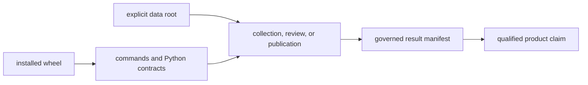
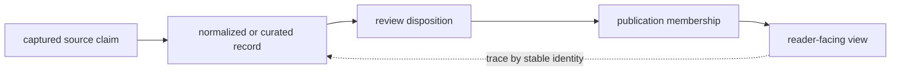
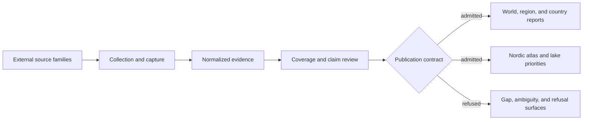
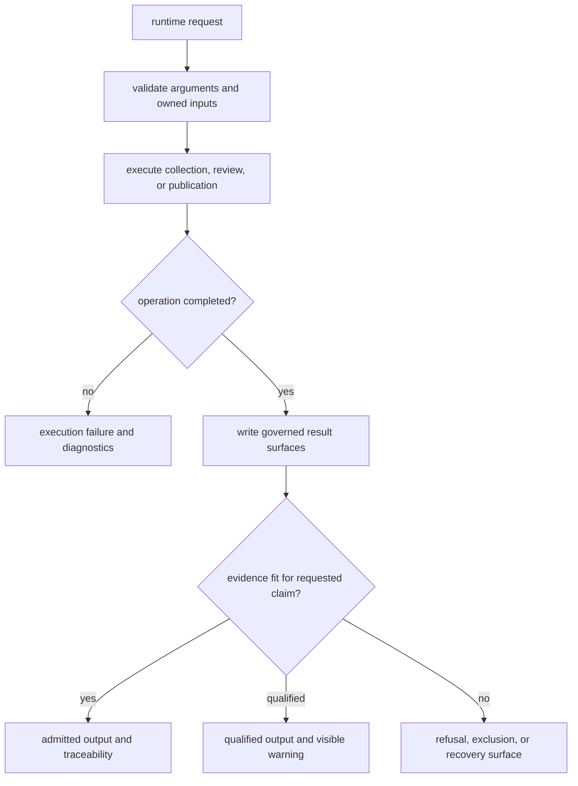
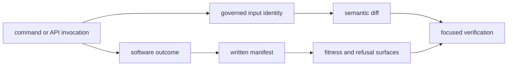
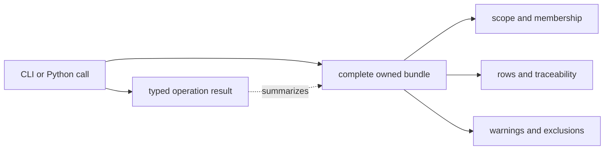
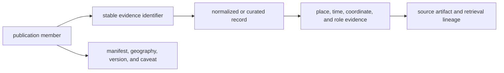

# bijux-pollenomics

`bijux-pollenomics` is the canonical runtime for collecting, normalizing,
reviewing, and publishing the evidence behind the Bijux Pollenomics atlas. It
keeps pollen, environmental archaeology, boundaries, lake registries, human
ancient DNA, and curated animal ancient DNA in distinct evidence roles while
building traceable world, regional, country, and lake-priority products.

The runtime is designed around evidence preservation: source capture remains
separate from normalization, review can refuse unsupported precision, and
publication emits only the subset admitted by a product contract.

<!-- bijux-pollenomics-badges:generated:start -->
[](https://pypi.org/project/bijux-pollenomics/)
[](https://github.com/bijux/bijux-pollenomics/blob/main/LICENSE)
[](https://github.com/bijux/bijux-pollenomics/actions/workflows/verify.yml?query=branch%3Amain)
[](https://github.com/bijux/bijux-pollenomics/actions/workflows/release-pypi.yml)
[](https://github.com/bijux/bijux-pollenomics/actions/workflows/release-ghcr.yml)
[](https://github.com/bijux/bijux-pollenomics/actions/workflows/release-github.yml)
[](https://github.com/bijux/bijux-pollenomics/actions/workflows/deploy-docs.yml)

[](https://pypi.org/project/bijux-pollenomics/)
[](https://pypi.org/project/pollenomics/)

[](https://github.com/bijux/bijux-pollenomics/pkgs/container/bijux-pollenomics%2Fbijux-pollenomics)
[](https://github.com/bijux/bijux-pollenomics/pkgs/container/bijux-pollenomics%2Fpollenomics)

[](https://bijux.io/bijux-pollenomics/public/pollenomics/)
[](https://bijux.io/bijux-pollenomics/public/pollenomics/)
<!-- bijux-pollenomics-badges:generated:end -->

## Install

```bash
python3.11 -m pip install bijux-pollenomics
bijux-pollenomics --help
```

Python 3.11 or newer is required. The core dependency set includes coordinate
transformation and safe XML handling; documentation and quality tooling live in
the `dev` extra.

## Distribution boundary

The wheel ships the typed Python runtime and command entry point. It does not
embed the repository's checked-in `data/` evidence tree or `docs/report/`
publication tree. Inspection commands that describe compiled runtime contracts
work immediately after installation:

```bash
bijux-pollenomics product-scope
bijux-pollenomics source-support --json
bijux-pollenomics adna-species --json
```

Collection and publication need explicit filesystem state. Their default
`data/`, `data/aadr/v66/`, and `docs/report/` paths are relative to the current
working directory. Applications should pass data, context, AADR, and output
roots explicitly so a valid command cannot silently address the wrong tree.

| Installed surface | Included | Supplied separately |
| --- | --- | --- |
| Python modules and type marker | collection, evidence, analysis, foundation, reporting, and CLI code | source-family captures and curated evidence records |
| console command | parser, validation, inspection, collection, and publication handlers | credentials or access required by an upstream source |
| artifact schemas and behavior | canonical runtime contracts | a prebuilt world, regional, or country publication tree |

The repository is the reproducible reference environment when the checked-in
evidence and publications are required together.

### Installed Runtime Versus Repository Product

An installation can expose the runtime correctly while having no evidence
database in its working directory. Distinguish these states before diagnosing
an empty result or invoking a writer:

| Check | Establishes | Does not establish |
| --- | --- | --- |
| `bijux-pollenomics --version` | which executable resolved and which runtime version it reports | presence of governed data or reports |
| `bijux-pollenomics product-scope` | compiled product and claim boundaries | maturity of the current repository evidence |
| `bijux-pollenomics source-support --json` | source families understood by the runtime | that their captures exist under the current root |
| `validate-collection-summary <path>` | one summary satisfies its structural contract | publication fitness of every collected record |
| product manifest plus evidence rows | membership and traceability for one publication | complete source recovery or analytical eligibility |



The manifest—not process success alone—establishes what the operation
materialized. The evidence and review members—not the manifest alone—establish
what may be claimed from those members.

## Choose The Right Surface

| Need | Start with | Why |
| --- | --- | --- |
| inspect product scope or ownership | `product-scope`, `surface-map`, or `ownership-map` | read-only orientation before touching governed state |
| inspect supported source families | `source-support` | shows collection and evidence responsibilities without collecting data |
| collect or refresh source data | `collect-data` | owns source-family retrieval and normalization contracts |
| inspect animal evidence readiness | `adna-species` and `adna-species-review` | separates inventory from review posture |
| rebuild animal evidence | `refresh-animal-adna-foundation` | refreshes project, sample, locality, chronology, coordinate, and review surfaces together |
| publish geographic products | `publish-reports` | assembles manifest-governed world, regional, and country bundles |
| embed behavior in Python | top-level `bijux_pollenomics` API | keeps integrations on the canonical runtime namespace |

Begin with the read-only surface when discovering an unfamiliar installation.
Collection, foundation refresh, and report publication intentionally write
governed artifacts and should receive explicit paths and review attention.

## Evidence authority by layer

The runtime coordinates the evidence system, but no single Python object is the
whole database. Authority stays with the layer that can answer the relevant
question:

| Question | Authoritative layer | What the runtime may do |
| --- | --- | --- |
| what did an upstream source provide? | captured source artifact and retrieval metadata | decode it without rewriting the source claim |
| which stable record does the project retain? | normalized or curated evidence record | validate identity, semantics, precision, and lineage |
| why is the record admitted or refused? | review ledger and product contract | apply the declared rule and emit its disposition |
| what belongs to this release? | publication manifest and member records | assemble the governed subset and its caveats |
| how is a member presented? | generated report view linked to its member identity | render without inventing evidence or changing membership |



A consumer should resolve a surprising map point or count from right to left:
first identify the publication member, then its disposition and governing
record, and finally the captured source. Editing the rendered report would
change presentation while leaving the authoritative decision untouched.

### Curation State Is External To The Wheel

The runtime implements curation and admission rules, but the wheel does not
contain a universal curated database. An integration supplies the governed
state and must preserve its authorities:

| Supplied state | Governing responsibility | Unsafe substitution |
| --- | --- | --- |
| captured source family | source identity, release, retrieval context, and raw material | a normalized export without capture lineage |
| project or paper bundle | accession or DOI identity, manifest, supporting materials, and blockers | article title or project label alone |
| sample foundation | project-owned stable sample identity and source locator | species or publication label used as the sample authority |
| locality, chronology, or coordinate claim | claim-specific evidence packet, precision, conflict, and review posture | one flattened “complete” record |
| publication candidate | admission outcome, failed rules, caveats, and recovery condition | GeoJSON geometry treated as proof of eligibility |

This boundary lets the same runtime evaluate a new governed data root without
claiming that every filesystem tree has the repository's review quality. A
caller is responsible for retaining the input identity and complete resulting
bundle; the runtime is responsible for applying its declared contracts and
failing visibly when required authority is missing.

## Runtime architecture



| Runtime boundary | Python ownership | Result |
| --- | --- | --- |
| Collection | `bijux_pollenomics.data_downloader` | tracked raw and normalized source-family data |
| Animal source recovery | `bijux_pollenomics.adna.sources` | project, paper, supplement, and artifact lineage |
| Sample evidence | `bijux_pollenomics.adna.projects` | stable samples, localities, chronology, and coordinate provenance |
| Scientific review | `bijux_pollenomics.evidence` and `bijux_pollenomics.analysis.review` | readiness, comparability, gaps, and explicit refusals |
| Ranking | `bijux_pollenomics.analysis` | candidate-site and Sweden lake decision-support surfaces |
| Publication | `bijux_pollenomics.reporting` | scoped reports, maps, traceability, and review products |
| Product contracts | `bijux_pollenomics.foundation` | ownership, scope, release posture, and language boundaries |

The repository's tracked `data/` tree is the evidence state. `docs/report/`
contains generated public and review products derived from that state. A report
does not replace the evidence record that governs it.

## Runtime state contract

| Operation | Governing inputs | Intended writes | Review after success |
| --- | --- | --- | --- |
| source collection | source identity, collector configuration, selected version | named source trees and `data/collection_summary.json` | retrieval metadata, hashes, normalized diff, coverage, and deletions |
| data-contract refresh | current checked-in `data/` tree | source, evidence-stage, ownership, and artifact contracts | authority paths, counts, roles, and schema drift |
| animal foundation refresh | project registries, captured papers and supplements, species configuration | project evidence, species records, review ledgers, and dependent publications | sample identity, locality, chronology, coordinates, exclusions, and release posture |
| report publication | governed data state, geography registry, and product configuration | `docs/report/` bundles | manifests, subsets, traceability, warnings, rankings, and caveats |

The runtime may complete an operation while producing a scientific refusal or
an empty qualified subset. That is not necessarily an execution failure. Exit
status describes software completion; the review surfaces describe evidential
fitness.



This split is part of the API contract. Callers must not interpret a successful
process exit as proof that the requested scientific claim was admitted.

## Operation Evidence Packet

For state-changing calls, the durable result is larger than the return value or
terminal output. Preserve the packet appropriate to the operation:

| Packet member | What it proves |
| --- | --- |
| invocation identity | which command or API, arguments, configuration, and roots were selected |
| input identity | which source release, governed data state, or product configuration was consumed |
| software outcome | whether execution completed and which diagnostics were emitted |
| written manifest | which files and members belong to the resulting state |
| semantic diff | how identities, fields, precision, coverage, or membership changed |
| fitness outcome | which records were admitted, qualified, excluded, or deferred |
| focused verification | which contract was checked against the written result |



An integration that retains only standard output cannot later prove product
membership or scientific fitness. An integration that retains only generated
files cannot explain the invocation and governed inputs that produced them.

## Command-line surface

The CLI groups commands by durable responsibility:

```text
Collection        collect-data, refresh-data-contract-surfaces,
                  validate-collection-summary, source-support
Animal evidence   adna-archive-projects, adna-normalization-bundle,
                  adna-species, adna-species-review,
                  refresh-animal-adna-foundation
Publication       report-country, report-multi-country-map, publish-reports
Architecture      surface-map, product-scope, ownership-map
```

Use command-specific help before an operation that writes governed outputs:

```bash
bijux-pollenomics collect-data --help
bijux-pollenomics refresh-animal-adna-foundation --help
bijux-pollenomics publish-reports --help
```

Read-only orientation commands expose the runtime's declared boundaries and
source support without rebuilding the collection:

```bash
bijux-pollenomics product-scope
bijux-pollenomics ownership-map
bijux-pollenomics source-support
bijux-pollenomics adna-species
```

## Python API

The top-level API exposes stable collection, publication, and architecture
entry points:

```python
from bijux_pollenomics import (
    build_product_scope,
    build_surface_map,
    collect_data,
    generate_country_report,
    generate_multi_country_map,
    generate_published_reports,
)
```

`collect_data` and the report generators perform repository operations and
should receive explicit input and output paths from their own signatures. The
architecture functions are useful for discovering the supported surface before
building an integration:

```python
from bijux_pollenomics import build_ownership_map, build_product_scope

scope = build_product_scope()
ownership = build_ownership_map()
```

## Integrate Without Losing Evidence

Choose the highest stable boundary that preserves the meaning your consumer
needs:

| Consumer need | Supported boundary | Evidence that must travel |
| --- | --- | --- |
| run an operator workflow | canonical CLI | command, explicit roots, exit status, and resulting manifest |
| compose collection or publication | top-level Python facade | typed result plus the complete written bundle |
| reuse source-family records | normalized data and family contract | stable record ID, source identity, version, semantics, and precision |
| reuse a publication subset | product manifest and structured members | parent bundle, selection rule, member IDs, warnings, and exclusions |
| inspect one visible feature | traceability surface | governing evidence ID, source lineage, role, place, time, and caveat |

The report object returned by a Python call summarizes the completed operation;
it does not replace the manifest and evidence records written by that
operation. Likewise, geometry and a label are not a sufficient export of a
publication member. Consumers that discard source identity, precision, role,
or qualification also discard the basis for the claim.



## Evidence guarantees

The runtime enforces the distinctions that make the published products
auditable:

- source-native identity and acquisition lineage survive normalization;
- direct evidence, contextual evidence, and geographic framing remain separate;
- sample-owned locality and chronology outrank broader project context;
- region-only geography is refused from animal point publication;
- broad or contextual chronology does not acquire synthetic numeric precision;
- product scope is explicit for world, region, and country subsets;
- excluded and unresolved records remain visible in review surfaces.

These guarantees constrain the published subset; they do not imply complete
recovery across every source family or animal project.

They also do not turn runtime types into scientific authorities. A valid
Python object demonstrates conformance to an encoded structure. The captured
locator, fact owner, review decision, and product manifest establish what the
object means and why it may be used.

## Traceability contract



An integration that exports a record should retain both branches: source and
evidence lineage explain the scientific claim, while product metadata explains
why that record appeared in a particular publication.

At minimum, retain the stable evidence identifier, source family, governing
record identity, coordinate and temporal posture, publication geography,
bundle version, and material caveats. Exporting geometry and a display label
alone discards the information that makes the result reviewable.

An integration should fail closed when a required member, governing record, or
contract cannot be resolved. Substituting a display label, nearby coordinate,
or copied narrative value creates a new unsupported interpretation rather than
recovering the missing link.

## Canonical and short names

Install `bijux-pollenomics` when dependency metadata, imports, operational
documentation, or scientific ownership should name the canonical runtime.
Install [`pollenomics`](../pollenomics/README.md) when a shorter executable and
import prefix are useful. The alias depends on this distribution and forwards
to the same modules; it does not carry a second implementation.

## Documentation

- [documentation home](https://bijux.io/bijux-pollenomics/)
- [runtime handbook](https://bijux.io/bijux-pollenomics/public/pollenomics/)
- [data and evidence handbook](https://bijux.io/bijux-pollenomics/public/pollenomics-data/)
- [evidence curation](https://bijux.io/bijux-pollenomics/public/pollenomics-data/curation/)
- [Nordic Evidence Atlas](https://bijux.io/bijux-pollenomics/public/nordic-atlas/)
- [Sweden lake priorities](https://bijux.io/bijux-pollenomics/public/nordic-atlas/sweden-lake-priorities/)
- [package boundaries](docs/boundaries.md)
