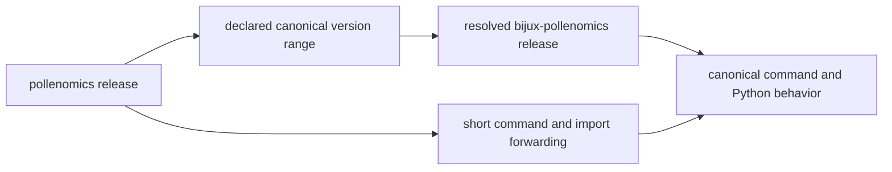
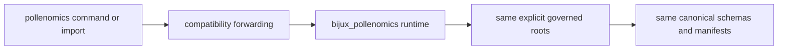

# pollenomics

`pollenomics` is the short-name distribution for
[`bijux-pollenomics`](../bijux-pollenomics/README.md). It supplies the
`pollenomics` executable and import prefix while forwarding all collection,
evidence, ranking, and publication behavior to the canonical runtime.

Use it for naming convenience, not as a smaller product or a separate
scientific implementation.

<!-- bijux-pollenomics-badges:generated:start -->
[](https://pypi.org/project/pollenomics/)
[](https://github.com/bijux/bijux-pollenomics/blob/main/LICENSE)
[](https://github.com/bijux/bijux-pollenomics/actions/workflows/verify.yml?query=branch%3Amain)
[](https://github.com/bijux/bijux-pollenomics/actions/workflows/release-pypi.yml)
[](https://github.com/bijux/bijux-pollenomics/actions/workflows/release-ghcr.yml)
[](https://github.com/bijux/bijux-pollenomics/actions/workflows/release-github.yml)
[](https://github.com/bijux/bijux-pollenomics/actions/workflows/deploy-docs.yml)

[](https://pypi.org/project/pollenomics/)
[](https://pypi.org/project/bijux-pollenomics/)

[](https://github.com/bijux/bijux-pollenomics/pkgs/container/bijux-pollenomics%2Fpollenomics)
[](https://github.com/bijux/bijux-pollenomics/pkgs/container/bijux-pollenomics%2Fbijux-pollenomics)

[](https://bijux.io/bijux-pollenomics/public/pollenomics/)
[](https://bijux.io/bijux-pollenomics/public/pollenomics/)
<!-- bijux-pollenomics-badges:generated:end -->

## Install

```bash
python3.11 -m pip install pollenomics
pollenomics --version
pollenomics product-scope --json
```

The alias depends on a compatible `bijux-pollenomics` release. Installing it
therefore installs the full canonical runtime rather than an independent or
reduced implementation.

### Version Pairing Is Directional

The alias metadata declares the accepted canonical-runtime version range. The
canonical runtime does not depend on the alias, and its version alone does not
prove that a separately installed short-name package is compatible.



Record both distribution versions when the short name appears in reproducible
provenance. The runtime version owns scientific behavior; the alias version
owns only the compatibility promise used to reach it.

## Choose The Distribution

| Requirement | Distribution and entry surface |
| --- | --- |
| canonical dependency and ownership identity | `bijux-pollenomics`, `bijux_pollenomics`, `bijux-pollenomics` |
| concise notebook or interactive identity | `pollenomics`, `pollenomics` |
| smaller runtime or different scientific behavior | neither; both reach the canonical runtime |
| alias-owned schema, evidence state, or release policy | none |

Libraries and durable architecture records should normally use the canonical
name. An application can use the short name consistently when its invocation
provenance records both installed distributions.

## Compatibility contract

The short executable dispatches to the canonical command implementation. The
short import resolver forwards runtime submodules and public names:

```python
from pollenomics import build_product_scope, collect_data
from pollenomics.reporting import generate_published_reports
```



The compatibility promise covers command dispatch, import forwarding, and
top-level public names for a compatible release pair. It does not create
alias-specific artifact formats, identifiers, configuration, scientific
decisions, write roots, or publication caveats.

## Record A Short-Name Run

When the alias creates governed artifacts, retain:

| Identity | Required record |
| --- | --- |
| entry surface | `pollenomics` distribution version and requested command or import |
| implementation | resolved `bijux-pollenomics` distribution version |
| operation | arguments, configuration, and explicit source, data, and output roots |
| evidence state | source releases, data revision, and materialized lifecycle stages |
| result | canonical manifest, member IDs, hashes, and focused verification |

Do not rename evidence IDs, schemas, provenance fields, or output roots to
contain the alias. Those identify scientific and product state rather than the
convenience namespace used to enter the runtime.

## Prove Parity At The Right Boundary

Parity means both names resolve the same canonical behavior for identical
inputs. Check the release pair and read-only contracts before replaying a
writer:

```bash
pollenomics --version
bijux-pollenomics --version
pollenomics product-scope --json
bijux-pollenomics product-scope --json
```

For a governed result, compare canonical schema identity, product manifests,
member IDs, evidence posture, and caveats. Different terminal labels are
expected; different scientific results under the same compatible versions and
inputs are a defect.

## Diagnose A Mismatch

Inspect these causes in order:

1. confirm which executables and environments resolved;
2. record both installed distribution versions;
3. confirm one import prefix is used consistently within the process;
4. compare arguments, configuration, and explicit roots;
5. compare canonical manifests and member identities; and
6. reproduce through the canonical name before attributing the mismatch to
   scientific behavior.

The alias changes access, not data state. An empty or different result usually
indicates environment, root, configuration, or version identity that must be
made explicit.

## Read Next

- [Canonical runtime package](../bijux-pollenomics/README.md)
- [Product handbook](../../docs/public/pollenomics/index.md)
- [Interfaces](../../docs/public/pollenomics/interfaces/index.md)
- [Evidence database](../../docs/public/pollenomics-data/index.md)
