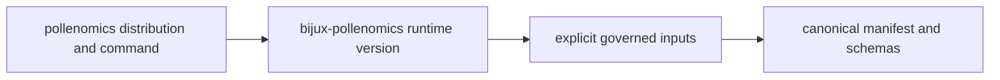
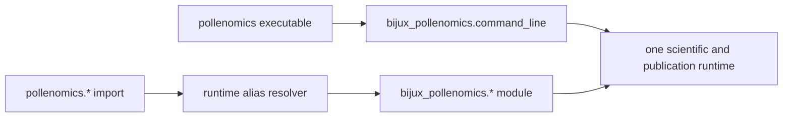
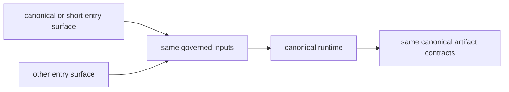
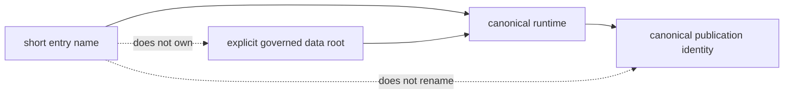
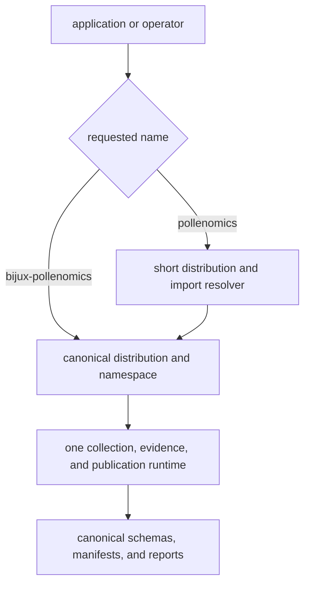

# pollenomics

`pollenomics` is the short-name distribution for
[`bijux-pollenomics`](../bijux-pollenomics/README.md). It provides the
`pollenomics` executable and import prefix while dispatching collection,
evidence review, ranking, and publication to the canonical runtime.

The alias inherits the canonical product boundary. It exposes the current
atlas-builder and evidence-publication runtime; it does not make planned
harmonization or interpretation engine surfaces available under a shorter
name.

<!-- bijux-pollenomics-badges:generated:start -->
[](https://pypi.org/project/pollenomics/)
[](https://github.com/bijux/bijux-pollenomics/blob/main/LICENSE)
[](https://github.com/bijux/bijux-pollenomics/actions/workflows/verify.yml?query=branch%3Amain)
[](https://github.com/bijux/bijux-pollenomics/actions/workflows/release-pypi.yml)
[](https://github.com/bijux/bijux-pollenomics/actions/workflows/release-ghcr.yml)
[](https://github.com/bijux/bijux-pollenomics/actions/workflows/release-github.yml)
[](https://github.com/bijux/bijux-pollenomics/actions/workflows/deploy-docs.yml)

[](https://pypi.org/project/pollenomics/)
[](https://pypi.org/project/bijux-pollenomics/)

[](https://github.com/bijux/bijux-pollenomics/pkgs/container/bijux-pollenomics%2Fpollenomics)
[](https://github.com/bijux/bijux-pollenomics/pkgs/container/bijux-pollenomics%2Fbijux-pollenomics)

[](https://bijux.io/bijux-pollenomics/public/pollenomics/)
[](https://bijux.io/bijux-pollenomics/public/pollenomics/)
<!-- bijux-pollenomics-badges:generated:end -->

## Install

```bash
python3.11 -m pip install pollenomics
pollenomics --help
```

The installed dependency is `bijux-pollenomics>=0.1.5,<1.0`. Scientific logic,
data contracts, and report behavior remain owned by that dependency.

## Decide Before Depending

| If your code needs | Depend on | Import or invoke |
| --- | --- | --- |
| canonical ownership and the stable implementation name | `bijux-pollenomics` | `bijux_pollenomics` or `bijux-pollenomics` |
| a short interactive name with the same behavior | `pollenomics` | `pollenomics` |
| a smaller scientific runtime | neither | the alias installs the canonical runtime |
| independent schemas, data formats, or release policy | neither | no alias-owned scientific contract exists |

Libraries should normally depend on the canonical distribution. User-facing
notebooks and command examples may prefer the short name when that convenience
outweighs the extra distribution identity.

### Record Both Distribution Identities

When the short executable creates governed artifacts, the reproducibility
record names both the entry surface and the implementation:

```text
entry distribution: pollenomics <installed-version>
runtime distribution: bijux-pollenomics <installed-version>
entry command: pollenomics <subcommand and arguments>
governed inputs: explicit roots, versions, and configuration
result identity: canonical manifest and member schemas
```

The first line explains which forwarding contract was requested. The second
identifies the scientific implementation. The final two lines identify the
state transition and its result. Replacing this packet with “ran pollenomics”
loses the implementation version and cannot reproduce a publication.



Artifacts do not gain an alias-specific schema or source identity. The short
name is part of invocation provenance; scientific meaning remains canonical.

## When The Short Name Helps

Use `pollenomics` for concise interactive commands, notebooks, and applications
that prefer the shorter import prefix. Use `bijux-pollenomics` and
`bijux_pollenomics` in architecture records, dependency ownership, operational
runbooks, and bug reports where the canonical implementation must be
unambiguous.

Choosing the short name does not create a lighter runtime. Installation still
resolves the canonical distribution, and collection or publication commands
retain the same write behavior, evidence rules, output contracts, and caveats.

The same rule applies to curation. The alias does not own sample identity,
fact ownership, locality or chronology decisions, conflict handling, recovery
queues, or admission outcomes. Those remain canonical runtime and governed
data contracts even when `pollenomics` is the requested command.

The compatibility promise is deliberately narrow: naming convenience without
scientific divergence. It covers forwarded imports, the short executable, and
top-level public names. It does not create an independent data format, release
posture, configuration model, or support lifecycle.

The same ceiling applies to operational guarantees. Collection and publication
retain the canonical write roots, staging behavior, replacement semantics, and
recovery requirements. A shorter executable is not a safer preview mode; use
an explicit `artifacts/` destination when rehearsing a state-changing call.

## Compatibility contract

If this works:

```python
from bijux_pollenomics.command_line import build_parser
```

the alias package is expected to support the same import through:

```python
from pollenomics.command_line import build_parser
```

The alias namespace installs an import resolver for canonical runtime
submodules. Local modules are limited to `cli`, `command_line`,
`runtime_alias`, and package entry points; other imports resolve to the matching
`bijux_pollenomics` module.



The same compatible release pair therefore supports either import style:

```python
from bijux_pollenomics.reporting import generate_published_reports
from pollenomics.reporting import generate_published_reports
```

Both imports execute the same runtime behavior.

Module identity follows the canonical implementation. Code should not load the
same runtime submodule through both prefixes and then rely on distinct class or
module identities. Pick one import style within an integration, while treating
serialized artifact schemas and command results as canonical runtime outputs.

Top-level public names are re-exported from the canonical package:

```python
from pollenomics import (
    build_product_scope,
    collect_data,
    generate_published_reports,
)
```

The intentional CLI difference is only the program label and executable name:

```bash
pollenomics product-scope
pollenomics source-support
pollenomics publish-reports --help
```

## Package selection

| Requirement | Distribution |
| --- | --- |
| canonical dependency and ownership name | `bijux-pollenomics` |
| canonical Python namespace | `bijux_pollenomics` |
| shorter executable | `pollenomics` |
| shorter import prefix | `pollenomics` |
| different scientific or publication behavior | neither; both use the canonical runtime |

Use `bijux-pollenomics` in system architecture, release ownership, and durable
integration documentation. Use `pollenomics` where a concise interactive name
is preferable.

## Change Names Without Changing Meaning

Moving an integration between the short and canonical names is a namespace
change, not a data migration:

1. change the declared distribution dependency;
2. change the executable or import prefix consistently;
3. record both installed distribution versions during the transition;
4. run the same read-only contract inspection through both names;
5. verify that canonical manifests, schemas, member identities, and caveats
   remain unchanged for identical governed inputs.

Do not rewrite evidence identifiers, source-family names, schema versions,
output roots, or provenance fields to contain the chosen package name. Those
artifacts identify scientific and product state, not the convenience namespace
used to enter the runtime.



A differing governed result under the same compatible version pair and inputs
is a compatibility defect. It must be investigated at executable resolution,
import forwarding, configuration, or environment identity rather than accepted
as alias-specific scientific behavior.

## Equivalent And Distinct Identity

| Surface | Equivalent | Intentionally distinct |
| --- | --- | --- |
| scientific behavior | same canonical modules and contracts | none |
| command behavior | same parser, dispatch, and operation | executable and program label |
| Python behavior | same resolved runtime modules and public names | import prefix requested by the caller |
| distribution metadata | depends on and constrains the canonical package | package name, wheel, and release artifact |
| ownership | canonical runtime remains authoritative | alias owns compatibility forwarding only |

Pinning only `pollenomics` still resolves a constrained canonical runtime
dependency. Compatibility therefore includes both alias behavior and the
declared canonical version range; it is not a copy of runtime source.

The alias distribution version identifies the forwarding package. The
canonical distribution version identifies the implementation. Record both in
reproducibility metadata when the short name is used to create governed
artifacts.

### Reproducibility record for the short name

When `pollenomics` creates or refreshes governed artifacts, retain enough
identity to reconstruct both the convenience boundary and the implementation:

| Record | Why it matters |
| --- | --- |
| `pollenomics` distribution version | identifies the forwarding contract that was installed |
| `bijux-pollenomics` distribution version | identifies the scientific implementation that ran |
| requested executable or import prefix | explains how the consumer entered the runtime |
| command arguments, configuration, and explicit roots | identifies the selected operation and filesystem state |
| resulting canonical manifest and focused verification | identifies what was written and which contract was checked |

Do not mint alias-specific schema names, provenance fields, or output roots to
record this information. Invocation metadata may name the short surface;
evidence records and publication members retain canonical runtime meaning.

### Data State Is Not Aliased

The compatibility resolver changes how code is reached. It does not select,
copy, or certify a governed evidence database. Both command names operate on
the explicit roots supplied by the caller and produce canonical manifests.

| Identity | Owned by | Required reproducibility record |
| --- | --- | --- |
| entry name | `pollenomics` compatibility distribution | alias version and requested command or import |
| runtime behavior | `bijux-pollenomics` canonical distribution | canonical version and resolved implementation |
| evidence state | supplied governed data root | repository revision or data release, source versions, and materialized lifecycle stages |
| publication state | canonical product contract | manifest identity, members, caveats, and focused verification |

Two runs with the same alias and runtime versions can produce legitimately
different results when their governed data roots differ. Conversely, changing
from the short command to the canonical command does not change scientific
meaning when the runtime version, inputs, arguments, and configuration are the
same.



## Single-Runtime Invariant

For a supported installation, these statements are all true:

| Invariant | Consequence |
| --- | --- |
| `pollenomics` depends on `bijux-pollenomics>=0.1.5,<1.0` | the alias cannot run without a compatible canonical distribution |
| forwarded submodules resolve to `bijux_pollenomics` implementations | scientific logic has one owner |
| both executables use the canonical command parser and dispatch | write behavior and exit semantics do not fork |
| artifacts retain canonical schemas and meanings | downstream consumers do not need alias-specific readers |
| releases remain separate distributions | installed versions must be reported as a pair |

The version pair matters because distribution compatibility and scientific
implementation are different facts. A `pollenomics` wheel can forward
correctly while an unexpected canonical version is installed, or the expected
pair can be present while the shell resolves a different executable.

### Prove Parity At The Right Boundary

| Parity check | Compare | Failure means |
| --- | --- | --- |
| contract parity | read-only product, ownership, and source-support results | forwarding or version resolution differs |
| invocation parity | parsed arguments, defaults, explicit roots, exit semantics, and diagnostics | the entry surfaces dispatch differently |
| artifact parity | canonical schemas, manifest identities, members, caveats, and exclusions for identical inputs | scientific or publication behavior has forked |
| environment identity | both distribution versions and resolved executable or module paths | the comparison did not exercise the intended installation |

Artifact parity does not require alias-specific provenance fields. Record the
short invocation at the operation boundary while keeping evidence identifiers,
schemas, and product members canonical. A byte difference is reviewed by its
semantic contract; byte equality alone does not prove the expected environment
was invoked.



Bug reports should include both the installed `pollenomics` version and the
resolved `bijux-pollenomics` version. The pair identifies the forwarding
contract and the implementation that actually produced the behavior.

## Diagnose A Compatibility Mismatch

Confirm distribution versions, import ownership, and command resolution before
attributing a difference to scientific behavior:

```bash
python3.11 -m pip show pollenomics bijux-pollenomics
python3.11 -c 'import pollenomics; print(pollenomics.__version__)'
python3.11 -c 'import bijux_pollenomics; print(bijux_pollenomics.__version__)'
pollenomics --version
bijux-pollenomics --version
```

Then compare the same read-only command through both executables:

```bash
pollenomics product-scope
bijux-pollenomics product-scope
```

A mismatch can come from an incompatible installed pair, a different
executable on `PATH`, or broken forwarding. It must not be normalized away by
maintaining separate expected outputs for the two names. Resolve the installed
identity or alias boundary; the canonical runtime remains the only owner of
the result.

When diagnosing imports, inspect module ownership as well as versions:

```bash
python3.11 -c 'import pollenomics.reporting as m; print(m.__name__, m.__file__)'
python3.11 -c 'import bijux_pollenomics.reporting as m; print(m.__name__, m.__file__)'
```

The requested prefix can differ, but behavior must resolve to the canonical
implementation. An application that deliberately loads both prefixes should
not use prefix differences as domain identity or serialize them into evidence
artifacts.

Applications should constrain releases through normal dependency metadata and
use one import prefix consistently. Serialized data and report contracts use
canonical runtime meaning regardless of which prefix invoked them.

## Boundaries

The alias does not fork:

- source acquisition or normalization;
- ancient-DNA sample, locality, chronology, or coordinate rules;
- evidence review and refusal logic;
- Nordic atlas or Sweden lake ranking;
- world, regional, country, or report publication.

New scientific capabilities belong in `bijux_pollenomics` and become available
through the alias automatically when they are part of the public runtime
surface.

The alias also cannot promote a planned canonical surface into a supported one.
Capability status is determined by the canonical runtime contract, not by
whether an import can be resolved or a name sounds domain-complete.

## Documentation

- [canonical runtime guide](../bijux-pollenomics/README.md)
- [documentation home](https://bijux.io/bijux-pollenomics/)
- [runtime handbook](https://bijux.io/bijux-pollenomics/public/pollenomics/)
- [data and evidence handbook](https://bijux.io/bijux-pollenomics/public/pollenomics-data/)
- [evidence curation](https://bijux.io/bijux-pollenomics/public/pollenomics-data/curation/)
