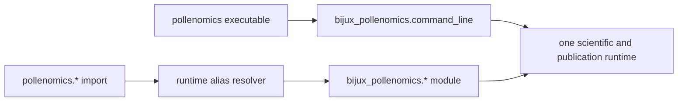

# pollenomics

`pollenomics` is the short-name distribution for
[`bijux-pollenomics`](../bijux-pollenomics/README.md). It provides the
`pollenomics` executable and import prefix while dispatching collection,
evidence review, ranking, and publication to the canonical runtime.

<!-- bijux-pollenomics-badges:generated:start -->
[](https://pypi.org/project/pollenomics/)
[](https://github.com/bijux/bijux-pollenomics/blob/main/LICENSE)
[](https://github.com/bijux/bijux-pollenomics/actions/workflows/verify.yml?query=branch%3Amain)
[](https://github.com/bijux/bijux-pollenomics/actions/workflows/release-pypi.yml)
[](https://github.com/bijux/bijux-pollenomics/actions/workflows/release-ghcr.yml)
[](https://github.com/bijux/bijux-pollenomics/actions/workflows/release-github.yml)
[](https://github.com/bijux/bijux-pollenomics/actions/workflows/deploy-docs.yml)

[](https://pypi.org/project/pollenomics/)
[](https://pypi.org/project/bijux-pollenomics/)

[](https://github.com/bijux/bijux-pollenomics/pkgs/container/bijux-pollenomics%2Fpollenomics)
[](https://github.com/bijux/bijux-pollenomics/pkgs/container/bijux-pollenomics%2Fbijux-pollenomics)

[](https://bijux.io/bijux-pollenomics/public/pollenomics/)
[](https://bijux.io/bijux-pollenomics/public/pollenomics/)
<!-- bijux-pollenomics-badges:generated:end -->

## Install

```bash
python3.11 -m pip install pollenomics
pollenomics --help
```

The installed dependency is `bijux-pollenomics>=0.1.5,<1.0`. Scientific logic,
data contracts, and report behavior remain owned by that dependency.

## Compatibility contract

If this works:

```python
from bijux_pollenomics.command_line import build_parser
```

the alias package is expected to support the same import through:

```python
from pollenomics.command_line import build_parser
```

The alias namespace installs an import resolver for canonical runtime
submodules. Local modules are limited to `cli`, `command_line`,
`runtime_alias`, and package entry points; other imports resolve to the matching
`bijux_pollenomics` module.



The same release line therefore supports either import style:

```python
from bijux_pollenomics.reporting import generate_published_reports
from pollenomics.reporting import generate_published_reports
```

and get the same runtime behavior.

Top-level public names are re-exported from the canonical package:

```python
from pollenomics import (
    build_product_scope,
    collect_data,
    generate_published_reports,
)
```

The intentional CLI difference is only the program label and executable name:

```bash
pollenomics product-scope
pollenomics source-support
pollenomics publish-reports --help
```

## Package selection

| Requirement | Distribution |
| --- | --- |
| canonical dependency and ownership name | `bijux-pollenomics` |
| canonical Python namespace | `bijux_pollenomics` |
| shorter executable | `pollenomics` |
| shorter import prefix | `pollenomics` |
| different scientific or publication behavior | neither; both use the canonical runtime |

Use `bijux-pollenomics` in system architecture, release ownership, and durable
integration documentation. Use `pollenomics` where a concise interactive name
is preferable.

## Equivalent And Distinct Identity

| Surface | Equivalent | Intentionally distinct |
| --- | --- | --- |
| scientific behavior | same canonical modules and contracts | none |
| command behavior | same parser, dispatch, and operation | executable and program label |
| Python behavior | same resolved runtime modules and public names | import prefix requested by the caller |
| distribution metadata | depends on and constrains the canonical package | package name, wheel, and release artifact |
| ownership | canonical runtime remains authoritative | alias owns compatibility forwarding only |

Pinning only `pollenomics` still resolves a constrained canonical runtime
dependency. Compatibility therefore includes both alias behavior and the
declared canonical version range; it is not a copy of runtime source.

## Boundaries

The alias does not fork:

- source acquisition or normalization;
- ancient-DNA sample, locality, chronology, or coordinate rules;
- evidence review and refusal logic;
- Nordic atlas or Sweden lake ranking;
- world, regional, country, or report publication.

New scientific capabilities belong in `bijux_pollenomics` and become available
through the alias automatically when they are part of the public runtime
surface.

## Documentation

- [canonical runtime guide](../bijux-pollenomics/README.md)
- [documentation home](https://bijux.io/bijux-pollenomics/)
- [runtime handbook](https://bijux.io/bijux-pollenomics/public/pollenomics/)
- [data and evidence handbook](https://bijux.io/bijux-pollenomics/public/pollenomics-data/)
